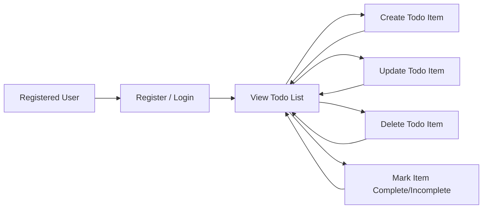

# Todo List Application: Requirements Analysis Report

## 1. Purpose and Scope
The todoList backend serves to enable individuals to manage their personal tasks efficiently and securely through a minimal, easy-to-use digital platform. The scope strictly includes business requirements for a solo user-focused CRUD todo application, omitting all collaborative or extraneous features. The service exists to ensure that users can reliably create, view, update, complete, or delete their own tasks and nothing more, with robust privacy and usability guarantees.

## 2. User Actors

- **Registered User**: An individual who holds a unique authenticated account. Each Registered User interacts solely with their own data; access to other users’ todo items is technically and procedurally prohibited.

Permission Matrix (Minimal):

| Actor           | Can Create | Can View | Can Update | Can Delete | Can Mark Complete | Notes                |
|-----------------|------------|----------|------------|------------|-------------------|----------------------|
| Registered User | Yes        | Yes      | Yes        | Yes        | Yes               | Only own data access |

## 3. Functional Requirements (in EARS format)

### Task Management (CRUD)
- WHEN a Registered User is authenticated, THE system SHALL allow the user to create new todo items with a text description, optional due date, and completion status.
- WHEN a Registered User is authenticated, THE system SHALL allow the user to retrieve the complete list of their own todo items, ordered by creation or due date.
- WHEN a Registered User is authenticated, THE system SHALL allow the user to update the text, due date, or completion status of any of their own todo items.
- WHEN a Registered User is authenticated, THE system SHALL allow the user to delete any of their own todo items.
- WHEN a Registered User marks a todo item as complete or incomplete, THE system SHALL persist this state immediately and reflect it on the next retrieval.
- WHEN a user requests access to another user's todo items, THE system SHALL return a 'Forbidden' error and log the event for audit purposes.

### Task Data Specification
- WHEN a new todo item is created, THE system SHALL require a non-empty text description and MAY accept an optional due date field that is either empty or a valid calendar date. Completion status SHALL default to 'incomplete' if not specified at creation.

### Viewing and Filtering
- WHEN listing todo items, THE system SHALL present all of the user’s items with fields: description, optional due date, completion status, and unique identifier.
- WHEN a user requests, THE system MAY allow sorting by creation date or due date, and MAY allow filtering by completion status.

## 4. Authentication Requirements

- WHEN a new user registers, THE system SHALL require a unique email and a password, storing credentials securely using an industry-standard hash function.
- WHEN a Registered User logs in, THE system SHALL authenticate credentials and issue a secure, expirable session token (such as JWT).
- WHEN making any API request pertaining to todo items, THE system SHALL require a valid session token; otherwise, a 401 Unauthorized error SHALL be returned.
- WHEN processing any request, THE system SHALL enforce data ownership, ensuring actions are performed only on resources belonging to the authenticated user.

## 5. Exception and Error Handling

- WHEN a user attempts to perform any operation without authentication, THE system SHALL return 'Unauthorized'.
- WHEN a data validation error occurs (e.g., missing description field, invalid date), THE system SHALL provide a structured, human-readable error message specifying the issue.
- WHEN attempting to access or modify a todo item not owned by the user, THE system SHALL respond with a 'Forbidden' error and SHALL NOT reveal the existence or status of that item.
- WHEN a user attempts to delete or update a non-existent todo item, THE system SHALL reply with 'Not Found'.
- WHEN database or application errors occur, THE system SHALL provide a generic error message to the end user and log the technical details for support.

## 6. Non-functional Requirements & KPIs

- WHEN responding to any authenticated request, THE system SHALL complete the operation in under 1 second in 99% of cases, under normal load.
- WHEN storing or retrieving sensitive user data, THE system SHALL use encryption at rest and in transit (e.g., TLS for all network traffic).
- WHEN handling user information, THE system SHALL comply with standard data retention and deletion practices, including the ability for a user to permanently delete their account and associated data.
- WHEN the application is in production, THE system SHALL maintain at least 99.9% uptime and track basic KPIs: daily active users, retention rate, and average response time.
- WHEN monitoring the backend, THE system SHALL collect anonymized metrics for system health and improvement, never storing personal task contents in logs.

## 7. User Workflow Diagram

## 8. Out-of-Scope and Constraints
- No features for team collaboration, sharing, notifications, tagging, prioritization, or analytics SHALL be implemented in this scope.
- All operations MUST restrict data strictly to the authenticated user’s scope; no admin or external user roles exist in this minimal version.

## 9. References
- For business context see: Service Overview
- For user authentication and permission detail see: User Actors and Permissions
- For exception flows and error handling see: Exception & Error Handling document
- For task validation details, see: Business Rules and Validation document

---

The above requirements comprise an actionable, unambiguous, production-grade specification for developing the backend of a minimal Todo List application, focused strictly on user privacy, core task management, and performance within a single-user paradigm.