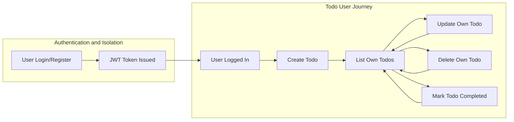

# Todo List Application Business Requirements Documentation

## Functional Requirements (Todos)

### Overview
This section describes all business requirements—written using EARS where possible—governing Todo management for the minimal Todo list application. It is limited to features required for effective personal task management by a single authenticated user.

### Todo Lifecycle Requirements
- WHEN a user creates a todo, THE system SHALL require a title field and permit an optional description field.
- WHEN a user creates a todo, THE system SHALL assign the todo to the user and make it private and inaccessible to others.
- WHEN a user views the list of todos, THE system SHALL display only those todos that belong to the authenticated user.
- WHEN a user updates a todo, THE system SHALL only allow the owner user to change the title, description, or completion status of their own todos.
- IF a user attempts to access, update, or delete a todo that is not owned by them, THEN THE system SHALL deny access and return an authorization error.
- WHEN a user deletes a todo, THE system SHALL remove only that todo from their own list and not impact other users’ data.
- WHEN a user marks a todo as completed, THE system SHALL persist this status and present it visually or via status in subsequent retrievals.
- THE system SHALL allow todos to be listed in both completed and uncompleted states and support filtering on completion status.

### Todo Data Fields and Rules
- THE system SHALL store the following for each todo: unique identifier, title, optional description, creation timestamp, completion status (true/false), and last updated timestamp.
- WHEN a user creates or modifies a todo, THE system SHALL validate all input values according to the rules described in the Input Validation Rules section.
- WHEN a user lists todos, THE system SHALL return todos ordered by creation time descending by default.

## Functional Requirements (Authentication)

### Overview
This section details user authentication and authorization requirements using EARS format, guaranteeing data privacy and exclusive personal access by design.

#### Authentication Workflows
- WHEN a user registers, THE system SHALL require an email address and password, both of which must meet the criteria defined in the Input Validation section.
- WHEN a user registers, THE system SHALL ensure the email address is unique and has not already been used by another user.
- WHEN a user logs in, THE system SHALL validate credentials and create a secure session upon successful authentication.
- WHEN a user logs out, THE system SHALL terminate only the authenticated session of the user.
- WHEN a user forgets their password, THE system SHALL allow them to reset their password via a secure, verifiable process (such as a password reset email).
- WHILE a user session is active, THE system SHALL allow full access to all personal todo management functions.
- THE system SHALL restrict all access to todos and personal data to authenticated users only; unauthenticated access to any todo-related endpoints SHALL be denied.
- THE system SHALL issue JWT tokens (access and refresh) for secure API authentication, with appropriate expiration and payload as described in business rules.

### User Data Isolation Requirements
- IF a user attempts to access, modify, or delete another user’s data, THEN THE system SHALL always deny such access and respond with an authorization error.

## Non-functional Requirements (Performance, Security, Privacy)

### Performance Expectations
- WHEN a user creates, updates, deletes, or retrieves todos, THE system SHALL process the request and return a response within 2 seconds, under normal operation.
- THE system SHALL support at least 99% uptime during normal business hours (9am-6pm Asia/Seoul).
- THE system SHALL maintain a user experience without noticeable delay in listing or updating todos for at least 500 concurrent users.

### Security and Privacy
- THE system SHALL store user credentials only in hashed and salted form using industry standard secure hashing algorithms.
- WHEN issuing JWT tokens, THE system SHALL sign them using a secure, secret key and validate expiration on every API call.
- THE system SHALL never expose user passwords via any API, log, or message.
- THE system SHALL comply with relevant privacy practices (e.g., no unnecessary data retention, data minimization: only store what is necessary for operation of the Todo list).

### Data Confidentiality
- THE system SHALL ensure that no user can read, modify, or delete another user’s data—strict per-user data boundaries are enforced at all times.
- THE system SHALL maintain logs of all failed authentication or authorization attempts for administrative review, omitting sensitive data.

## Input Validation Rules
- WHEN a user provides a todo title, THE system SHALL require the title to be non-empty, not only whitespace, and not exceed 255 characters.
- WHEN a user provides a todo description, THE system SHALL allow up to 1024 characters; descriptions are optional.
- WHEN a user provides an email to register or reset password, THE system SHALL require it to be in valid email format and not exceed 254 characters.
- WHEN a user sets or resets a password, THE system SHALL require a minimum of 8 and a maximum of 64 characters, with at least one letter and one digit.
- WHEN input fails to comply with validation rules, THE system SHALL reject the attempt and provide a clear error describing the field and validation issue.

## Business Rules
- THE system SHALL allow only one actor type: the registered user.
- THE system SHALL require every todo to be associated with its creator user; orphaned todos SHALL not exist.
- THE system SHALL not support any shared, collaborative, or group features—each todo is private to its owner.
- THE system SHALL only process requests if an authenticated session is active; anonymous sessions are not recognized.
- THE system SHALL invalidate all existing sessions if a user resets their password.
- IF a user deletes their account, THEN THE system SHALL permanently remove all their todos and account data after confirmation, with no possibility of recovery.
- THE system SHALL not support external integrations at launch (e.g., no calendar sync).

## Mermaid Diagram: Todo User Flow (Minimal)

## End of Requirements Document

This document defines all business requirements necessary to implement a minimal Todo list backend service in accordance with the user’s intent: simple and private personal todo management for non-programmers. All technical implementation details are at the discretion of the development team.