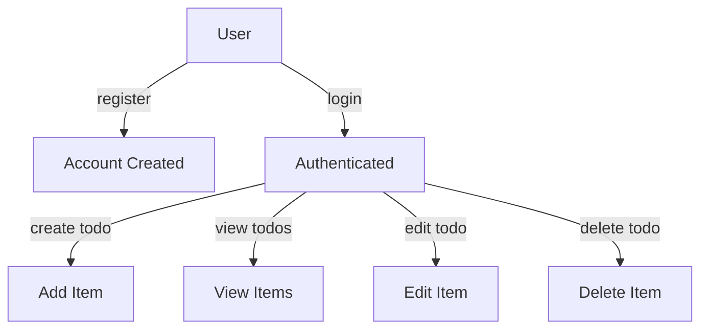

# Todo Service Requirements Overview

## Service Vision
Enhance individual productivity by providing a minimal, focused Todo list application tailored for users who require only the essential functionalities—adding, viewing, editing, and deleting their own tasks. Inspired by simplicity, the service eliminates distractions and avoids feature overload, aiming for the fastest, least-demanding experience for busy users who value reliability and privacy.

## Problem Statement
Productivity tools have become excessively complicated, often including unnecessary features that frustrate or confuse users who only need straightforward task tracking. Many users require an application that does not siphon their attention with menus, advanced options, or integrations. Existing alternatives can leak sensitive data or require complex privacy settings. A direct, minimal Todo application fills the gap, ensuring every interaction is purposeful and data security is never in question.

## Core Value Proposition
- Streamlined user workflows for managing personal todos and daily tasks
- No superfluous features: restrict core operations to create/read/update/delete (CRUD) for todos
- All todo data is private; user access to todos is strictly self-only—no sharing, exporting, or publication features in MVP
- Built-in privacy and security, ensuring compliance with standards and no accidental data exposure
- Immediate feedback and responsiveness to user actions
- Minimal registration required: email and password (or modern secure auth provider)
- All operations strictly authenticated
- All input validated (see requirements) for completeness, forbidden character sets, excessive length
- Clear error messages and robust feedback on failures

## Business Model
**Purpose**: Serve privacy- and simplicity-focused individuals with an essential todo application, designed for high trust with zero distractions. No monetization or premium features at launch; future revenue only considered after user satisfaction with the core experience is proven.

Revenue opportunities (beyond MVP) may include:
- Subscription-based premium features: reminders, calendar or productivity integrations
- Optional unobtrusive ads, never violating privacy or depleting minimalism
- Institutional/Enterprise licensing for organizations seeking simple internal task management
- For the MVP: zero revenue focus, total prioritization of product-market fit and retention

**User Actors**:
- **User**: Any registered individual, owner of their personal todos. All todos are private by default; no user may access another user’s data for any operation.

## Business and Functional Requirements (EARS Format)
- WHEN a user registers with a valid email and password, THE system SHALL create a new private todo list accessible only to that user.
- WHEN a user is authenticated, THE system SHALL allow adding new todo items to the user’s personal list.
- WHEN a user is authenticated, THE system SHALL show only that user's todo items, in chronological order by creation time (or optionally due date if provided).
- WHEN a user is authenticated, THE system SHALL allow updating the text and completion status of todos they own.
- WHEN a user is authenticated, THE system SHALL allow deletion of any todo they own.
- WHEN a user is unauthenticated, THE system SHALL deny all access to any todo data and SHALL display an authentication error message within 1 second.
- IF a user attempts to access or alter data belonging to another user, THEN THE system SHALL reject the action and respond with a 'forbidden' error within 1 second.
- THE system SHALL validate todo item text to not exceed 200 characters and to contain no control or script-related characters. Forbidden characters SHALL cause rejection with an explicit error message.
- WHEN an invalid API request is made (invalid fields, data types, missing authentication/authorization), THE system SHALL respond with validation or authentication errors without altering any data.
- WHEN a todo is created, modified, or deleted, THE system SHALL return the updated list state within 1 second of submission for optimal responsiveness.
- THE system SHALL enforce a per-user todo limit of 300 active items to prevent abuse; exceeding the limit SHALL result in a clear, actionable error.
- WHEN the service experiences a system error, THE system SHALL return a 500 error (internal server error) and SHALL NOT leak any sensitive information about user or system state.

## Authentication, Privacy, and Authorization Requirements
- Registration requires only email and password. No public profile or discoverability features are present.
- All API requests for todos and user data SHALL require authentication (JWT, session, or equivalent proven secure mechanism).
- User sessions SHALL be invalidated upon logout, credential change, or after 7 days of inactivity.
- Passwords SHALL be handled using industry-standard secure salting+hashing (e.g., bcrypt or Argon2), never stored or transmitted in plaintext.
- No actor except the authenticated user may access or view any user's tasks for any reason within the application.
- Data at rest and in transit SHALL be encrypted using accepted industry best practices (e.g., HTTPS/TLS 1.2+).
- Error messages SHALL not reveal internal implementation details or any information about other users.

## Non-Functional Requirements (NFRs)
- System SHALL support at least 10,000 concurrent users with 99.9% monthly uptime.
- UI responses to CRUD operations SHALL be returned in under 1 second, barring network or platform-level incidents outside the application's control.
- Service SHALL provide clear API error codes and user-friendly error messages.
- Service SHALL provide full audit logging for authentication, failed access attempts, and any administrative operations (if present in future versions).
- System SHALL comply with applicable privacy regulations (e.g., GDPR for EU-based users) as appropriate for MVP.

## Mermaid Diagram: Essential User Flow

## Success Metrics
| Key Metric                 | Definition                                                                   |
|---------------------------|------------------------------------------------------------------------------|
| Daily Active Users (DAU)   | Number of users logging in and viewing or managing their todos daily          |
| Task Completion Rate       | Percentage of created tasks successfully marked as complete                   |
| Retention Rate             | Proportion of users returning after 7 days and after 30 days                 |
| Error Incident Rate        | Number of failed requests due to validation/authentication per 1,000 sessions |
| Privacy/Security Breaches  | Number of confirmed privacy/data security incidents (goal: 0)                |
| User Feedback/NPS          | Direct user rating, survey responses, and overall satisfaction score          |

The Todo service establishes a foundation for a secure, reliable, minimal, and distraction-free user experience, prioritizing user privacy and performance above all else. All future additions or expansions must maintain this core ethos and never compromise on simplicity or user trust.