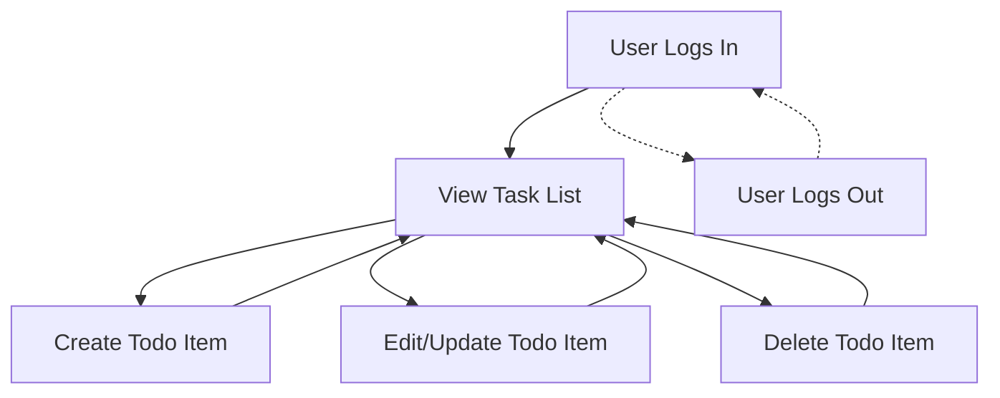

# Todo List Application - Service Vision and Business Model

## Service Vision
The Todo List application delivers a minimalist, reliable, and user-friendly digital solution for individuals seeking to efficiently manage and organize personal tasks. The vision is to provide a frictionless, distraction-free platform that enables users to prioritize, update, and track daily duties with the utmost ease and clarity. WHEN users need to manage their tasks, THE application SHALL empower them to quickly and simply add, edit, and remove items on their personalized to-do list across devices, ensuring consistent, always-accessible productivity without non-essential features.

## Business Justification
WHEN individuals—ranging from students to professionals—seek a means to organize their daily, weekly, or long-term tasks, THE Todo List application SHALL provide an intuitive, no-frills platform focused strictly on the essential capabilities for personal productivity. Many current solutions introduce excessive configuration or irrelevant features that hinder new users or those desiring simplicity. THE application SHALL address this market gap by reducing onboarding steps, avoiding feature bloat, and emphasizing privacy and accessibility for every user segment seeking a simple yet secure digital checklist.

### EARS-Formatted Business Requirements
- WHEN a user creates a new task, THE system SHALL add the item to their personal list and confirm success immediately.
- WHEN a user updates or deletes a task, THE system SHALL make changes visible instantly to ensure responsive user experience.
- WHEN a user attempts to view, change, or delete another user's tasks, THE system SHALL deny access and present a clear, actionable error message within 2 seconds.
- WHEN system errors occur, THE service SHALL always show user-friendly messages that clarify what happened and guide recovery.
- WHEN a user accesses the application from any supported device, THE system SHALL synchronize their tasks in real-time, maintaining data integrity and privacy.

## Core Value Proposition
- All users MAY securely create, read, update, and delete only their own tasks, with robust privacy boundaries in place.
- WHEN users interact with their list, THE application SHALL always provide fast, reliable feedback for every successful or failed operation.
- WHEN a new user signs up, THE system SHALL require only the simplest possible authentication pathway consistent with modern privacy and security best practices.
- THE application SHALL remain free of distractions (ads, upsells) and ANY data collection unrelated to maintaining core Todo functionality.

## Business Goals
### Short-Term Goals
- THE system SHALL guarantee seamless sign-up, authentication, and full CRUD (create/read/update/delete) of personal Todo items for every registered user with zero tolerance for unauthorized data access.
- THE application SHALL exhibit error-free operation with explicit, actionable error messages phrased in plain language suitable for end users.
- Collect actionable feedback from monitored user interactions and surveys to validate functional requirements against real-world needs within the first quarter.

### Long-Term Goals
- Achieve at least 1,000 monthly active users (MAU) in the first full year after launch.
- Maintain a retention rate of 95% or greater for all cohorts of users active past three months.
- Build and sustain a reputation among productivity enthusiasts for excellent reliability, simplicity, and privacy.

## Revenue Strategy
- THE service SHALL launch as a free product for all users, placing focus on adoption, trust, and constructive user feedback during the first phases.
- WHEN user demand emerges for advanced or specialized workflow features (such as reminders, third-party integrations, analytics), THE application MAY introduce such capabilities as paid, opt-in premium upgrades.
- WHEN approached by organizational clients or resellers, THE product MAY offer bespoke features or managed solutions under custom licensing terms.

## Growth Plan
### User Acquisition & Retention
- Encourage viral growth using satisfied-user referrals and transparent sharing features that never compromise individual privacy.
- Develop a presence in relevant forums, productivity blogs, and academic/professional communities to broaden reach, especially in the first six months.
- THE application's technical design SHALL support elastic scaling to handle incremental user influx without performance degradation or privacy risks.

### Roadmap for Expansion
- THE core commitment SHALL always remain on essential features only; any expanded capabilities SHALL be ruthlessly vetted for simplicity, value, and user autonomy before introduction.
- Continuously collect user feedback and usage analytics—always fully anonymized—to inform roadmap decisions and maintain strict adherence to product vision.

## Success Metrics
| Metric                  | Description                                              | Target                                        |
|-------------------------|----------------------------------------------------------|-----------------------------------------------|
| Monthly Active Users    | Unique users who use the service in a 30-day window      | ≥ 1,000 by the end of Year 1                  |
| Retention Rate         | Users returning after 1 and 3 months                     | ≥ 95% for all 3-months-plus cohorts           |
| Avg Todos per User     | Mean number of Todos owned per user                      | ≥ 10 active Todos/user by Q4                  |
| System Uptime          | Fraction of time the service is available to all users    | ≥ 99.9%                                       |
| Error Rate             | Portion of user actions resulting in errors               | ≤ 0.1%                                        |
| User Satisfaction      | Mean survey score (1-5) on usability/satisfaction        | ≥ 4.5/5                                       |

## Authentication and Security Requirements (Natural Language)
- WHEN a new user registers, THE system SHALL require a minimally intrusive sign-up (preferably email and password, no excessive PII).
- WHEN a user logs in, THE system SHALL authenticate credentials swiftly and manage sessions securely with modern encryption.
- WHEN a user logs out or session expires, THE system SHALL reliably terminate access and redirect to sign-in.
- No user's data, authentication status, or personal information SHALL ever be revealed to other users in any scenario.
- THE service SHALL comply with modern privacy principles (local storage, strong password hygiene, opt-out for marketing, etc.).

## Summary Diagram - Minimal Flows

## Conclusion
The Todo List application's service vision and business model are intentionally constrained to core productivity needs for privacy-conscious everyday users. Every business requirement, user expectation, and future feature SHALL trace back to the guiding principle of "simple, reliable, secure task management without distraction." This foundation is designed to drive engineering, product strategy, and long-term business growth.