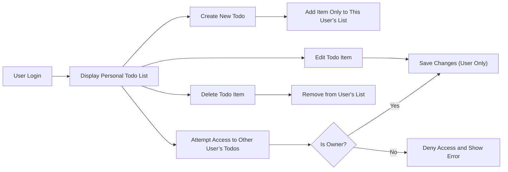

# Minimal Todo List Requirements

## Problem Statement
The Todo List application enables registered users to organize, remember, and manage their personal tasks privately and simply. Users face missed appointments and disorganization when tasks are not tracked in a dedicated, secure, digital tool. Existing applications are often overwhelming with superfluous features, or lacking necessary privacy. The priority is to satisfy the unmet need for a truly private, intelligible, and cross-device todo-tracking experience without introducing unnecessary complexity.

## Target Users
- Individuals seeking a digital solution for organizing personal tasks, reminders, errands, or self-improvement goals.
- Users prioritizing simplicity, privacy, and minimal setup.
- Non-technical or first-time digital productivity users.
- Users who require their todo list to be strictly private and accessible only via secure authentication.

## Goals and Success Criteria
- Users SHALL always be able to create, view, edit, and delete their own todo items with zero exposure to other users.
- The interface and backend SHALL NOT introduce extraneous task management features (e.g., tagging, categories, priorities, sub-projects).
- The app SHALL be fully usable on any device, with no loss of data, for authenticated users.
- No user-specific data SHALL be accessible or visible to any other user or admin except where legally required or for critical system maintenance (as permitted by compliance policies).
- Success is defined as all interactions being intuitive, secure, fast (all operations < 1s under normal conditions), and error messages being clear and actionable.

## Minimal Functional Requirements

1. WHEN a registered user accesses the service, THE system SHALL display only that user’s todo list or an empty list if none exists.
2. WHEN a user creates a todo, THE system SHALL link the new item uniquely to the user and not expose it to others.
3. WHEN a user requests their todo list, THE system SHALL return tasks ordered chronologically or by user-defined order.
4. WHEN a user edits an item, THE system SHALL persist changes that restrict visibility and edit access exclusively to the item owner.
5. WHEN a user deletes a todo, THE system SHALL permanently remove the item from the user’s list immediately.
6. WHEN a user attempts to access, modify, or delete another user’s todos, THE system SHALL deny the operation and produce a clear error message.
7. WHEN a user is authenticated, THE system SHALL persist and synchronize their todo list across devices and sessions.
8. WHEN system errors or maintenance prevent operations, THE system SHALL communicate this promptly and ensure unsaved edits remain locally available for later recovery.

## Business Flows and User Scenarios
- Scenario 1: User registers/logs in and is presented with an empty or existing personal todo list.
- Scenario 2: User creates a new todo item, which immediately appears in their list and remains private.
- Scenario 3: User edits text/details of any personal todo item; updates are saved for only them to see.
- Scenario 4: User deletes a task, which vanishes instantly from their view and cannot be recovered.
- Scenario 5: Any attempt to interact with tasks not owned by the session user fails with a specific, user-friendly error.
- Scenario 6: System is temporarily offline or under maintenance; users are notified and may continue working locally. Changes auto-sync when connection is restored.

## Privacy, Authentication, and Authorization
- User data SHALL be accessible only after successful login or session authentication.
- Each todo item SHALL be strictly mapped to the authenticated user by a unique, non-guessable identifier.
- No provision for cross-user visibility, admin viewing, or data sharing except where strictly required by law or catastrophic system troubleshooting (with full audit log).
- Session timeouts and password or token-based authentication SHALL be enforced to secure user access at all times.
- Unauthorized access or resource modification SHALL be rejected with clear explanation and HTTP 401/403 error codes for API clients.
- Compliance with relevant jurisdictional privacy regulations SHALL be ensured (GDPR, local equivalents as applicable).

## Error Handling Requirements
- WHEN a user tries to access or modify todo items without authentication, THEN THE system SHALL produce an authorization error, with no resource exposure.
- WHEN any unexpected backend failure occurs while creating, editing, or deleting, THEN THE system SHALL return a descriptive error; client SHALL offer to retry without data loss.
- WHEN user data sync fails (e.g., network outage), THEN the client SHALL display a warning and store changes locally until connectivity is restored.
- WHEN user attempts invalid operations (e.g., empty todo text, duplicate entries if not allowed), THEN THE system SHALL clearly inform the user and reject the action.

## User Experience and Non-Functional Expectations
- All core operations SHALL complete within one second for at least 99% of requests.
- System SHALL support high availability and automatic recovery from typical service interruptions.
- User interface messages SHALL be simple and human-centered, avoiding technical jargon or ambiguous terminology.
- Consistency of experience SHALL be maintained across all supported devices and browsers.
- Accessibility for users with disabilities SHALL be a priority in all user-facing interfaces (details in UX guidelines).

## Workflow Diagram

## Summary of Key Constraints
- Application SHALL NOT implement features outside of minimal core todo management (no deadlines, priorities, tags, or collaboration tools).
- Only registered and authenticated users may access service functionality.
- No todo data may ever be visible to others unless legal or essential operational exceptions apply; all access attempts SHALL be fully logged.
- All error, authentication, and business rules are guided by privacy-first, user-centric design principles and strict EARS-compliant requirements.