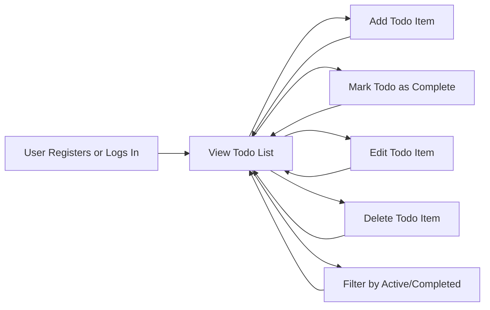

# Problem Statement and User Needs for Todo List Application

## Target Users

The Todo List application addresses the daily organizational needs of several distinct user groups:

- **Self-organizing professionals** such as office workers, freelancers, and knowledge workers, seeking a lightweight solution to privately manage personal and work-related tasks with minimal distraction.
- **Students and academic users** balancing academic commitments (classes, assignments, deadlines) and personal chores, preferring direct, easy task management with limited setup.
- **General users** who want a reliable, simple tool to jot down, track, and complete life errands or personal goals without complexity or social features.
- **Mobile-first users** expecting seamless access and synchrony across smartphones, tablets, and computers, desiring the same experience and data regardless of device.

## User Pain Points

Common frustrations addressed by the minimal Todo List application include:

- **Unnecessary Complexity**: Existing tools add nonessential project, collaboration, or scheduling features that distract from basic task tracking.
- **Cognitive Overload**: Excessive interface options and notifications hinder users who want a focused, actionable task list.
- **Laborious Onboarding**: Long registration processes or required social logins prevent fast and private account setup.
- **Lack of Data Privacy**: Many apps require excessive permissions or share user activity, making users wary of data exposure.
- **Manual Processes**: Without a Todo app, users face forgotten, lost, or duplicated tasks when depending on notes, memory, or informal methods.
- **Poor Device Support**: Inconsistency or loss of data across devices frustrates users who need continuity.
- **Unclear Task States**: Difficulty in distinguishing between active, completed, or deleted items leads to confusion and inefficiency.

## Market Gap Analysis

Despite a crowded productivity app market, most available solutions fail to cover the following needs for a focused, minimal Todo List service:

- **True Minimalism Lacking**: Popular options quickly become feature-heavy, overlooking users demanding just the essentials.
- **Fragmented User Flow**: Tools often lock users into calendars, chats, or teams, disrupting a natural personal workflow for simple task management.
- **Excess Tracking**: Free solutions frequently monetize user data or force account integrations that deter privacy-focused users.
- **Non-transparency**: Unclear data practices reduce user trust and comfort.
- **High Entry Barriers**: Account or device setup often involves unnecessary complexity, discouraging quick use.

## Primary Use Cases (EARS Format)

### Core Task Management
- THE user SHALL be able to create a Todo with a task title and optional description.
- THE user SHALL be able to view a chronologically ordered list of their own Todos, each showing status (active/completed).
- WHEN a user marks a Todo as completed, THE system SHALL update its status and visibly display it as completed in the user's list within 1 second.
- WHEN a user edits a Todo, THE system SHALL allow update of title and description, only for their own Todos.
- WHEN a user deletes a Todo, THE system SHALL remove it from their visible list without affecting other Todos.
- WHILE viewing their list, THE user SHALL be able to filter Todos by status (active/completed).

### Data Integrity & Security
- THE system SHALL ensure each user can view, modify, or delete only their own Todos and no others.
- IF a user attempts access to someone else's Todo, THEN THE system SHALL block the action and return a clear error.

### Application Performance
- WHEN a user creates, edits, completes, or deletes any Todo, THE system SHALL reflect the change on the user's list within 1 second.
- WHEN a user logs in, THE system SHALL retrieve and show the user's complete and current Todo list instantly.

### Error Handling & Fault Tolerance
- IF user submits invalid input (e.g. empty title, excessive length), THEN THE system SHALL display a prompt with actionable error details within 1 second.
- IF user not logged in, THEN THE system SHALL require authentication for all Todo actions and deny access until authenticated.
- WHILE user is interacting, THE system SHALL automatically save changes, preserving data on navigation, refresh, or device switching to the greatest feasible extent.

### User Authentication & Privacy
- THE user SHALL be able to register and log in with only email and password; no third-party or social login is required or permitted by default.
- THE user SHALL be able to securely log out and end their session cleanly.
- THE user SHALL always see, modify, and delete only their own Todos.
- THE user’s session management SHALL meet modern privacy standards; authentication tokens SHALL be securely managed with best practice expiry, rotation, and invalidation.

### Device Consistency
- WHEN a user logs in from any device or browser, THE system SHALL immediately show their up-to-date Todo list, preserving completed and active items across platforms.

## Supporting Minimal User Workflow (Mermaid)

## Conclusion: User Value and Outcomes

By focusing on a minimal feature set, strict data privacy, and frictionless authentication, the Todo List application is designed to maximize user trust and daily effectiveness for managing personal tasks. The service supports rapid entry, seamless device transitions, and clear, testable requirements for backend development, ensuring that single users enjoy a straightforward, distraction-free task flow—delivering precisely what is needed, with nothing extraneous.