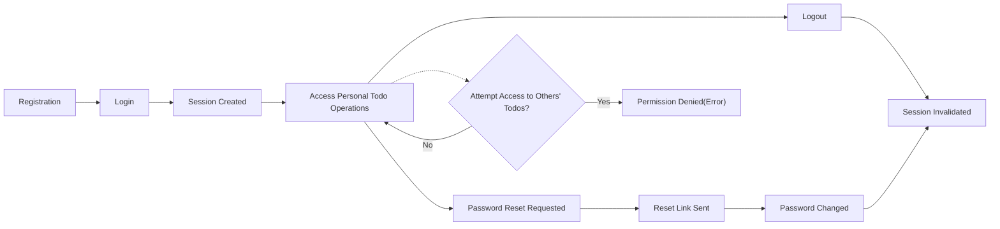

# User Actors and Authentication Structure for Todo List Service

## User Persona Descriptions

The Todo List application is designed for individuals who wish to organize, track, and manage personal tasks using digital means. The service focuses on serving users who seek minimal friction and maximum privacy in handling their to-do items, with a strict, user-centered permission model.

### Persona: Registered User
- **Description:** A user who has registered for the Todo List service using a valid email and password. This is the only user actor in the initial scope.
- **Intent:** To securely manage a personal list of todos—add, view, update, complete, or delete tasks—as a private, authenticated experience.
- **Limitations:** No access to other users’ information or todos. Cannot administer or supervise other accounts. 

## Authentication Requirements

Authentication is mandatory for all CRUD (Create, Read, Update, Delete) operations involving todo items. The authentication system SHALL use industry-standard workflows and security patterns for user identity and access management, emphasizing user privacy, secure access, and session protection.

The authentication user journey covers registration, login, logout, session state, and password recovery.

EARS requirements:

- WHEN a user registers, THE system SHALL require a unique email address and password.
- WHEN a user submits login credentials, THE system SHALL authenticate the credentials and respond with session tokens if valid.
- IF login credentials are invalid, THEN THE system SHALL deny access and show a clear error message.
- WHEN a user is authenticated, THE system SHALL allow the user to access only their own todo data.
- WHILE a session is valid, THE system SHALL allow the user to perform all permitted actions.
- IF the user logs out, THEN THE system SHALL invalidate their session tokens.
- IF a user requests password reset, THEN THE system SHALL send a password reset workflow to their registered email.
- WHEN a user changes their password, THE system SHALL invalidate all active sessions and require re-login.

### Authentication Flows in Plain Language
- Registration requires an email and password.
- To log in, a user submits their email and password via the login endpoint.
- On successful login, a session is created, and the user receives access to API endpoints for their own todos.
- Users may log out from any device; doing so terminates the session.
- Password recovery is available via a "forgot password" flow all via email.

## Permission Levels and Restrictions

Only one user actor—'user'—is present in the initial version. All permissions pertain exclusively to actions taken on the individual’s own data. The business rules strictly prohibit users from reading, modifying, or deleting any data that does not belong to them.

EARS requirements:
- THE user SHALL be able to create, view, update, and delete their own todos.
- IF a user attempts to access todos created by another user, THEN THE system SHALL deny the request and provide a suitable error.
- THE user SHALL not access or modify system settings, other users, or data not owned by them.

## Session Management

Sessions represent the state of an authenticated user. Sessions must be secure, limited in duration, and refreshable to balance usability and security.

EARS requirements:
- WHEN a session is created (after successful login), THE system SHALL issue valid tokens for access control.
- THE system SHALL invalidate a session when the user logs out or changes their password.
- WHILE a session is unexpired, THE system SHALL accept authenticated requests using the session’s tokens.
- IF a session expires (e.g., after predetermined inactivity), THEN THE system SHALL require the user to log back in to continue.
- THE system SHALL support explicit session revocation by the user ("log out everywhere").

Sessions use access and refresh tokens to manage authentication securely and conveniently.

## Password and Access Recovery

The system provides self-service password management to safeguard user accounts and reduce support needs.

EARS requirements:
- WHEN a user forgets their password, THE system SHALL allow them to reset via email link or code.
- WHEN a user successfully resets their password, THE system SHALL disable all previous sessions and require password re-entry for further access.
- IF a user attempts to reset a password with an unregistered email, THEN THE system SHALL provide a generic error message to protect account privacy.

## Permission Matrix

| Action                     | user |
|----------------------------|------|
| Register                   | ✅   |
| Log in / Log out           | ✅   |
| View own todos             | ✅   |
| Create todo                | ✅   |
| Update own todo            | ✅   |
| Delete own todo            | ✅   |
| View others’ todos         | ❌   |
| Update/delete others’ todos| ❌   |
| Access system config       | ❌   |
| Password reset             | ✅   |
| Change password            | ✅   |
| Logout everywhere          | ✅   |

## Example Flow Diagram: Authentication and Authorization

## Business Requirements Summary in EARS
- THE system SHALL only permit registered users to use any core features.
- IF any unauthenticated request is made to a protected resource, THEN THE system SHALL deny access and provide an authentication prompt.
- WHILE user is authenticated, THE system SHALL permit creation, read, update, and deletion of their own todos only.
- IF any user attempts to manipulate or read another user’s data, THEN THE system SHALL provide a rejection response, maintaining privacy and integrity.
- THE system SHALL allow full self-service password and session management, without administrator intervention.
- THE system SHALL ensure all sessions are revoked following a password change or explicit user action.
- THE system SHALL not allow escalation of privileges beyond the defined "user" actor role.
- THE system SHALL provide error messages that do not leak sensitive information (e.g., existence of accounts).

## Conclusion
This document fully specifies, in business terms, the only user actor, required authentication and session flows, complete restriction on cross-user data access, and all necessary permission and recovery rules for the Todo List application. All requirements use EARS format where applicable, and diagrams clarify process flows. This document serves as the definitive reference for all backend authentication, authorization, and user scoping logic in this service.