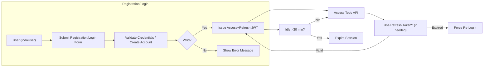
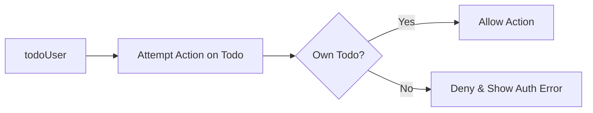

# Authentication Requirements and Permission Model for Todo List Application

## 1. Introduction
This document describes the business requirements for authentication, registration, permission management, and associated security/privacy expectations for the Todo List backend application. Its focus is on defining clearly what backend developers must build for secure, robust, and user-centric authentication using JWT, applicable session management, and permission enforcement for the 'todoUser' actor.

## 2. Authentication Flows

### 2.1 User Registration (Sign Up)
- THE system SHALL allow any individual to register for a new todoUser account using a valid email and password.
- WHEN a user submits a registration request with a duplicate email, THEN THE system SHALL prevent registration and SHALL provide a business-relevant error message.
- WHEN registration is successful, THE system SHALL automatically create an initial session for the new todoUser.
- THE system SHALL require password minimum length of 8 characters and recommend a mix of letters and numbers.

### 2.2 User Login
- WHEN a todoUser submits login credentials (email and password), THE system SHALL validate them and, on success, SHALL issue a new JWT access token and refresh token for the session.
- IF a todoUser provides invalid credentials, THEN THE system SHALL reject the login attempt and SHALL provide a business-relevant error message.
- THE system SHALL limit repeated failed login attempts to prevent brute-force attacks.

### 2.3 User Logout
- WHEN a todoUser requests to logout, THE system SHALL invalidate the current session and SHALL require a new login to regain access.

### 2.4 Password Reset
- WHEN a todoUser requests password reset, THE system SHALL provide a secure, time-limited password reset process via email.
- THE system SHALL allow todoUser to set a new password only after successful token verification.

### 2.5 Session Expiry
- THE system SHALL implement session expiration for idle users.
- WHILE a user remains inactive for more than 30 minutes, THE system SHALL invalidate their access token and SHALL require re-authentication on subsequent requests.
- THE refresh token SHALL expire after 30 days regardless of activity.

### 2.6 Token Renewal (Refresh)
- WHEN a valid refresh token is provided before expiry, THE system SHALL issue a new access token without requiring the user to re-login.
- IF a refresh token is expired or invalid, THEN THE system SHALL deny token renewal and SHALL require full re-authentication.

## 3. Permission Model

### 3.1 todoUser Abilities
- THE todoUser SHALL be able to create, view, update, mark complete, and delete only their own todo items.
- THE todoUser SHALL not access, modify, or view todos belonging to other users.
- THE todoUser SHALL have no administrative permissions or access to system-wide data or settings.
- THE JWT payload for a todoUser SHALL contain at least userId, email, and role set to 'todoUser', and SHALL NOT contain sensitive data such as passwords.
- WHEN a todoUser attempts to perform any action on another user's todos, THEN THE system SHALL deny the attempt and SHALL return a business-relevant authorization error message.

### 3.2 Permission Matrix
| Action                               | todoUser |
|-------------------------------------- |:--------:|
| Register (sign up)                   |   ✅     |
| Login                                |   ✅     |
| Logout                               |   ✅     |
| Create todo item                     |   ✅     |
| View own todo items                  |   ✅     |
| Update own todo items                |   ✅     |
| Mark own todos as complete/incomplete|   ✅     |
| Delete own todo items                |   ✅     |
| View other users' todo items         |   ❌     |
| Modify/delete other users' todos     |   ❌     |
| Administrative/system-wide actions   |   ❌     |

## 4. Security and Privacy Requirements

### 4.1 JWT Token Usage
- THE system SHALL use JWT (JSON Web Tokens) for both access tokens and refresh tokens.
- Access tokens SHALL expire after 30 minutes of inactivity (or optionally earlier if the user logs out or is deleted).
- Refresh tokens SHALL expire after 30 days, regardless of activity.
- THE system SHALL securely store JWT secret keys and SHALL NOT expose them in any client-accessible location.
- JWTs SHALL be signed using a strong cryptographic algorithm (e.g., HS256 or RS256).

### 4.2 Session and Token Expiry
- WHEN an access token expires, THE system SHALL require the user to refresh or login again.
- WHEN a refresh token expires, THE system SHALL require the user to log in again.
- IF a user is inactive past the session expiry threshold (30 min), THEN THE system SHALL end their session and SHALL require re-authentication.
- THE system SHALL invalidate all tokens upon password change or account deletion.

### 4.3 Data Privacy Expectations
- THE system SHALL NOT record user passwords in plaintext at any time.
- THE system SHALL NOT expose any confidential authentication data to other users.
- THE system SHALL NOT reveal the existence or non-existence of accounts to non-authenticated actors through registration or password reset responses.

## 5. Success Criteria and Edge Scenarios
- All requirements SHALL be implemented for only the 'todoUser' actor; no other actor types exist in this service.
- THE system SHALL comply with all requirements using only standardized authentication technologies (e.g., JWT, secure password hashing).
- THE service SHALL meet all failure and edge-case handling expectations as related to authentication, authorization, and session management. (Refer to the [Error Handling Scenarios] document.)

## 6. Mermaid Diagrams
### 6.1 Authentication and Session Flow

### 6.2 Permission Enforcement

## 7. References to Related Documents
- [Error Handling Scenarios](./06-error-handling-scenarios.md)
- [Business Rules and Validation](./09-business-rules-and-validation.md)
- [Non-Functional Requirements](./07-non-functional-requirements.md)

---
