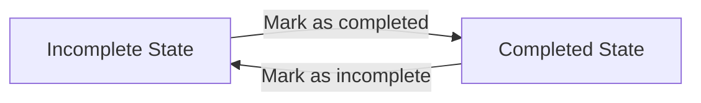

# Functional Requirements for Minimal Todo Backend Service

## Introduction
The Todo Backend Service enables registered users to create, view, update, complete, and delete their own todo items. The core philosophy is strict isolation of user data, ensuring no access between users. All features, constraints, and behaviors are implemented to deliver the minimum set of functions expected in a basic, safe, modern todo application, with a focus on clarity, robustness, and user privacy.

## Todo Management Features
- WHEN a registered user requests to create a new todo item, THE system SHALL accept a title (required) and a description (optional). The todo SHALL be associated exclusively with that user.
- WHEN a user requests to view their list of todos, THE system SHALL return only their own items, never exposing data belonging to any other user.
- WHEN a user requests details of a specific todo, THE system SHALL return details only if the todo is owned by that user; otherwise, THE system SHALL deny access and inform the user of insufficient permissions.
- WHEN a user attempts to edit a todo, THE system SHALL allow changes to the title and description only for items they own and are not deleted.
- WHEN a user wants to mark a todo as completed or incomplete, THE system SHALL toggle the state accordingly for items owned by the user.
- WHEN a user requests to delete a todo, THE system SHALL immediately and permanently remove that item from the user’s list and ensure it is irretrievable.
- WHEN a user initiates batch operations for update, completion, or deletion, THE system SHALL support up to 50 items in a single request and reject requests that exceed this batch size or contain items the user does not own.

### EARS Examples
- WHEN a user successfully adds a todo, THE system SHALL save it with the user’s identifier and an initial state of incomplete.
- WHEN a user loads their todo list, THE system SHALL present their own items ordered by most recently modified first (default behavior; users may later request different orders).
- IF a user attempts access or modification of an item not owned by them, THEN THE system SHALL prevent the action and provide a permissions error.

## Data Validation Rules
- THE system SHALL require that each todo item has a non-empty title with a maximum of 255 characters.
- WHEN a description is provided, THE system SHALL limit it to 2,000 characters.
- THE system SHALL reject requests where the title is empty, null, or consists only of whitespace, and provide an actionable error message.
- WHEN a user input for title or description exceeds its limit, THE system SHALL not create or update the item and SHALL inform the user of the length violation and the applicable maximum.
- WHEN creating or editing a todo, THE system SHALL trim leading/trailing whitespace on both title and description.

## Item State Transitions
A todo item lifecycle consists of two states: incomplete and completed. Users may switch status as needed on their own items.

- WHEN a todo is created, THE system SHALL set its state to incomplete.
- WHEN a user marks an incomplete todo as completed, THE system SHALL update its state, save the completion time, and reflect this in all future list and detail responses.
- WHEN a todo is reverted back to incomplete, THE system SHALL remove the completion timestamp and update the state accordingly.
- IF a user attempts to change the state of an item that does not exist, is deleted, or does not belong to them, THEN THE system SHALL reject the operation and explain the failure reason.

## Restrictions & Ownership
- THE system SHALL ensure users interact only with their own todos: no creation, viewing, editing, completion, or deletion of other users’ items is ever permitted.
- THE system SHALL enforce a hard limit of 1,000 active todos (not deleted) per user. WHEN this limit is reached, THE system SHALL deny further creations and guide the user to delete items before adding more.
- WHEN batch actions are performed, THE system SHALL reject the entire batch if it includes items the user doesn’t own or if the batch exceeds 50 todos.
- WHEN a todo is deleted, THE system SHALL permanently remove it with no undo, and ensure deleted items do not appear in any API results or user interface.

## Performance & Responsiveness
- WHEN any operation is performed (create, update, delete, complete), THE system SHALL respond within 2 seconds under normal system conditions.
- THE system SHALL guarantee that changes are immediately visible to the user in subsequent list or detail queries, ensuring a real-time experience.

## Error Scenarios & Edge Cases
- WHEN a user acts on a non-existent todo (such as after deletion), THE system SHALL return a clear item-not-found error.
- WHEN a user submits data with invalid or missing title/description, THE system SHALL return a descriptive validation error message.
- IF system faults or unexpected issues occur, THEN THE system SHALL return a generic error, maintaining user privacy and suggesting to retry later.
- WHEN a batch action includes a mix of valid/invalid or owned/unowned items, THE system SHALL reject the entire batch and specify the exact problem to the user.

## User Privacy & Security
- THE system SHALL enforce authentication for all operations; only authenticated users can access or manage todo data.
- THE system SHALL isolate all user data at the highest level—there is no shared or public visibility.
- THE system SHALL never expose any aspect of a user’s data to others, including identifiers, counts, or content, under any failure or attack scenario.

## Permissions Table
| Operation                  | User Action | Ownership Restriction | Batch Supported | System Response |
|----------------------------|-------------|----------------------|-----------------|----------------|
| Create todo                | Yes         | Yes, own only        | No              | ≤2 seconds     |
| View all todos             | Yes         | Yes, own only        | N/A             | ≤2 seconds     |
| View individual todo       | Yes         | Yes, own only        | N/A             | ≤2 seconds     |
| Edit todo                  | Yes         | Yes, own only        | No              | ≤2 seconds     |
| Mark as complete/incomplete| Yes         | Yes, own only        | Yes             | ≤2 seconds     |
| Delete todo                | Yes         | Yes, own only        | Yes             | ≤2 seconds     |

## Minimal Authentication & Actor Requirements
- THE system SHALL use authenticated user sessions for all API endpoints.
- THE system SHALL deny all unauthenticated requests with a clear authentication error message.
- Every operation SHALL check identity and data ownership before proceeding, enforcing proper permissions at each step.

## References
- See Service Overview for high-level context.
- Business rules and additional scenarios may be found in related requirements documents.
