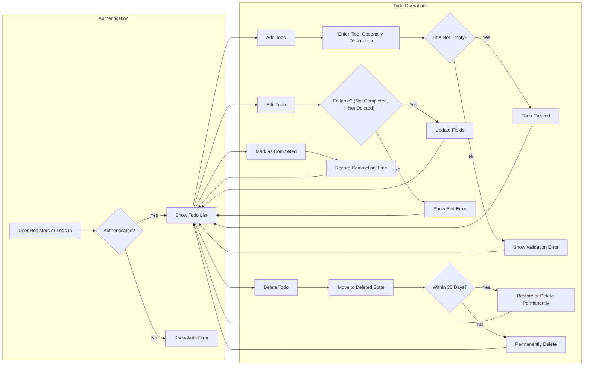

# Todo List Application: Business Requirements Analysis

## 1. Purpose and Context
The Todo List Application is designed to allow individual registered users to efficiently manage their personal tasks. The service keeps the interface and operations minimal, offering only the most essential todo management features in line with user expectations for simplicity, privacy, and reliability. All business logic focuses on supporting productivity, personal organization, and user data privacy. User actions are conducted strictly under authenticated sessions for every feature, ensuring tasks are secure and only visible to their owner. Each feature below is defined in natural business language to support clear backend design and remove ambiguity for developers.

## 2. User and Actor Definitions
- **User**: A registered individual who manages their own list of Todos. Users must authenticate with email and password before accessing any functional features.
- There are no other actors in this application.

## 3. Functional Requirements (Minimal Viable Scope)
- A user SHALL be able to register using an email address and password. WHEN registration is requested, the system SHALL create a new user if fields are present and valid, rejecting registration with missing or invalid entries (EARS).
- A user SHALL log in using their credentials, and WHEN authenticated, SHALL access their list of Todos within 2 seconds for lists up to 100 items.
- A user SHALL be able to create a Todo by providing at minimum a non-empty title, with optional description/notes.
- THE system SHALL NOT allow creation of Todos with empty or missing titles. WHEN a user submits an invalid Todo, the system SHALL provide a clear validation error.
- A user SHALL view their own, non-deleted Todo items, sorted by creation or completion status. WHEN a login is performed, the entire Todo list SHALL be delivered immediately after authentication.
- A user SHALL be able to update the title or description of a Todo, except for Todos marked as completed or deleted.
- WHEN editing, THE system SHALL enforce field validation: title required, description up to 1,000 characters.
- A user SHALL mark a Todo as completed, causing the system to record the completion date and render the Todo uneditable except for undoing completion or deletion.
- A user SHALL delete a Todo, causing the system to move it to a 'deleted' state (not full erasure). Deleted Todos SHALL be restorable for up to 30 days; after this, THEY SHALL be permanently removed.
- WHEN a user requests to restore a deleted Todo within 30 days, THE system SHALL return it to the active list.
- The system SHALL NOT allow one user to view, edit, or delete another user's Todos for any reason.
- WHEN any error occurs (e.g., authentication fails, invalid data submitted), THE system SHALL return a clear, actionable error message within 2 seconds.

## 4. User Business Workflow
### Main User Flow Narrative
When a new user arrives, they access the registration page and provide email and password. After successful registration, they log in to access a personal task dashboard. Creation of a Todo always prompts for a non-empty title; an optional description provides extra context. Todos are listed and grouped by status (active, completed, deleted), and only the authenticated user's items are shown. Editing is restricted to non-completed, non-deleted Todos. Deletion moves the Todo to a recoverable trash for 30 days, supporting the user in accidental delete cases. Completion status marks a Todo as read-only (except undo/delete). Session management ensures re-authentication is required if the user's session expires.

### Business Workflow Diagram

## 5. Requirement Matrix in EARS Format
- WHEN a user submits registration, THE system SHALL create a user with valid email & password, and SHALL reject incomplete fields.
- WHEN a user logs in, THE system SHALL authenticate and present their Todo list within 2 seconds.
- WHEN a user creates a Todo, THE system SHALL require non-empty title and optionally description, rejecting invalid requests.
- WHEN a user updates a Todo, THE system SHALL only permit if not completed or deleted, validating fields.
- WHEN a Todo is marked as completed, THE system SHALL record date and disable editing.
- WHEN a Todo is deleted, THE system SHALL move to deleted state, restorable for 30 days; after, permanently erase.
- WHEN a user tries to access another's Todo, THE system SHALL deny and log the attempt.
- WHEN session expires, THE system SHALL require re-authentication to proceed.
- WHEN errors occur (invalid login, validation, unauthorized access), THE system SHALL return actionable error messages within 2 seconds.

## 6. Authentication, Permissions, and Security
- All actions require authentication—user must log in successfully to access, manage, or view Todos.
- Session tokens SHALL be used to maintain authentication; sessions auto-expire after timeout or on logout.
- All Todos are visible and modifiable only by their owner; cross-user access is strictly forbidden by business rule.
- All error cases (invalid token, failed validation, unauthorized action) trigger a clear error in natural language.
- Recovery from deleted state is only possible by the owner, within 30 days.

## 7. Non-Functional Requirements
- THE system SHALL respond to authenticated user actions within 2 seconds in normal load (lists up to 100 Todos).
- All validation errors SHALL include clear, user-friendly messages.
- Unauthorized actions SHALL be denied and logged for audit.
- System SHALL guarantee users never see or alter others' data.
- Data modifications SHALL appear instantly in user view upon action.

## 8. Summary and Constraints
The Todo List application defines only the minimal essential business workflows: register, login, manage personal Todos (create, edit, complete, delete, restore). No features outside strict single-user scope are in scope. All requirements are set out in EARS format to maximize clarity and enforceability for backend implementation. User privacy and ownership, reliable authentication and error feedback, and minimal latency are strictly required in all implementations.