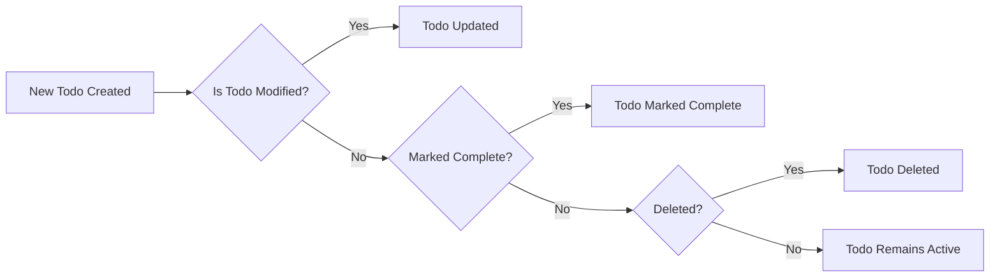
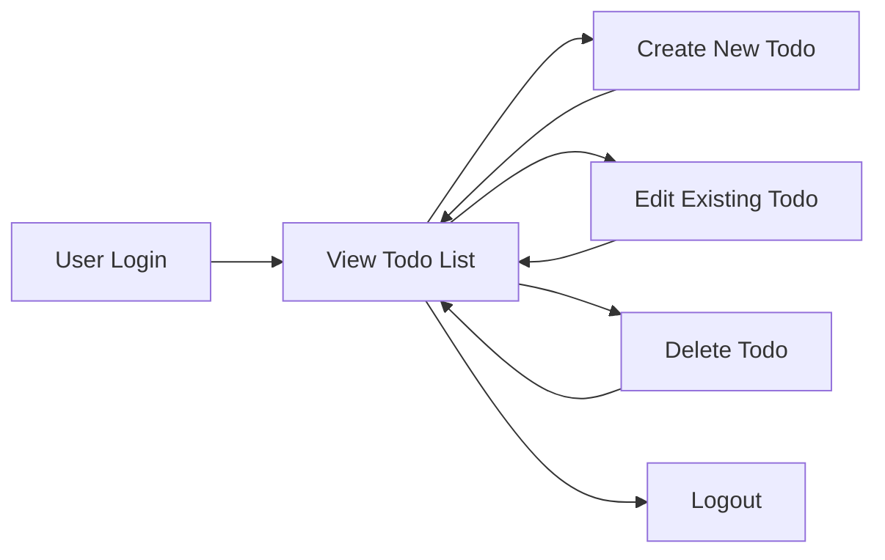

# Service Operation Overview for Minimal Todo List Application

## 1. System Overview
The minimal Todo list application enables a single user (role: user) to manage personal tasks securely, with authentication enforced at every interaction. The system avoids any non-essential features and focuses on the core business purpose: allowing a user to track, update, and remove their own tasks reliably. Each user operates in isolation, and no collaboration or advanced feature set is included.

- Only one user role exists: "user". All operations are self-service for this role alone.
- No priorities, labels, deadlines, or sharable lists are supported.
- Simplicity and reliability are prioritized for all main process flows.

## 2. Main Features

| Feature              | Business Description                                        |
|----------------------|-----------------------------------------------------------|
| User Signup/Login    | Users register and authenticate before using the service  |
| View Todos           | Users see a list of all their Todos                       |
| Add Todo             | Users add a single Todo with required text content        |
| Edit Todo            | Users update the text or completion flag of their Todos   |
| Delete Todo          | Users remove their Todos permanently                      |

The business model limits features strictly to those above. All other feature requests are out of scope for minimal Todo list operation.

## 3. Business Processes

### Todo Lifecycle
Each Todo is created by its owner. Only the creator (authenticated user) can view, edit, complete, or delete the Todo.

Process Steps:
- Todo Creation: User submits text; system validates content is non-empty.
- Viewing: User requests list; returns only own Todos in most-recent or last-edited order.
- Editing: User updates text or toggles "complete"; only own Todos can be updated.
- Deleting: User issues remove request; Todo disappears from their list instantly.

#### Mermaid State Diagram

### Authentication Process
- Users must log in or register to use any feature.
- Every feature, including viewing, requires re-verification of user identity (active session).
- No unauthenticated access is possible.

### Data Consistency and Security
- User actions immediately reflect in the service’s state.
- Each operation strictly verifies ownership before mutating any data.

## 4. Primary User Flows

### End-to-End Minimal Journey
1. Signup/Login: User creates an account or signs in using credentials.
2. View Todos: After login, user is shown current tasks; if empty, an empty state appears.
3. Add Todo: User adds a new Todo (must have non-empty text); it immediately appears in list.
4. Edit Todo: User modifies content or toggles completion; changes are saved instantly.
5. Delete Todo: User removes a Todo; list reflects the removal at once.
6. Logout: User logs out, ending access to all operations until re-authenticated.

#### Mermaid Flow Diagram

## EARS Requirements Summary
- WHEN a user is not authenticated, THE system SHALL not display, create, edit, or delete any Todos.
- WHEN a user is authenticated, THE system SHALL allow full CRUD only for that user's own Todos.
- WHEN a Todo is created, THE system SHALL require the content field to be non-empty.
- WHEN a Todo is edited or deleted, THE system SHALL check user ownership before any change occurs.
- IF a user attempts to act upon another user's Todo, THEN THE system SHALL reject the request and show a standard access error.
- WHILE a user’s session is active, THE system SHALL persist all Todo updates instantly.

## References
Further details are available in the [Functional Requirements Document](./05-functional-requirements.md) and [Business Rules and Validation](./07-business-rules-and-validation.md), which expand on each operation and edge-case validation.