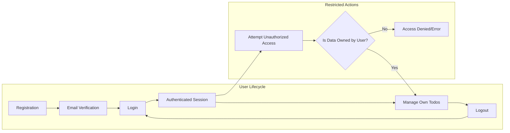

# User Actors and Permissions Specification for Todo List Application

## 1. Actor List and Descriptions

The Todo List application is strictly a personal task management service with user authentication. Only one end-user actor exists:

- **user**: An authenticated individual, registered with a unique email address and secure password, capable of managing their own todo items. The user role is limited solely to self-management; no administrative, guest, or observer roles are supported. Each user's data is strictly segregated and isolated by system policy. No access to other users' information or tasks will ever be allowed, under any circumstance.

## 2. Authentication Requirements

- All operations, except user registration, initial login, and password reset request, require the user to be authenticated with valid credentials and a confirmed account status.
- Registration demands a unique, legitimate email and password (minimum 8 characters, at least one letter and one number).
- Upon registration, the system SHALL dispatch an email verification link. The account remains inactive and cannot be used until verification is complete.
- Duplicate or disposable/fake email addresses SHALL be rejected. Registration must clearly explain the reason for rejection if validation fails.
- Password reset is managed via secure, expiring (60-minute) email link. No information leakage about account existence is permitted under any condition; error messages do not indicate whether an email is valid.
- JWT (JSON Web Token) access tokens valid for 15 minutes, and refresh tokens valid for 14 days, SHALL be issued on every successful login. All tokens are globally invalidated on logout, password reset, or account deletion.
- All login sessions and significant security events IF occurring SHALL be fully auditable for compliance, security review, and debugging.
- WHEN any unauthenticated person attempts to access or perform any todo-related action, THE system SHALL require successful login first.
- WHEN a new user submits valid registration details, THE system SHALL create a pending user record, email verification, and restrict usage until verified.
- WHEN a user logs in, THE system SHALL validate the credentials, issue access/refresh tokens, and log the session.
- WHEN a user requests password reset, THE system SHALL email a secure, time-limited reset link and allow password update via this mechanism.
- WHEN a user resets their password, THE system SHALL immediately revoke all tokens, log out all sessions, and require login for future use.
- IF a login attempt fails, THEN THE system SHALL display a generic error message and log the event for security.
- WHEN a user initiates account deletion, THE system SHALL irreversibly erase all user data, including todos, tokens, and session data.
- IF a registration is attempted with an already used, disposable, or forbidden email, THE system SHALL return a clear, user-friendly rejection reason.

## 3. Registration & Login Process

- Registration is open: anyone with a compliant email and password may attempt to register.
- Upon registration, an email verification link is dispatched, and access is fully blocked until completion.
- Upon duplicate or non-compliant email entry, detailed but non-leaking error messages are provided.
- After 5 unsuccessful login attempts within a 30-minute window, the account is locked for 15 minutes, or password reset is enforced.
- All password reset flows use a 60-minute expiring link, and system responses never reveal account presence or absence.
- Any credential change or account deletion triggers global, immediate token and session revocation.

## 4. Permission Matrix

| Action                                      | user |
|---------------------------------------------|------|
| Register account                            | ✅   |
| Login/log out                               | ✅   |
| View own todo items                         | ✅   |
| Create a new todo item                      | ✅   |
| Update own todo item (content, status, etc) | ✅   |
| Mark todo as complete/incomplete            | ✅   |
| Delete own todo item                        | ✅   |
| View/modify/delete another user’s todo      | ❌   |
| Initiate password reset                     | ✅   |
| Change password                             | ✅   |
| Delete own account and all data             | ✅   |
| Attempt any action while unauthenticated    | ❌   |
| Attempt privileged/admin actions            | ❌   |

- Each user can only view and manipulate their own data; no operation permits access to any other user's tasks or information. Attempts to do so are always denied, with business errors that do not reveal any details of others' existence.
- The minimum product includes no other actors, roles, or business permissions beyond self-management.

## 5. EARS-Based Business Requirements

- THE system SHALL enforce that each user can act only on their own records and cannot interact with or view others’ data.
- WHEN a user requests any read, update, or delete action for a todo item, THE system SHALL check and confirm that the item belongs to the requesting user before proceeding; IF not, access is denied.
- IF a user attempts ANY restricted or forbidden operation (including but not limited to privilege escalation, cross-user access, or unauthenticated actions), THEN THE system SHALL reject the attempt with a clear, actionable business error and SHALL NOT reveal anything about other users’ existence or data.
- WHEN any unauthenticated request is made for task or account data, THE system SHALL redirect or require authentication/registration as a strict prerequisite.
- WHEN initiating sensitive actions (such as password reset, deletion), THE system SHALL require re-authentication and full auditing of each event.
- WHEN the user logs out, requests password reset, or deletes the account, THE system SHALL immediately invalidate all sessions and revoke every outstanding token.

## 6. Mermaid Diagram: Authentication and Authorization Flow


```

---

This requirements document, enhanced for completeness, EARS conformity, unambiguous business logic, and production-ready format, is suitable as an authoritative specification for backend implementation of the Todo List application's user actors, permissions, and authentication model.