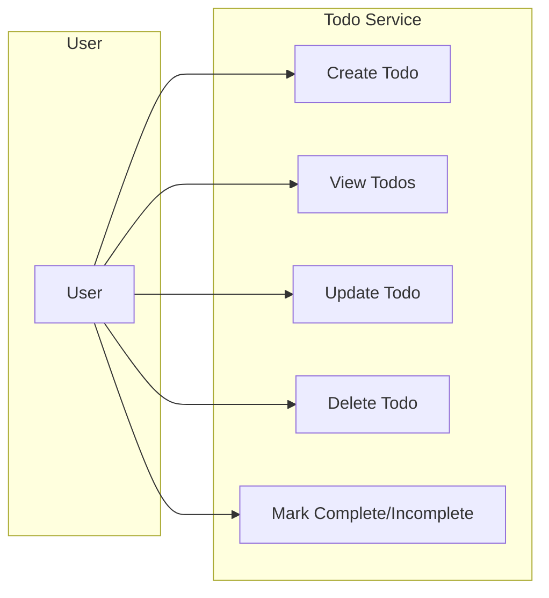

# Functional Requirements for Todo List Service

## Introduction and Context

The Todo List service provides each authenticated user with a private, minimal, production-ready environment for managing their personal tasks. The application scope is explicitly limited to only the features necessary for a basic yet robust Todo list supporting personal productivity, without collaborative or advanced functionality. No data is shared between users—each todo list is strictly private. Every requirement is formulated using Easy Approach to Requirements Syntax (EARS) for clarity, measurability, and unambiguous acceptance.

## CRUD Operations for Tasks

### Creating Todos
- WHEN an authenticated user submits a request to create a new todo item, THE service SHALL create a new todo entry associated with that user only.
- THE service SHALL require that every todo item has a non-empty title provided by the user, and this title SHALL not exceed 255 characters.
- IF the todo title is missing or empty, or longer than 255 characters, THEN THE service SHALL reject the creation and provide a user-friendly error message specifying the reason.
- WHEN a user creates a todo, THE service SHALL set its initial status to "incomplete" and record the creation timestamp in UTC.

### Viewing Todos
- WHEN an authenticated user requests to view their todo list, THE service SHALL return only the todo items created by that user.
- THE service SHALL display todos ordered by creation date in descending order (most recent first) by default, unless otherwise specified by the user.
- THE service SHALL present todos paginated, showing 20 items per page by default, unless an alternative limit (not exceeding 100) is specified by the user.
- IF a user attempts to view todos without an active authenticated session, THEN THE service SHALL reject the request with an authentication error.

### Updating Todos
- WHEN an authenticated user submits a request to update a todo, THE service SHALL update the todo if and only if it belongs to that user.
- THE service SHALL allow the updating of the title and an optional description (up to 1,000 characters).
- IF the updated title is empty or exceeds 255 characters, THEN THE service SHALL reject the update and provide a precise error message.
- IF a user attempts to update a todo that does not belong to them, THEN THE service SHALL reject the operation and inform the user that the todo is inaccessible or non-existent.
- THE service SHALL record the last modified timestamp in UTC upon every successful update.

### Deleting Todos
- WHEN an authenticated user requests deletion of a todo, THE service SHALL permanently remove that todo if and only if they are its owner.
- IF a user attempts to delete a todo item not owned by them, THEN THE service SHALL reject the request and return an authorization error.
- Upon successful deletion, THE service SHALL provide confirmation to the user and remove the todo from all subsequent queries.

## Completion Tracking

- WHEN a user marks a todo as complete, THE service SHALL update the todo's status to "complete" and set a completion timestamp in UTC.
- WHEN a user reverts a completed todo to "incomplete," THE service SHALL update the status and clear the completion timestamp.
- THE service SHALL allow users to filter their todo list to show only "complete" or only "incomplete" items.

## Ordering and Filtering

- THE service SHALL provide ordering options by creation date (newest or oldest first) and, where applicable, by completion date.
- THE service SHALL support filtering todos by completion status ("complete" or "incomplete") and return paginated results.
- All results SHALL be filtered and ordered only within the scope of the authenticated user's own items—no cross-user data ever appears.

## Input Validation Rules and Business Constraints

- THE service SHALL validate that each todo has a non-empty title (max 255 characters) and, if provided, a description of no more than 1,000 characters.
- IF input exceeds these limits or required fields are missing, THE service SHALL reject the operation with a clear explanation.
- THE service SHALL restrict access to CRUD operations so that only the authenticated user can access their own data.
- IF a user attempts to access, update, or delete a todo item not belonging to them, THEN THE service SHALL reject the operation and notify the user of the authorization violation.
- All error messages SHALL be clear, actionable, and non-leaking (no sensitive data is revealed).
- THE service SHALL enforce authentication on every API endpoint—no operation is permitted for unauthenticated requests.

## Out of Scope

- No collaborative, sharing, group, or delegation features exist—all data is strictly personal and private.
- No recurring, reminder, or notification functionalities are included.
- No categories/tags, priorities, or reordering of items beyond basic ordering by date.
- No soft deletion—removal is permanent.

## Functional Requirement Traceability Table

| Feature               | EARS Reference / Description                                                      |
|-----------------------|----------------------------------------------------------------------------------|
| Create Todo           | WHEN a user submits a new todo, THE service SHALL create it for that user         |
| View Todos            | WHEN a user requests their todos, THE service SHALL return only their own items   |
| Update Todo           | WHEN a user updates a todo, THE service SHALL allow it only if they own that todo |
| Delete Todo           | WHEN a user deletes a todo, THE service SHALL remove it only if they own it       |
| Mark Complete         | WHEN a user marks as complete, THE service SHALL record status and completion date|
| Mark Incomplete       | WHEN a user reverts completion, THE service SHALL clear completion timestamp      |
| Ordering/Filtering    | User SHALL be able to order/filter within own items only                          |
| Input Validation      | All fields SHALL be validated for content, length, and requiredness               |
| Access Control        | All CRUD operations are strictly single-user, authenticated-only                  |
| Pagination            | Results are paginated for performance and usability                               |

## Mermaid Diagram: User-Task CRUD Flow

## References
- See authentication and user actor requirements for details on session management and permissions.
- Error handling rules are detailed in the exception and business validation requirements.

## Conclusion

These functional requirements, expressed in EARS format, contain all business logic necessary for a minimal, single-user Todo List application. Backend developers must implement the entire feature set as described using these requirements as the complete business specification. All technical or architectural details are left to the implementation phase; this document represents the unambiguous baseline for "what" is to be delivered.