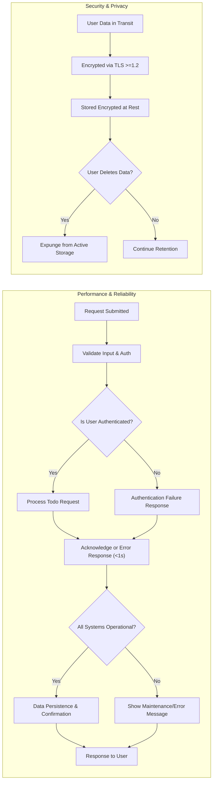

# Non-Functional Requirements for Todo List Application

## Introduction
The Todo List application is designed for users seeking an efficient, reliable, and secure way to manage personal tasks. Non-functional requirements detail the expected system qualities which guarantee a consistently positive experience for all users. Every backend application component must strictly comply with these specifications to ensure service continuity, data safety, and legal compliance under all operating conditions. Requirements below use EARS format where applicable.

## 1. Performance

### 1.1. Response Times
- WHEN a user requests any create, update, retrieve, or delete (CRUD) operation on a todo item, THE system SHALL respond within 1 second for 95% of requests under standard load.
- WHEN authentication operations (login, register, logout) are completed, THE system SHALL respond to the client within 1 second for 95% of requests.
- IF the system experiences traffic above normal thresholds, THEN THE system SHALL return a clear error message describing delays, and encourage retry after a short period.

### 1.2. Scalability
- THE system SHALL support a minimum of 10,000 registered users, each managing up to 5,000 individual todos, without degraded service.
- WHEN user or todo volume exceeds specified baselines, THE system SHALL support horizontal scaling to maintain baseline performance.
- IF users attempt more than 100 CRUD operations in any 10-second window, THEN THE system SHALL process requests with average response times below 2 seconds per operation.

### 1.3. Throughput
- THE system SHALL sustain 50 requests per second during traffic peaks with no loss in core functionality.
- IF server is running backup or maintenance jobs, THEN THE system SHALL maintain minimum 80% performance for user-facing endpoints.

## 2. Reliability

### 2.1. Availability
- THE system SHALL maintain 99.9% uptime monthly (excluding previously notified scheduled maintenance).
- WHEN maintenance is scheduled, THE system SHALL provide at least 24 hours advance notification to all users.
- IF system failure occurs, THEN THE system SHALL recover automatically within 5 minutes, or provide a meaningful error screen indicating the nature of the interruption.

### 2.2. Data Persistence and Integrity
- THE system SHALL atomically persist all CRUD operations on todos, guaranteeing no data loss during standard operation.
- WHEN users submit new or edited todos, THE system SHALL confirm data storage before acknowledging success.
- IF any write fails, THEN THE system SHALL never falsely confirm success and SHALL accurately report outcomes to users.
- THE system SHALL initiate and manage automated backups of user data at least every 6 hours, allowing recovery from latest backup within 1 hour in severe failure cases.

### 2.3. Consistency
- WHILE a user is authenticated, THE system SHALL always display the most up-to-date todo list reflecting all recent operations.
- IF two conflicting writes to the same todo occur within 1 second, THEN THE system SHALL apply a last-write-wins resolution strategy.

## 3. Usability

### 3.1. User Experience & Guidance
- THE system SHALL include informative, specific error messages for every possible user-facing error event.
- WHEN users fetch their todo list, THE system SHALL ensure todos are shown ordered by latest update time by default, but alternative sorting may be user-selectable in future releases.
- IF a user attempts unauthorized actions (modifying or deleting other users’ todos), THEN THE system SHALL specify precisely why the action is blocked.
- THE system SHALL validate email and password fields on input to enforce best-practice formatting and length with explicit message feedback.

### 3.2. Accessibility
- WHERE feasible, THE system SHALL structure API responses for compatibility with screen readers and assistive tools, supporting inclusive access for users with disabilities.
- THE system SHALL never issue responses or formats known to cause failures for accessibility utilities.

### 3.3. Session Management
- THE system SHALL allow authenticated sessions to persist for 30 days of inactivity so long as security policies are not violated.
- IF a user’s session expires, THEN THE system SHALL require re-authentication and clearly explain the need for login again due to inactivity or security.

## 4. Security & Privacy

### 4.1. Authentication and Authorization
- THE system SHALL enforce session-based or JWT authentication for all API calls beyond public endpoints, using credentials stored and validated to industry best practice standards.
- WHEN a user logs in or registers, THE system SHALL issue session or JWT tokens with strong cryptography, requiring token presence for all data-modifying requests.
- WHILE authenticated, users SHALL only view, change, or remove their own todo items—never those belonging to other users.

### 4.2. Data Privacy
- THE system SHALL encrypt at-rest and in-transit user and todo data (minimum TLS 1.2 for network transmission).
- WHEN users delete todo data or personal information, THE system SHALL remove those items from operational stores within 24 hours and schedule for erasure from backup archives at next rotation.
- IF the server detects any unauthorized access, THEN THE system SHALL log all details, alert the administrator, and forcibly expire suspect user sessions within 5 minutes.

### 4.3. Compliance and Security Hardening
- THE system SHALL comply with privacy law relevant to regions served (such as GDPR for EU), supporting personal data export or removal on demand.
- THE system SHALL apply rate limiting for authentication and sensitive endpoints (no more than 10 failed login attempts per IP per hour) to block brute-force attacks.
- THE system SHALL log every authentication event (success and failure) for at least 60 days for audit purposes.

## 5. Visual Overview: Workflow and Security

## 6. Conclusion
These non-functional requirements are essential for delivering a Todo List service that is fast, reliable, secure, usable by all, and robust under all typical business conditions. Backend engineering teams are expected to enforce every requirement, using this specification as an implementation checklist to guarantee the best possible user and business outcome.