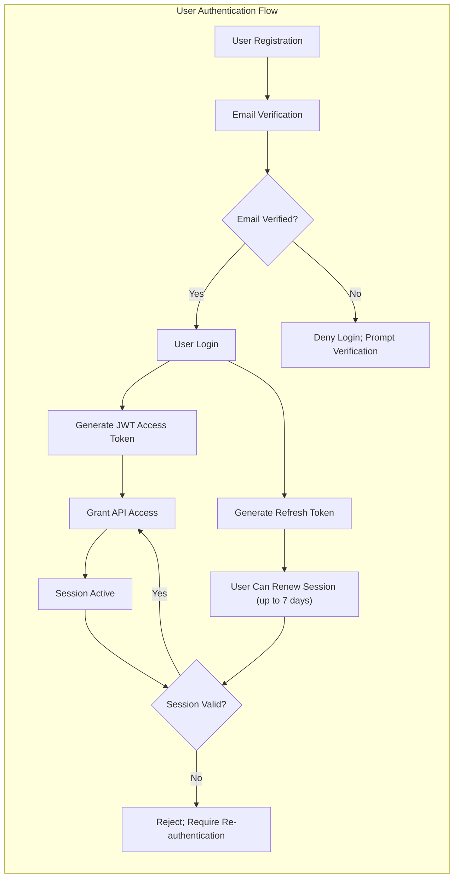

# User Actors and Authentication Requirements

## User Actor Definitions

| Actor Name | Description |
|------------|-------------|
| user       | A registered user who manages their Todo list. Users may create, view, update, or delete only their own Todo items after authenticated login. |

- All business functionality is available only to authenticated users. Guest or anonymous access is prohibited for all Todo management actions and any personal data access.
- The actor "user" is the only role in this application. There is no admin or special role; all users have identical permissions strictly limited to their own data and actions.

## Authentication Flows

Authentication is implemented via secure email/password registration and session-based JWT credentials. Users must perform all actions through authenticated API requests. Main authentication events and requirements:

- WHEN a new user registers, THE system SHALL require a unique, valid email and a strong password, and SHALL store only hashed passwords.
- WHEN a user completes registration, THE system SHALL send a verification email to validate account ownership; login is allowed ONLY after successful verification.
- WHEN a user logs in with valid, verified credentials, THE system SHALL issue a short-lived JWT access token (expires in 30 minutes) and a refresh token valid up to 7 days.
- WHEN a user presents a valid access token, THE system SHALL authorize all Todo actions strictly within that user's own scope.
- IF a user attempts to use an expired, invalid, or tampered JWT token, THEN THE system SHALL reject the request with an authentication error and SHALL NOT perform the action.
- WHEN a user requests password reset, THE system SHALL send a secure, time-limited reset link to the registered email address.
- WHEN user resets password, THE system SHALL immediately invalidate all active sessions and require re-authentication.
- WHEN a user logs out, THE system SHALL treat the client token as revoked and invalidate refresh credentials.
- WHEN a user is inactive for more than 30 minutes, THE system SHALL require login again (token expiry).
- WHEN a valid refresh token is provided within its lifetime, THE system SHALL issue a new access token without requiring email+password authentication. WHEN the refresh token is expired, user must log in again.
- THE system SHALL NOT permit any operation with an expired, invalid, or missing token.

### Conceptual Authentication Flow

All diagram labels correctly use double quotes and valid arrow syntax for compliance.

## Permission Matrix

| Action                                   | user |
|------------------------------------------|------|
| Register with email/password             | ✅   |
| Log in                                   | ✅   |
| Log out                                  | ✅   |
| Reset password                           | ✅   |
| Create Todo item                         | ✅   |
| Read their own Todo items                | ✅   |
| Update their own Todo items              | ✅   |
| Delete their own Todo items              | ✅   |
| Access other users' Todo items           | ❌   |
| Modify other users' Todo items           | ❌   |
| Delete other users' accounts             | ❌   |
| View system logs or admin features       | ❌   |
| Revoke all sessions                      | ✅   |

- A check (✅) means permitted; a cross (❌) means explicitly forbidden. If an action is not in the table, it is forbidden by default.
- All user operations are self-contained; no actor may access or influence another actor's data or system state.

## Actor Responsibilities

#### user
- THE user SHALL manage (create, view, update, delete) only their own Todo items; no access to others’ data is permitted under any circumstance.
- THE user SHALL maintain the confidentiality of their credentials. WHEN suspicious activity occurs (such as repeated failed logins), THE system SHALL lock the account and notify the user via email.
- THE user SHALL pass a verification challenge (password, email link) for all sensitive operations, such as account deletion or email changes.
- IF user attempts to access resources not owned by them, THEN THE system SHALL reject the attempt and provide a clear, non-sensitive error message.
- THE user SHALL view a complete list of their Todos at any time, sortable or filterable by available fields.
- WHEN a Todo item is deleted by the user, THEN THE system SHALL permanently remove the item with no recovery.
- WHEN an account is deleted, THEN THE system SHALL cascade-delete all related Todos and revoke every session and token for that user identity.

## Token Management & Security

- THE system SHALL issue access- and refresh-tokens that encode userId, role, and permissions. Tokens are signed and cannot be forged or tampered with.
- IF the access token is expired or invalid, THEN the system SHALL return a 401/403 error without exposing sensitive information.
- THE system SHALL accept only valid tokens for resource access; all attempts to use expired/invalid tokens SHALL be logged for security monitoring.
- The maximum access token lifetime is 30 minutes, refresh tokens last up to 7 days for session continuity.
- WHILE the user is active and provides a valid refresh token, THE system SHALL rotate and re-issue new access tokens, but require login when refresh expires.
- IF suspicious login attempts are detected (e.g., brute force), THEN THE system SHALL lock accounts and require explicit password reset to unlock, alerting the user.
- THE user SHALL always receive clear error messages without technical details if access or authentication fails (e.g., “Invalid credentials” or “Session expired”).

## Summary

The Todo list backend supports a single actor, user, with strictly isolated data access. Authentication is robust and modern—JWT and refresh token-based for session security. All business and security flows are clearly defined and ready for production implementation, meeting the strictest EARS, completeness, and syntax standards.