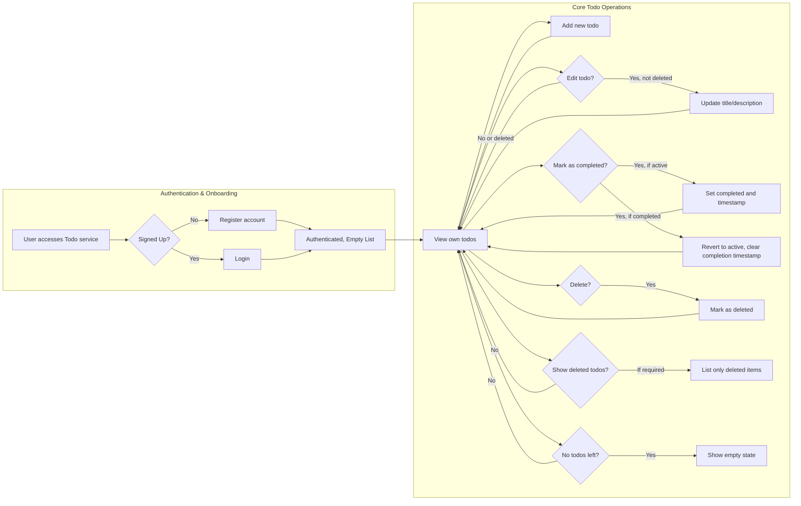

# User Journey for Todo List Application

## Introduction
The Todo List application is designed to provide users with a focused, minimal workflow for personal task management. This document describes the full business process flow from the first-time user experience through all core operations and edge cases, ensuring all requirements are business-driven, testable, and written for backend developer implementation. Only the essential features required for minimal Todo functionality are included.

## First-Time User Experience

### Onboarding and Account Creation
- WHEN a new user accesses the service, THE system SHALL present clear options for registration (sign up) and login.
- WHEN a new user chooses registration, THE system SHALL require email and a secure password (see [Authentication Requirements](./03-authentication-requirements.md)).
- WHEN registration is successful, THE system SHALL immediately authenticate the user, create an empty todo list, and present a message indicating "no tasks yet."
- WHEN a user logs in for the first time, THE system SHALL show an empty list and allow creation of their first todo immediately.

### Account Access
- WHEN a user accesses the Todo service after logging out or session expiration, THE system SHALL prompt for login credentials.
- IF an unauthenticated person attempts to access any Todo functionality or data, THE system SHALL require login (see [Authentication Requirements](./03-authentication-requirements.md)).
- WHEN authentication is successful, THE system SHALL retrieve and show only the user's own todo data, never revealing other users' information.

## Daily Workflow

### Viewing Todos
- WHEN an authenticated user accesses their home view, THE system SHALL display all their active and completed todos in descending order by creation date (most recent first).
- THE system SHALL group todos by state: active and completed. Deleted items are never shown in regular views (see [Business Rules and Validation](./09-business-rules-and-validation.md)).

### Adding a Todo
- WHEN a user creates a todo, THE system SHALL accept a mandatory title (1–100 characters, cannot be blank/whitespace) and optional description (0–500 characters; see [Business Rules and Validation](./09-business-rules-and-validation.md)).
- WHEN a todo is created, THE system SHALL assign a unique identifier, current timestamp, completion state as incomplete, and owner identity (see [Functional Requirements](./05-functional-requirements.md)).

### Updating a Todo
- WHEN a user edits a todo, THE system SHALL allow modification only of the title and description of an active or completed (not deleted) todo.
- IF a user attempts to edit a todo not owned by them, THEN THE system SHALL deny the request and show a permission error.
- IF a user tries to edit a deleted todo, THEN THE system SHALL reject the action with a business error and no change occurs.
- WHEN a todo is updated, THE system SHALL update the modification timestamp.

### Completing a Todo
- WHEN a user marks an active todo as completed, THE system SHALL set isCompleted to true and assign a completion timestamp.
- IF a user tries to complete a todo that is already completed, THE system SHALL retain the current state (no error or change).
- WHEN a user reverts a completed todo to 'active', THE system SHALL set isCompleted to false and clear the completion timestamp.
- IF a user tries to complete, uncomplete, or edit a deleted todo, THE system SHALL reject the action, showing a business error.

### Deleting a Todo
- WHEN a user decides to delete a todo, THE system SHALL set its state to deleted and remove it from the normal list view.
- Deleted todos are not shown except if a specific view for deleted items is implemented in business requirements.
- WHEN a user deletes a todo, THE system SHALL ensure that todo is never accessible or visible to the user again in regular lists.
- IF a user attempts to delete an already deleted or non-existent todo, THEN THE system SHALL show a "not found" or "already deleted" error.

### Ownership and Permissions
- THE system SHALL enforce strict ownership, so only the authenticated user can read, update, complete, or delete their own todos (see [Data Flow and Relationships](./10-data-flow-and-relationships.md)).
- IF a user attempts any action on todos not owned by them, THEN THE system SHALL reject the operation and display a permission-denied message.

## Status Transitions and Constraints

- Active → Completed: WHEN an active todo is completed, state and timestamp update
- Completed → Active: WHEN a completed todo is reverted, state updates and completion timestamp is cleared
- Any (active/completed) → Deleted: WHEN a todo is deleted, it is removed from standard user views and marked deleted
- Deleted: Deleted todos cannot be edited, completed, or reverted in any way
- No bulk deletion, bulk restoration, or editing of deleted items is supported

## Mermaid Diagram: End-to-End User Workflow

## Edge Cases, Unwanted Behaviors, and Error Handling

- IF an unauthenticated user attempts to perform any action, THEN THE system SHALL reject and require authentication.
- IF a user acts on a todo not owned by them, THEN THE system SHALL deny with a permission error and no data exposure.
- IF a user submits a blank or invalid title, or description exceeds allowed length, THEN THE system SHALL return validation error messages (see [Business Rules and Validation](./09-business-rules-and-validation.md)).
- IF a user attempts any operation (edit, complete, delete) on a todo that is deleted or does not exist, THEN THE system SHALL notify "not found" or "already deleted."
- IF a user tries to bulk delete or restore todos, THEN THE system SHALL not perform the action and may clarify this is unsupported.
- IF system session expires during any workflow, THEN THE system SHALL require re-authentication and preserve unsaved input where business-appropriate.
- IF transient backend/system errors occur, THEN THE system SHALL instruct users to retry, with no data lost or corrupted.

## Acceptance and Success Criteria

- All listed workflows and constraints must function for authenticated solo users (todoUser actor).
- No user can ever access, edit, delete, or complete another user's todos.
- Deleted todos are kept out of standard list views and are not recoverable unless a separate deleted-view feature is specified by business requirements.
- Error handling and edge cases must always be handled strictly as described, with clear, actionable business logic.
- The system SHALL never add advanced or optional features (labels, reminders, attachments, sharing, collaborations, etc.).

## References to Related Documents
- [Authentication Requirements](./03-authentication-requirements.md)
- [Functional Requirements](./05-functional-requirements.md)
- [Business Rules and Validation](./09-business-rules-and-validation.md)
- [Data Flow and Relationships](./10-data-flow-and-relationships.md)
- [Error Handling Scenarios](./06-error-handling-scenarios.md)

All requirements and processes in this document are mandatory and define the complete user journey for backend implementation of a minimal Todo List application.