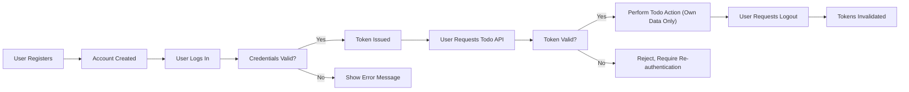

# User Role and Authentication Requirements for Minimal Todo List Application

## Introduction
This document provides a comprehensive specification for user roles, authentication processes, and session management requirements for the minimal Todo List application. The scope is business-oriented, specifying only the minimum set of permissions and flows needed to support authenticated users managing their own Todos via API. All requirements are written to remove ambiguity for backend development and follow EARS (Easy Approach to Requirements Syntax) where possible.

## User Role Definition
There is only one user role in this application: the "user" role. This role represents a registered individual who can manage their own Todo items and perform essential account operations via API. No administrative or special roles exist in this minimal version.

| Role Name | Description                                                       |
|-----------|-------------------------------------------------------------------|
| user      | Registered individual managing their own Todo items via API.       |

### Role Scope
- "user" role is assigned upon successful registration.
- Users represent real individuals with unique credentials.
- No guest or anonymous actions are permitted; all business logic assumes an authenticated "user".

## Role Permissions and Restrictions
The following matrix defines what actions a user can and cannot perform from a business logic perspective.

| Feature                               | user |
|---------------------------------------|:----:|
| Register account                      |  ✅  |
| Authenticate (Login)                  |  ✅  |
| Logout (terminate session)            |  ✅  |
| Create Todo items                     |  ✅  |
| View own Todo items                   |  ✅  |
| Edit own Todo items                   |  ✅  |
| Delete own Todo items                 |  ✅  |
| View, edit, or delete others' Todos   |  ❌  |
| Access administrative features        |  ❌  |
| Perform batch operations              |  ❌  |
| Reset password                        |  ✅  |

- Users can ONLY access and manage their own Todo resources.
- Access to any resource not created or owned by the authenticated user is strictly forbidden at the business logic level.

## Authentication Flow
The authentication process is required for all interactions with Todo resources. The requirements below define registration, login, and session management, consistently using EARS format.

### Registration and Account Creation
- THE system SHALL allow new users to register using a valid email and password.
- IF the registration email is already in use, THEN THE system SHALL notify the user of the duplication.
- IF the password does not meet minimum security criteria (minimum 8 characters), THEN THE system SHALL reject the registration with an appropriate message.

### Login
- WHEN a user submits valid credentials, THE system SHALL authenticate the user and start a new session.
- IF the user provides invalid credentials, THEN THE system SHALL deny login and present an error message without revealing whether the email is registered or not.
- THE system SHALL enforce rate limiting on failed login attempts to prevent brute force attacks.

### Password Management
- THE system SHALL allow users to reset their password via a secure email-based process.
- IF the user enters the wrong email for password reset, THEN THE system SHALL not disclose whether the email is registered, but SHALL complete the request with a generic success or failure notice.
- THE system SHALL require current password confirmation before accepting a password change request from authenticated users.

### Logout
- WHEN a user requests to logout, THE system SHALL terminate their session and invalidate their authentication token.
- THE system SHALL allow users to logout from all devices.

## Session Management and Security
- THE system SHALL use token-based authentication (e.g., JWT) for all API requests after login.
- THE system SHALL ensure each token is uniquely bound to the user identity and cannot be used to access other users’ data under any circumstance.
- THE system SHALL set a session (access token) expiration time of no more than 30 minutes after last activity.
- THE system SHALL provide a secure mechanism for refreshing expired tokens using a refresh token, valid for up to 30 days.
- IF a session token is expired or invalid, THEN THE system SHALL require the user to login again.
- WHEN a user logs out, THE system SHALL invalidate all outstanding tokens for that account if requested.
- THE system SHALL not permit any action on any Todo resource without a valid and active session.

### Security
- THE system SHALL require HTTPS for all authentication and user-related data transmission.
- THE system SHALL store user credentials securely using one-way cryptographic hashing.
- THE system SHALL implement protections against common vulnerabilities (e.g., brute force, session hijacking, token leakage).
- IF suspicious activity is detected (such as too many failed login attempts), THEN THE system SHALL temporarily lock the account and require further verification.
- THE system SHALL log all authentication-related events for audit and troubleshooting purposes.

## Flow Diagram: Authentication and Permission Process

## Summary
This document defines the sole user role, all allowed business-level actions, and all authentication/business security requirements for the minimal Todo List application. There are no additional roles or elevated permissions. All access and actions are restricted to the authenticated user's own data. 

Backend implementation is at the discretion of the development team subject to these business requirements. All technical details, including token storage, JWT claim structure, or underlying infrastructure, fall outside the scope of this document.
