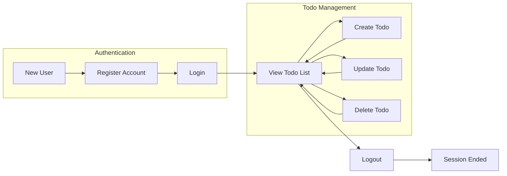
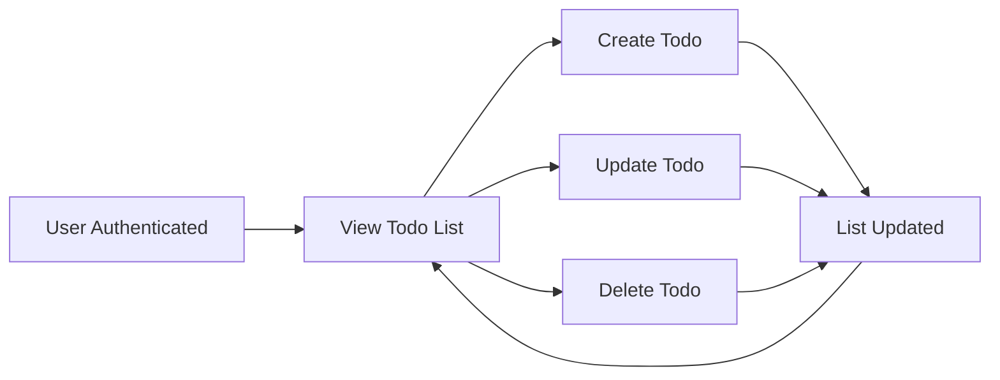
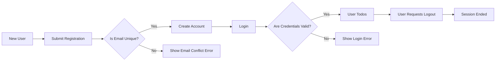
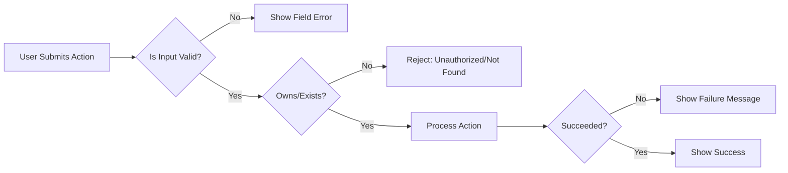

# User Scenarios for Minimal Todo List Application

## High-level User Journeys

A typical registered user progresses through the Todo List application by registering, logging in, creating, viewing, updating, and deleting only their own todos, while being strictly denied access to any other user’s data or system areas beyond their own.

### Core User Journey
A registered user creates an account with an email and password, logs in, and is immediately presented with their personal, private todo list. From this screen, the user can add new todos, review completion status of existing todos, and update or remove any task that belongs to them. Logout is always available. At every step, privacy and isolation are enforced, so no user can access or affect another’s data.

#### Mermaid Diagram: High-Level User Flow

## Core Scenarios: Create, Read, Update, Delete Todos

All required actions use EARS format for clarity and testability, applying only to the registered user actor.

### Creating a Todo
- WHEN a user submits a new todo with a valid title (non-empty text), THE system SHALL create a new todo linked only to that user.
- IF a new todo title is missing or only whitespace, THEN THE system SHALL reject creation and provide an actionable error message (e.g., "Todo title is required").
- THE system SHALL guarantee every created todo is accessible only to its creating user; sharing or assigning across users is forbidden.

### Reading Todos
- WHEN a user requests a todo list, THE system SHALL return only todos owned by that user.
- IF a user attempts to access another user’s todos, THEN THE system SHALL block access and notify the user that such action is not permitted.

### Updating a Todo
- WHEN a user edits one of their todos, THE system SHALL update the todo only if it belongs to the user and new title (if changed) is non-empty.
- IF a user tries to modify a todo that does not exist or is not owned by them, THEN THE system SHALL return an authorization or not-found error as appropriate.

### Deleting a Todo
- WHEN a user requests to delete a todo, THE system SHALL remove that todo if it’s owned by the requesting user.
- IF a user tries to delete a todo not owned by them, THEN THE system SHALL deny action and clearly indicate lack of permission.
- THE system SHALL confirm deletion is permanent, informing the user that deleted todos cannot be restored.

### General CRUD Feedback
- THE system SHALL provide clear success and error confirmation for every create, update, delete, or read action within 2 seconds.
- WHEN an operation fails, THE system SHALL display which field or action failed and how to resolve it, where possible.

#### Mermaid Diagram: CRUD Flow

## Registration and Login Scenarios

Authentication is required for todo management and all user actions, ensuring privacy and security at every step.

### Registering an Account
- WHEN a new user enters a valid, unique email and password, THE system SHALL create a new user account and allow immediate login.
- IF the email is already in use, THEN THE system SHALL reject registration and display an error indicating the conflict.
- IF the password does not meet length/complexity requirements, THEN THE system SHALL reject registration and describe the acceptable format.

### Logging In
- WHEN a registered user submits correct credentials, THE system SHALL authenticate them and display their personal todo list.
- IF credentials are incorrect, THEN THE system SHALL show a generic login error ("Invalid email or password")
- WHEN the user’s session expires, THE system SHALL require re-authentication and notify the user immediately.

### Logging Out
- WHEN a logged-in user selects logout, THE system SHALL invalidate their session and prevent access to their data until they log in again.
- THE system SHALL remove session tokens from all devices on logout everywhere action.

### Password Reset
- WHEN a user requests password reset, THE system SHALL start a reset workflow (e.g., email verification) and allow a secure new password entry.
- IF a reset is requested for an unregistered email, THEN THE system SHALL show a generic error ("Account not found or reset not possible").
- WHEN password is changed successfully, THE system SHALL immediately revoke all previous sessions, enforcing a new login.

### Session Expiry
- WHILE a user is inactive for 30 days, THE system SHALL expire the session and require login on next access.

#### Mermaid Diagram: Registration & Auth Flow

## Error/Edge Case Scenarios

All possible errors must be handled with actionable user feedback in every scenario, including but not limited to:

### Duplicate Todos
- IF a user submits two identical todos, THEN THE system SHALL allow it (no uniqueness constraint on content is enforced).

### Non-existent or Unauthorized Access
- IF a user tries to access, edit, or delete a todo that does not exist or they do not own, THEN THE system SHALL block the action with a generic not-found or unauthorized error, revealing no details about other users.

### Invalid Input
- IF a todo is submitted without required fields (e.g., blank title), THEN THE system SHALL reject and specify which fields must be fixed.

### Concurrent Modification
- IF a user attempts to update/delete a todo altered or removed elsewhere, THEN THE system SHALL notify the user their action can’t be completed (item missing/changed).

### Performance
- IF any CRUD or authentication request exceeds 2 seconds (normal condition), THEN THE system SHALL display a timeout or slow response error.

#### Mermaid Diagram: Error Recovery Flow

## Summary

All user actions and business rules are delineated so that each scenario is actionable for backend logic: strict per-user ownership, privacy, robust business-driven error handling, clearly defined journeys (registration to logout), with natural language EARS requirements and diagrams using approved Mermaid syntax throughout. No technical assumptions or UI details are included; only business processes, error feedback, and user experience outcomes are specified, compliant with the table of contents structure and project requirements.