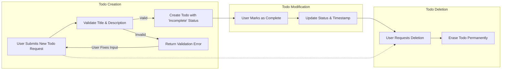

# Business Rules and Validation Specification for Todo List Service

## Todo Creation and Completion Rules

- WHEN a registered user submits a request to create a todo, THE service SHALL require a non-empty title and SHALL assign ownership to the requesting user only.
- WHEN a todo is created, THE service SHALL set its status to "incomplete" by default.
- WHEN a user marks a todo as complete, THE service SHALL update the completion status and timestamp.
- WHEN a user attempts to create a todo with only whitespace or an empty title, THEN THE service SHALL reject the request with a validation error.
- WHEN a user deletes a todo, THE system SHALL permanently remove the todo, making it inaccessible to both the user and the system.

## Title/Description Constraints

- THE title of a todo SHALL be a non-empty string with a maximum length of 255 characters.
- THE title SHALL NOT consist solely of whitespace characters.
- THE description field SHALL be optional. IF provided, THEN THE description SHALL NOT exceed 1024 characters.
- WHEN a description is omitted, THE system SHALL allow todo creation without any additional notes.
- WHEN a user attempts to provide a description with only whitespace, THEN THE service SHALL treat it as empty (null).

## Ownership and Privacy Rules

- THE system SHALL associate every todo item with exactly one user (the owner).
- WHEN a user retrieves the list of todos, THE service SHALL only return todos owned by the requesting user.
- WHEN a user attempts any operation (read, update, delete, complete) on a todo not owned by them, THEN THE system SHALL deny access and return an authorization error.
- THE system SHALL NOT allow users to access, modify, or learn the existence of other users’ todos under any circumstance.

## Duplicate Handling

- WHEN a user creates a new todo, THE system SHALL allow multiple todos with identical or similar titles or descriptions within the same account.
- THE system SHALL NOT enforce unique titles for todos from the same user; duplication is permissible for independent organization.

## Input Validation Policies

- WHEN creating, updating, or completing a todo, THE system SHALL validate all fields according to the stated constraints before processing the request.
- WHEN invalid characters (such as null bytes or control characters) are submitted for any field, THEN THE system SHALL reject the entire request with a validation error.
- WHEN a title or description exceeds the maximum allowed character length, THEN THE service SHALL reject the request.
- THE system SHALL trim leading and trailing whitespace from both title and description before validation.
- WHEN malformed or missing required fields are submitted, THEN THE system SHALL clearly indicate which field(s) and validation rules were violated.

## Data Retention and Deletion Rules

- WHEN a user deletes a todo, THE system SHALL immediately and irreversibly erase the todo from storage—no soft-delete or trash bin feature is maintained in this minimal implementation.
- THE system SHALL NOT allow recovery of permanently deleted todos by any means.
- WHEN a user account is deleted, THEN THE system SHALL also delete all associated todos permanently.
- THE service SHALL not retain logs or history of deleted todos at the business logic level.

## Mermaid Diagram: Todo Life-cycle Workflow

## Examples & Edge Cases

| Scenario                                                     | Valid? | Reason                                                      |
|--------------------------------------------------------------|--------|-------------------------------------------------------------|
| Title: "Grocery shopping"                                   | ✅     | Meets title requirement                                      |
| Title: "    " (spaces only)                                 | ❌     | Whitespace-only titles are invalid                            |
| Title: "" (empty)                                           | ❌     | Empty titles are invalid                                     |
| Description: omitted                                         | ✅     | Description is optional                                      |
| Description: 2000 characters                                 | ❌     | Exceeds maximum length                                       |
| User tries to access another user's todo                     | ❌     | Privacy restriction - forbidden                              |
| Duplicate todos with title "Read book" for same user        | ✅     | Allowed, no uniqueness constraint                            |
| Title with control characters (e.g., null byte)              | ❌     | Invalid character usage                                      |
| Deleting a todo, then querying it                            | ❌     | Ultra-hard deletion, todo not recoverable or visible         |
| User account is deleted; all child todos                     | ❌     | All associated todos are immediately purged                  |

## Error Handling

- IF a user request fails business rule validation, THEN THE system SHALL return a clear message specifying which field failed and why.
- IF a user attempts access outside their scope (e.g., other user’s todos), THEN THE system SHALL issue an explicit authorization error without disclosing any information about the target resource.
- IF input fields contain forbidden or invalid values, THEN THE system SHALL explain the specific validation failure to the requester.
- WHEN too many large or malformed requests are received in a short period, THE system SHALL respond with a rate limiting or abuse warning.

## Performance Expectations

- WHEN a user creates, updates, completes, or deletes a todo, THE system SHALL respond within 1 second under normal conditions.
- THE system SHALL process validation and ownership checks instantly to provide immediate feedback.

## Out-of-Scope Items

- THE system SHALL NOT include recurring, scheduled, or delayed-due todos in this minimal implementation.
- THE system SHALL NOT provide sharing features, comments, or collaboration between users.

---

This document defines mandatory business rules and validation criteria for the Todo list backend, ensuring correctness, security, and privacy without dictating technical implementation details.