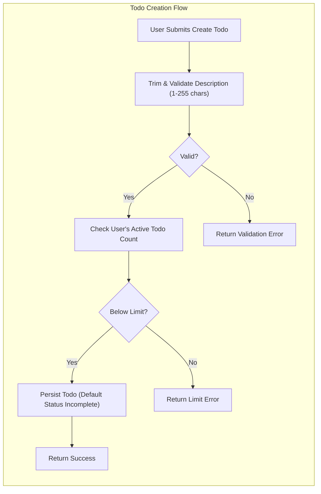
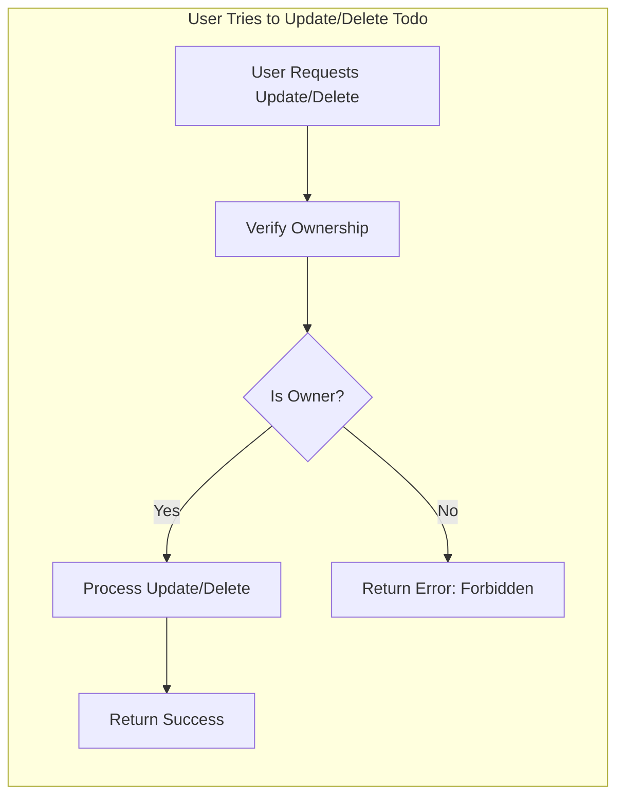
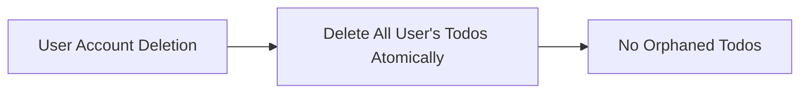

# Todo List Application Minimum Requirement Specification

## Introduction
The Todo List application is designed to enable users to manage their tasks in an efficient, straightforward manner. This document defines all the minimum essential business requirements and validation rules that must be implemented for a production-quality, scalable backend. The content below is intended to be actionable for backend developers and avoids technical specifics such as database schemas or API signatures.

## Business Requirements

### Core User Interaction
- WHEN a user registers, THE system SHALL create a unique user account record.
- WHEN a user is authenticated, THE system SHALL allow access to all permitted todo management operations for that user only.

### Todo Management
- WHEN a user creates a todo, THE system SHALL require the todo to have a description field between 1 and 255 characters (after whitespace is trimmed).
- IF a submitted todo description is empty or exceeds 255 characters after trimming, THEN THE system SHALL reject the request and return a user-friendly validation error.
- WHEN a todo is created, THE system SHALL default its completed status to "incomplete" unless explicitly specified otherwise.
- WHEN a user requests their todo list, THE system SHALL only return todos that are owned by the requesting user.
- WHEN reading, editing, updating, marking as complete/incomplete, or deleting a todo, THE system SHALL ensure the operation is permitted **only** if the todo is owned by the authenticated user.
- IF a user attempts to access or modify a todo not owned by them, THEN THE system SHALL deny the action and return an explicit authorization error message.
- WHEN updating a todo, THE system SHALL allow only the description and completed status fields to be changed. All other fields SHALL be ignored.
- WHEN a user tries to delete a todo, THE system SHALL only remove it if it exists and is owned by the user; otherwise, RETURN a clear, actionable error.
- WHEN a new todo is created, THE system SHALL automatically record both a created timestamp and a last-modified timestamp.
- WHEN a todo is updated, THE system SHALL update the last-modified timestamp automatically.
- THE system SHALL associate every todo with exactly one user.
- THE service SHALL support multiple todos per user even if their descriptions are identical.
- WHEN a user account is deleted, THE system SHALL immediately and atomically delete all todos belonging to that account (cascade delete) so that no orphaned todos remain.

### User Limits
- THE system SHALL enforce a maximum of 1,000 active todos per user.
- WHERE a user's active item count is at the maximum (1,000), THE system SHALL prevent new todo creation and return a specific, clear error message stating the user has reached their todo limit.

### Data Integrity & Operations
- WHEN operating on todos (create, update, delete), THE system SHALL guarantee atomic execution such that no partial or inconsistent states are possible.
- THE system SHALL ensure there are no orphaned todos (todos without an owner).
- WHEN auditing is enabled, THE system SHALL log all create, update, and delete actions with the responsible user’s ID and precise action timestamps.

## Error and Validation Requirements
- IF any business rule, integrity, or data validation error is violated, THEN THE system SHALL always return a clear, actionable, human-friendly error message. Technical stack traces or internal details MUST never be exposed through user-facing messages.

## Security & Authentication Requirements
- WHEN a user authenticates, THE system SHALL issue, track, and verify a session or authentication token associated uniquely with that user.
- THE system SHALL require authentication for all todo management actions.
- THE system SHALL ensure users can neither view nor manage todos of any other user by enforcing user isolation rigorously at every endpoint.

## Non-Functional Requirements (MVP-Level)
- THE system SHALL support up to 1,000 user accounts with up to 1,000 todos each with no performance degradation for basic operations.
- THE system SHALL respond to standard todo operations within 1 second for 99% of requests under expected load.
- THE system SHALL maintain data consistency at all times and prevent concurrent modification issues.

## Audit & Compliance
- WHEN user or todo data is modified or deleted, THE system SHALL record an audit trail (where auditing is enabled), including the responsible user, operation timestamp, and type of operation.
- THE system SHALL fully remove todo data for deleted users in compliance with user privacy requirements.

## Diagrams: Validation and User Operation Flows

### Todo Creation and User Limit

### Todo Operation and Ownership

### Cascade Deletion on User Account Removal

## Glossary
- **Todo**: An individual task record created and managed by a user
- **Active**: Any todo entry that is not deleted
- **Completed status**: Boolean flag indicating whether a todo is finished
- **User**: An account registered in the system uniquely identified by credentials
- **Auditing**: Process of recording actions (who did what, when) for compliance and traceability

## End of Specification