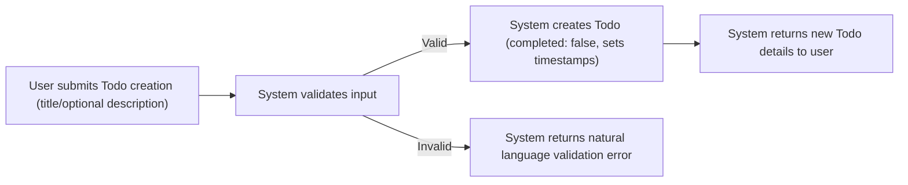
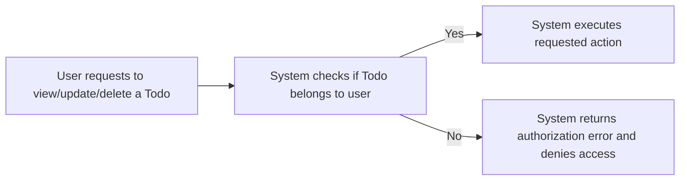
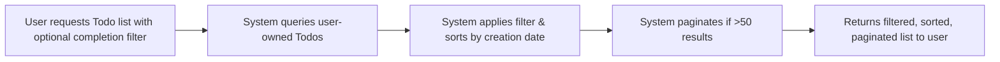

# Todo List Application Requirements Analysis

## 1. Introduction & Service Scope

The Todo List Application provides a simple, user-centric task management solution. The application is designed for individual users who need to capture, update, complete, and delete personal Todo tasks. The focus is to deliver only the minimum viable features necessary for a functional Todo experience.

**Service Scope**:
- Core: Todo creation, retrieval, update, deletion (CRUD)
- User authentication and self-access only (no shared or group tasks)
- Simple completion-tracking (finished/unfinished)
- Usable by non-technical end-users with clear error messages for all invalid actions
- Excludes complex features such as deadlines, reminders, categories, teamwork, or notifications

## 2. Key Functional Requirements

1. THE system SHALL allow each registered user to create, view, update, and permanently delete their own Todo items. 
2. THE system SHALL require successful user authentication before permitting any Todo feature access.
3. THE system SHALL prevent access to or modification of any Todo item not owned by the logged-in user.
4. THE system SHALL store for every Todo item: title (required), description (optional), completion status (boolean), creation timestamp, and last updated timestamp.
5. THE system SHALL enable users to filter their Todo list by completion status (all/completed/uncompleted) and order items by creation date, newest first by default.
6. THE system SHALL allow users to change a Todo item's completion status (completed ↔ uncompleted).
7. THE system SHALL support bulk listing: users can retrieve all their Todos in one request, with pagination if over 50 items.
8. THE system SHALL respond to any invalid, unauthorized, or malformed API request with a meaningful error message in natural language within 2 seconds.

## 3. User Actors & Permissions

### Actors:
- **User**: The sole actor in the system; represents any registered, authenticated individual. All Todos are private and only accessible to their creator.

### Permissions Matrix

| Feature                   | User (authenticated) | Unauthenticated |
|---------------------------|:--------------------:|:---------------:|
| View own Todos            |      ✅ Permitted     |       ❌        |
| Create own Todo           |      ✅ Permitted     |       ❌        |
| Update own Todo           |      ✅ Permitted     |       ❌        |
| Delete own Todo           |      ✅ Permitted     |       ❌        |
| Access others' Todos      |          ❌           |       ❌        |

## 4. Business Rules & Validation

- WHEN a user creates a Todo, THE system SHALL require a non-empty title (1–100 characters); description is optional (max 1,000 characters).
- WHEN a user attempts to update a Todo, THE system SHALL allow modification only of the title, description, and completion status; owner and creation date are system-managed and immutable.
- WHEN a user deletes a Todo, THE system SHALL make the operation irreversible and remove the item from all future queries.
- WHEN any Todo API operation is attempted without valid authentication, THE system SHALL deny access with a 401 error and clear explanation.
- WHEN a user requests their Todo list and result exceeds 50 items, THE system SHALL paginate the response and indicate total item count and current page.
- WHEN illegal access or invalid parameters are provided (e.g., empty title, too-long description, unauthorized access, editing a non-existent Todo), THE system SHALL return informative error responses specifying the requirement broken and next steps.

**Validation Table:**

| Field            | Rule                                                     |
|------------------|----------------------------------------------------------|
| Title            | Required, 1-100 characters, non-blank                    |
| Description      | Optional, up to 1000 characters                          |
| Completed        | Boolean (true/false)                                     |
| Owner            | System-managed: must be the authenticated user           |
| createdAt        | Managed by system, immutable after creation              |
| updatedAt        | Managed by system, updated on any modifications          |

## 5. Authentication & Security

- WHEN interacting with the API, THE system SHALL validate authentication using a secure token or session mechanism for every request except registration/login.
- WHEN authentication is missing or invalid, THE system SHALL respond with a rejection and a message instructing the user to log in again.
- WHEN a user is authenticated, THEY SHALL be permitted access to only their own Todo data at every API endpoint.
- THE system SHALL never expose, leak, or allow enumeration of any other user's Todo, regardless of input.
- THE system SHALL process all permitted requests within 2 seconds under normal load conditions, and log any authentication failures for monitoring.

## 6. User Interactions & Example Flows

### Todo Creation Flow

### Todo Access Authorization

### Todo Listing & Filtering

## 7. Acceptance Criteria

1. WHEN an authenticated user requests their Todo list, THE system SHALL return only Todos owned by that user.
2. WHEN a user attempts to view, update, or delete any Todo they do not own, THE system SHALL block the action and provide a clear error indicating missing permissions.
3. WHEN a new Todo is created with a valid title, THE system SHALL persist the record with completed set to false and accurate timestamps.
4. WHEN a Todo is created/updated with invalid data (e.g., missing or blank title, excessive length), THE system SHALL respond with an explicit validation error message stating the exact requirement violated.
5. WHEN a user marks a Todo as completed/uncompleted, THE system SHALL correctly update the status and updatedAt timestamp.
6. WHEN a user deletes their Todo, THE system SHALL immediately remove it from their records and prevent future access or recovery.
7. WHEN unauthenticated access is attempted, THE system SHALL reject with a 401 error and instruction to log in.
8. WHEN more than 50 Todos are requested, THE system SHALL paginate the results and include metadata for count and paging.
9. All endpoints SHALL provide success/error messages in clear, human-readable language suitable for users with no technical background.
10. All system responses SHALL execute within 2 seconds during normal operation; any slower transactions SHALL be recorded for review.

---