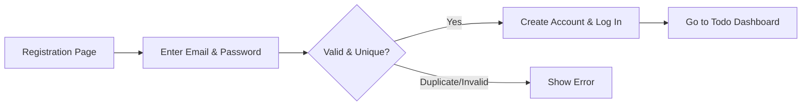
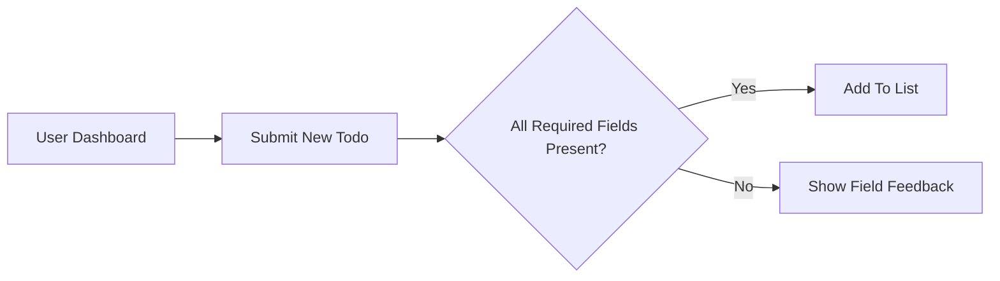
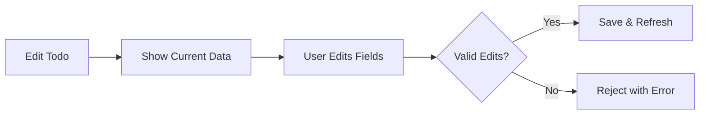
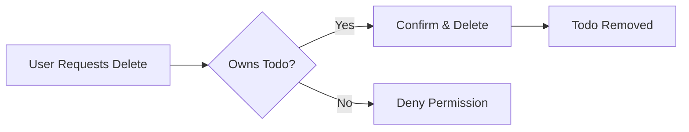

# Minimal Todo List Application Requirements

## Introduction
The Todo List application delivers the essential business functions required for managing personal tasks. Designed for maximum simplicity, its scope covers only minimal, necessary CRUD features for todos and standard authentication. The system is user-centric, providing only the basic flows needed to create, view, update, complete, and delete todos, ensuring clarity, usability, and secure process boundaries at all times.

## User Actors
- **Registered User**: Any individual who has created an account and authenticated via email and password. Full access to personal todo operations.
- **Guest (Unauthenticated Visitor)**: May only access the registration/login screens. Guests have no access to todo functionality.

## Registration and Authentication
- WHEN a visitor wishes to manage todos, THE system SHALL require registration using a valid email and password.
- WHEN registration details are submitted and valid, THE system SHALL create an account and immediately authenticate the user.
- IF registration details are invalid or email is already in use, THE system SHALL deny registration and provide a clear error message specifying the reason (e.g., duplicate email or failed validation).
- WHEN a registered user logs in, THE system SHALL verify credentials and, upon success, grant access to the user’s todos.
- IF authentication fails, THE system SHALL provide an actionable error indicating cause (invalid email, password, or other reason).
- WHEN authenticated, THE user SHALL only access, create, or manage their own todos. No user SHALL ever access or view another user’s todos.

## Creating Todos
- WHEN an authenticated user submits a new todo with required fields, THE system SHALL add the todo and display it at the top of their list.
- IF the provided todo lacks a required field (such as a non-empty title), THEN THE system SHALL reject the creation and display a specific feedback message.
- Todos are user-specific and are never visible to anyone but their creator.
- Todos SHALL default to “active/uncompleted” status on creation.

## Viewing Todos
- WHEN a registered user is authenticated, THE system SHALL display all active and completed todos that belong to them.
- THE system SHALL arrange todos in descending order by creation date, with newest first.
- WHEN a user has many todos, THE system SHALL provide paging (default: 20 todos per page) so the user always interacts with a manageable list.

## Editing Todos
- WHEN a user chooses to edit a todo they own, THE system SHALL display its current title and description for modification.
- WHEN edits are submitted with valid data, THE system SHALL save changes and update the display.
- IF attempted edits break validation (e.g., blank title), THE system SHALL reject the changes and display a clear validation message.
- IF a user attempts to edit a todo not owned by them, THE system SHALL deny the operation and provide a specific permission error.

## Marking as Complete
- WHEN a user marks their own todo as complete, THE system SHALL move it to a completed section and update its status.
- WHEN a user re-activates a completed todo, THE system SHALL restore it to the active section.
- IF a user attempts to modify the status of a todo not owned by them, THE system SHALL deny the operation and present a permission error.
- Completed tasks SHALL remain visible to their creator and may be reverted to active at any time.

## Deleting Todos
- WHEN a user chooses to delete a todo they own, THE system SHALL request confirmation and, if confirmed, remove the item from their view and the database.
- IF a user attempts to delete a todo not owned by them, THE system SHALL reject the operation and notify the user of insufficient permissions.
- Deletion SHALL be permanent and irreversible. No recovery option is provided for deleted todos.

## Business Rules and Validation
- Every todo MUST have a non-empty title. Description is optional.
- Only authenticated users can manage todos—guests CANNOT access any todo functionality.
- All operations (create, read, update, delete, mark complete) are restricted to the user’s own todos.
- Paging is enforced where the todo count exceeds 20.

## Error Handling Principles
- IF any required field is missing or fails validation, THE system SHALL provide immediate and precise feedback to the user.
- IF an operation is denied due to permissions, THE system SHALL display an explicit error stating the lack of privileges.
- WHEN internal errors occur, THE system SHALL present a generic, non-technical message and log the details for troubleshooting.

## Non-functional Requirements (Minimal)
- Response time for any user action SHALL NOT exceed 2 seconds under normal operation.
- THE system SHALL maintain at least 99% availability on a monthly basis.
- All error messages SHALL be clear and actionable.

## Security and Safeguards
- All authentication information (email, password) must be securely handled and never exposed in responses or logs.
- Every API request affecting todo data SHALL require user authentication and authorization for the specific item.
- No user SHALL access, edit, or delete another user’s data under any circumstance.
- Passwords must meet minimum complexity standards (8+ characters; letters and numbers).

## Glossary
- **Todo**: A single user-created actionable task consisting of at least a title (required) and optional description.
- **Active Todos**: Todos not yet marked as complete.
- **Completed Todos**: Todos explicitly marked as completed by the user.
- **Paging**: Limiting large lists to a manageable subset (e.g., 20 items per page).
- **Registered User**: Authenticated person proven by registration and login credentials.
- **Guest**: Unauthenticated visitor with no access to any todo data or functionality.