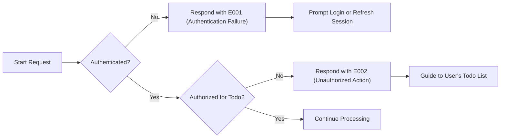
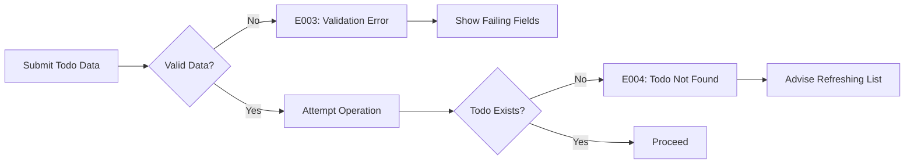
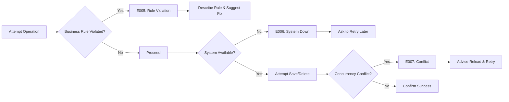

# Error Handling and Exception Scenarios for Todo List Application

## Introduction
Reliable error handling is essential for a production-grade Todo List application. The following sections document, in business language and EARS (Easy Approach to Requirements Syntax) format, the complete set of requirements for how the system SHALL respond to various business error events. All requirements are user/business-focused, actionable, and expressed to be unambiguous for backend development and subsequent testing.

---

## 1. Common Error Scenarios
Error events may arise from user actions, system limitations, business constraints, or external factors. The system is required to address at least the following error scenarios, ensuring clarity and consistency for users:

- Invalid or missing authentication (expired/absent/malformed credentials)
- Unauthorized access attempts by non-owners of a Todo
- Validation failures: Required fields missing or malformed (e.g., title, due date format)
- CRUD operations targeting nonexistent Todo items
- Violation of business rules (e.g., duplicate Todo title if forbidden, exceeding item quotas)
- System or network unavailability
- Concurrency conflicts (two users editing or deleting the same Todo simultaneously)

### Error Scenarios Reference Table
| Code | Description                      | Example Trigger                                      |
|------|----------------------------------|------------------------------------------------------|
| E001 | Authentication Failure           | No token, expired/malformed credentials              |
| E002 | Unauthorized Action              | Modifying another user’s Todo                        |
| E003 | Validation Error                 | Empty title, invalid date format                     |
| E004 | Todo Not Found                   | Update/delete of non-existent item                   |
| E005 | Business Rule Violation          | Duplicate title, over max Todos                      |
| E006 | System/Network Unavailable       | DB/network outage                                   |
| E007 | Concurrency Conflict             | Simultaneous changes to the same Todo                |

---

## 2. EARS-Format Requirements for Error Responses

- WHEN authentication is absent, expired, or invalid, THE system SHALL reject the request, returning error code E001 and a clear user message indicating login is required.
- WHEN a user attempts to access, update, or delete a Todo they do not own, THE system SHALL reject the request, respond with error code E002, and inform the user about insufficient permissions.
- WHEN a request contains missing or malformed data (e.g., empty required field, malformed due date), THE system SHALL return error code E003 and specify which field(s) failed, with actionable feedback for corrections.
- WHEN a user attempts to operate on a non-existent Todo, THE system SHALL respond with error code E004 and instruct the user to refresh their list to get the up-to-date view.
- WHEN business rules are violated (e.g., duplicate title, exceeding per-user limit), THE system SHALL return error code E005, describe the specific violation, and offer guidance to resolve (e.g., change title, remove other items).
- WHEN the backend or network is down (temporarily unavailable), THE system SHALL respond with error code E006, instruct users to retry later, and, if possible, provide an estimate for restoration.
- WHEN a concurrency conflict is detected (simultaneous update or delete), THE system SHALL return error code E007 and prompt the user to reload and reapply their change, warning about possible data overwrite.

---

## 3. User Recovery Flows

- WHEN authentication error (E001) occurs, THE system SHALL prompt re-login/session-refresh and give clear next steps, including password reset if needed.
- WHEN unauthorized action (E002), THE system SHALL clearly inform the user the operation is disallowed and guide them to their personal Todo list.
- WHEN a validation error (E003), THE system SHALL indicate the failing fields explicitly and instruct the user on correct values/formats (e.g., non-empty title, date as YYYY-MM-DD).
- WHEN a Not Found error (E004), THE system SHALL communicate item absence and suggest refreshing the Todo list.
- WHEN a business rule violation (E005), THE system SHALL state the violated rule and offer concrete steps (e.g., select different title or remove an existing Todo).
- WHEN a system/network error (E006), THE system SHALL advise to retry later and, if system maintenance is ongoing, share ETA if available.
- WHEN a concurrency conflict (E007), THE system SHALL instruct user to reload the Todo and retry change, noting risk of lost changes.

---

## 4. Error Workflows (Mermaid Diagrams)

### 4.1 Authentication & Authorization Error Flow

### 4.2 Validation & Item Existence Error Flow

### 4.3 Business Rule, System, and Concurrency Error Flow

---

## 5. Acceptance Criteria

- THE system SHALL always use unique error codes (E001-E007) for traceability and mapping.
- THE system SHALL provide explicit, human-readable error messages in every case, never exposing technical jargon.
- THE system SHALL link each error scenario to a clear user/business recovery path.
- THE system SHALL guarantee a response (even in error) within 2 seconds under normal operating conditions.
- THE system SHALL log all errors with context, supporting business analysis of system reliability and user experience breakdowns.
- THE system SHALL never return error codes outside E001-E007 scope without explicit business specification.

---

## 6. Business Considerations
- Error responses and flows must support user understanding, fast recovery, and minimal frustration even when business rules are violated.
- All requirements defined here are business-facing and must not, under any circumstances, reference underlying database, API response structures, or implementation specifics.
- The error handling strategy must be implementation-agnostic and focused solely on observable business and user-facing outcomes.
