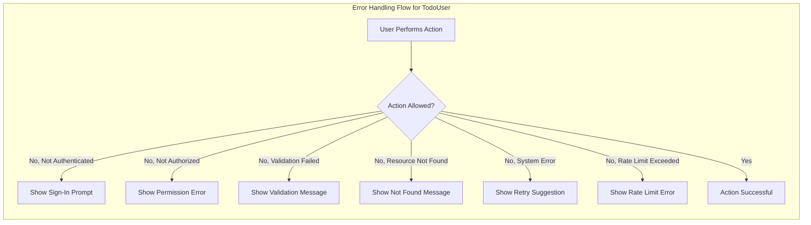

# Error Handling Scenarios and User-Facing Recovery Strategies for Todo List Application

## Error Scenarios

A robust Todo List application must anticipate and handle errors encountered by authenticated users (todoUser) during their interaction with personal todo items. The following are the primary user-facing error scenarios with requirements written in EARS format:

### 1. Authentication & Authorization Failures
- WHEN an unauthenticated person attempts any todo-related action, THE system SHALL block the request and display a message stating that sign-in is required.
- IF a user attempts to view, edit, complete, or delete a todo item owned by another user, THEN THE system SHALL deny access and inform the user that this action is not permitted.
- WHEN a user's session has expired, THE system SHALL require re-authentication and display a session expiration message.

### 2. Input Validation and Data Integrity
- WHEN a user submits a todo with missing or invalid required fields (e.g., empty title, excessively long text), THE system SHALL reject the submission and provide a clear message about the violated validation rule.
- WHEN a user attempts to update a todo with content that fails business validation rules (as defined in the [Business Rules and Validation Requirements](./09-business-rules-and-validation.md)), THE system SHALL prevent the update and specify the error condition.
- IF a user attempts to mark a nonexistent or already-completed todo as completed, THEN THE system SHALL return a clear error message indicating the action is invalid.

### 3. Resource Existence and State Errors
- WHEN a user attempts to access, update, or delete a todo that does not exist (e.g., deleted or non-existent ID), THE system SHALL return a not-found error message.
- WHILE the todo list is empty, THE system SHALL display a visual indication (e.g., empty state) and shall not treat this as a failure.
- IF a user attempts to create duplicate todos where unique constraints exist (e.g., duplicate title in a short period), THEN THE system SHALL reject the action and indicate the duplication rule.

### 4. System-Level and Operational Failures
- IF database or storage errors occur and prevent saving or retrieving todo data, THEN THE system SHALL present an error message indicating a temporary failure and recommend retrying later.
- WHEN the service is temporarily unavailable (e.g., maintenance, outages), THE system SHALL display a message explaining the unavailability and, where possible, provide an estimate for service restoration.
- IF an unexpected error or software exception occurs, THEN THE system SHALL catch the error gracefully and display a non-technical, user-friendly error message.

### 5. Rate Limiting and Abuse Prevention
- WHEN a user exceeds the allowed frequency of todo creation, update, or deletion (rate limits defined in [Non-Functional Requirements](./07-non-functional-requirements.md)), THE system SHALL reject the action and inform the user about the limit and safe retry timing.

## Business Impact of Failures

Failure scenarios in a Todo List application mainly hinder a user’s ability to effectively organize, track, and update personal tasks. Business impact includes:
- Loss of user trust due to ambiguous or unclear error messages
- Decreased engagement if errors are not clearly explained or recovery is impossible
- Increased support burden when users experience unhandled or cryptic failures

A resilient error handling model, as defined above, directly supports the business goal of providing a reliable, satisfying productivity tool for individual users and minimizes both churn and support requests.

## User Recovery Support

For each error scenario, the application must ensure user-centric recovery strategies are offered, written in EARS format:

- WHEN users encounter validation errors, THE system SHALL present actionable instructions so users understand how to fix input data (e.g., indicate maximum characters, required fields).
- IF a user’s session expires during an active workflow, THEN THE system SHALL allow the user to recover by prompting sign-in and restoring unsaved input where feasible.
- WHEN a todo action fails due to a transient system error, THE system SHALL encourage the user to retry, clearly distinguishing between permanent and temporary failures.
- WHEN access is denied for authorization reasons, THE system SHALL clarify the permission boundary without revealing sensitive information about other users or system internals.
- WHEN rate limits are reached, THE system SHALL explain the limit and, if possible, offer information about when actions may be retried safely.

## Sample Error Handling Workflow Diagram

All recovery strategies aim to maximize clarity and minimize frustration, supporting continued user engagement. Every error message and pathway must use plain language, avoid technical jargon, and offer next-step guidance where possible.

## Conclusion

The requirements set forth above prescribe explicit business and user expectations for error recognition, communication, and recovery support in the Todo List service. These requirements must guide all backend error handling design and business logic implementation, with technical details and methods determined by the development team.