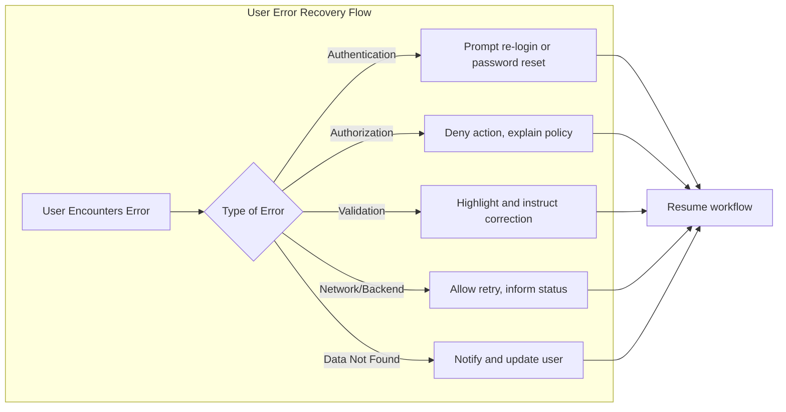

# Error Handling and User Recovery Process Requirements for Todo List Application

## Common Error Cases
Efficient error handling ensures reliable service and user trust. The error cases in the Todo List Application can be grouped into the following major categories:

| Category                | Typical Occurrences                                                     |
|-------------------------|--------------------------------------------------------------------------|
| Authentication          | Wrong email or password, expired login session, or session denial        |
| Authorization           | Attempt to modify or view another user’s todo                            |
| Validation              | Todo creation with missing required fields or invalid data length         |
| Data Access/Sync        | Failure to save, delete, or retrieve todos due to network or server error |
| System/Unexpected       | Rare backend crash, data corruption, or system downtime                  |

## Authentication Failures
Authentication incidents generally occur during login, token refresh, or access of protected actions by unauthenticated users.

### EARS Requirements
- WHEN a user submits a login request with the wrong email or password, THE system SHALL deny authentication and show an error about invalid credentials.
- WHEN a user’s authentication session expires, THE system SHALL require login again and display a notification.
- WHEN a user’s account is temporarily locked due to repeated failed logins, THE system SHALL show an explicit “locked” notification and explain when retry is allowed.
- WHEN a user tries to access their todos without being logged in, THE system SHALL block access and display a message instructing them to log in.

### User Experience
| Error Case             | Error Message                                  | Recovery Step                           |
|-----------------------|------------------------------------------------|-----------------------------------------|
| Invalid credentials   | "Login failed: Invalid email or password."     | Allow retry, show password reset option |
| Session expired       | "Session expired. Please log in again."        | Redirect to login                       |
| Account locked        | "Too many failed attempts. Try again later."   | Show time until unlock, allow retry     |
| Not logged in         | "You must be logged in to continue."           | Prompt login                            |

## Authorization Failures
All user actions are scoped to their own data, so errors occur if one tries to access or manipulate another’s data.

### EARS Requirements
- WHEN a user tries to access, edit, or delete a todo item owned by another user, THE system SHALL deny the action and provide a clear forbidden error message.
- WHEN a user attempts any action outside their permission scope, THE system SHALL block the attempt and explain the restriction.

### User Experience
| Error Case                              | Error Message                                  | Recovery Step              |
|-----------------------------------------|------------------------------------------------|---------------------------|
| Access another user’s todo              | "Access denied: You do not have permission."   | Stop action, stay on page |
| Modify another’s data                   | "You cannot modify this todo."                 | Show policy, disallow     |

## Validation Errors
A major source of user-facing errors is invalid or missing todo data.

### EARS Requirements
- WHEN a todo is created or updated without a title, THE system SHALL reject the request and explain the title is required.
- WHEN a todo description exceeds set limits, THE system SHALL deny saving and indicate the length allowed.
- WHEN a user provides data in an invalid format (e.g., unsupported characters), THE system SHALL highlight specific field errors.
- WHEN mandatory fields (e.g., due date) are missing, THE system SHALL block submission and explain requirements.

### User Experience
| Error Case                | Error Message                                 | Recovery Step                  |
|--------------------------|-----------------------------------------------|--------------------------------|
| Missing title             | "Todo title is required."                    | Highlight input, prompt entry  |
| Description too long      | "Todo description exceeds 500 characters."   | Prompt edit, prevent save      |
| Invalid format            | "Title only supports letters/numbers."       | Block submission, show example |
| Field missing             | "Due date cannot be empty."                  | Remind user, prompt input      |

## Data Access or Sync Errors
Service stability is assumed, but disruptions from connectivity or backend issues must be managed.

### EARS Requirements
- WHEN saving, updating, or deleting a todo fails due to network loss, THE system SHALL notify the user and explain the action did not complete.
- IF the server or backend is down, THEN THE system SHALL show a clear message about temporary unavailability.
- WHEN the requested todo is not found (e.g., deleted elsewhere), THE system SHALL explain that the item does not exist.

### User Experience
| Error Case                | Error Message                                         | Recovery Step                     |
|--------------------------|------------------------------------------------------|-----------------------------------|
| Network loss              | "Connection error. Please check your internet."      | Allow retry after restore         |
| Backend/service down      | "Server unavailable. Try again later."               | Permit user to retry              |
| Data not found            | "Todo not found or was deleted."                     | Remove from list, show message    |

## User-friendly Recovery Processes
The system must guide all users back to a productive state following any error.

### EARS Requirements
- WHEN authentication/token or session errors occur, THE system SHALL immediately offer login/reset steps.
- WHEN user input is invalid, THE system SHALL point out the problematic field and provide correction examples or help.
- WHEN a backend/network error temporarily halts the action, THE system SHALL provide a retry button, and, where feasible, automatically queue the user’s action for retry after connectivity resumes.
- WHEN an item no longer exists, THE system SHALL remove it from active lists and explain why.
- WHEN user is barred due to error repetition, THE system SHALL always communicate the wait time or required user action to restore access.

### Error Recovery Process Diagram

## Additional Business-aligned Error Handling Requirements
- THE system SHALL never reveal technical error details or codes to the user.
- WHEN an error is detected, THE system SHALL log a detailed internal error trace but only show user-friendly summaries to the user.
- WHEN action retry is possible, THE system SHALL make it prominent and simple.
- WHERE any persistent error blocks action, THE system SHALL propose alternate actions or helpful next steps.
- THE system SHALL always prefer data integrity to convenience, preventing any incomplete save or update on error.

## References
For further specifics on data/business rule validation, see the [Business Rules and Validation](./05-business-rules.md), and for core functional requirements see the [Functional Requirements Document](./03-requirements.md).