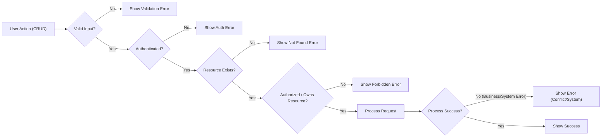

# Exception & Error Handling Requirements for Minimal Todo List Application

## Introduction
Reliable handling of errors and exceptions is critical for a Todo list backend service’s usability and trustworthiness. All error scenarios must be addressed clearly, ensuring users are always aware of what went wrong and what to do next. These requirements serve as the authoritative behavioral contract between system, users, and developers.

---

## 1. Common Error Scenarios
All features in the Todo application must implement standardized error handling logic. Requirements are written in EARS (Easy Approach to Requirements Syntax) wherever possible.

### 1.1 Authentication and Authorization
- WHEN an unauthenticated user attempts access to any feature, THE system SHALL reject the request and instruct the user to authenticate.
- WHEN a user tries to access, modify, or delete a todo item not owned by them, THE system SHALL deny the operation and inform the user of insufficient permissions.

### 1.2 Input Validation Errors
- WHEN required fields are missing on input (e.g., task name), THE system SHALL reject and identify each missing field in the response.
- WHEN input values exceed allowed limits (e.g., name too long), THE system SHALL reject and explain the constraint.
- WHEN an invalid type or format is provided (e.g., non-string task name), THE system SHALL return an error noting the correct format.

### 1.3 Resource Not Found
- WHEN a user requests a todo item that does not exist, THE system SHALL communicate that the item is not found.
- WHEN a user attempts to access a deleted todo, THE system SHALL return a not-found error and may advise a refresh or alternative action.

### 1.4 Conflict and Duplicate
- WHEN attempting to create a todo with a duplicate name (if required), THE system SHALL reject with a clear explanation.

### 1.5 Business Process Constraints
- WHEN marking an already complete todo as complete, THE system SHALL accept idempotently (no change, no error shown).
- WHEN performing disallowed operations (e.g., deleting already deleted), THE system SHALL return a contextually appropriate error.

### 1.6 System/Internal Errors
- IF a backend failure occurs (e.g., database error), THEN THE system SHALL return a generic error and suggest the user retry later.

---

## 2. User Feedback and Recovery Steps
Clarity and consistency are essential for every error case. The system must fulfill all of the following:
- SHALL supply a human-friendly error message explaining what happened.
- SHALL include a standardized error code for troubleshooting when appropriate.
- SHALL avoid disclosing sensitive or internal technical details in error responses.
- WHEN applicable, SHALL suggest specific actions for the user’s recovery (e.g., log in, correct the task name).
- IF the error is temporary/systemic, THEN SHALL suggest the user retry and internally log the condition.
- Error messages for the same root cause SHALL remain consistent across endpoints and workflows.

### Sample Error Feedback Table
| Error Scenario          | Example User Message                               | Error Code     | Recovery Guidance                    |
|------------------------|----------------------------------------------------|---------------|--------------------------------------|
| Not logged in          | You must be logged in to perform this action.      | AUTH_REQUIRED | Please log in and try again.         |
| Unauthorized access    | You do not have permission to access this todo.    | FORBIDDEN     | Use the correct account, check item. |
| Input invalid          | The task name is required and cannot be empty.     | INVALID_INPUT | Provide a valid name.                |
| Not found              | The requested todo item does not exist.            | NOT_FOUND     | Refresh or try another item.         |
| Duplicate/conflict     | A task with this name already exists.              | CONFLICT      | Use a different name.                |
| System error           | Service temporarily unavailable.                   | SYSTEM_ERROR  | Try again soon.                      |

---

## 3. Business Logic for Data Integrity
Preserving correctness and preventing unauthorized actions are essential. Requirements for backend data and concurrent requests:
- THE system SHALL ensure users cannot access, change, or delete tasks they do not own. Unauthorized attempts SHALL reveal no information about other users’ data.
- WHEN two or more requests attempt to modify the same todo simultaneously, THE system SHALL use atomic updates and return a conflict error in case of race conditions, including guidance for user resolution.
- WHILE deleting a todo, THE system SHALL confirm ownership and existence; if not satisfied, rejection and guidance must be provided.
- IF any data inconsistency or internal error is detected, THE system SHALL block user actions on corrupt records and log the issue, while communicating the appropriate message to the user.

---

## 4. Visualized Error Handling Flow (Mermaid Diagram)

---

## 5. Summary and Completion Compliance
All requirements are written in actionable natural language for developers, specifying user-facing error handling and backend enforcement with measurable acceptance criteria using EARS format standards wherever possible.