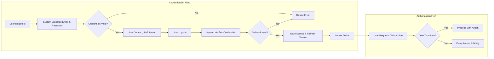

# User Actors, Permissions, and Authentication Requirements for Todo List Backend

## User Actor Definitions

The Todo List Application is designed to provide a simple, private environment for individuals to manage their personal tasks. This system maintains strict separation of user data to ensure privacy and security. Only one user actor is supported in this minimal configuration, and all business process and access control logic must reflect this single-actor design.

| Actor | Description |
|-------|-------------|
| user  | A registered and authenticated individual who can create, view, update, and delete their own todo items. Each user has a distinct, private workspace within which only their todos are accessible and manageable. |

### Actor Scope and Purpose
- The `user` actor represents any authenticated person who interacts with the Todo List backend.
- THERE SHALL be no public, administrative, or shared actor types in this minimal solution.
- All access control and isolation requirements are strictly based on the identity and ownership of todo items per user.

## Permissions and Responsibilities

### General Permissions for 'user'
- Create new todo items (tasks) within their private workspace
- View the list of their own todo items
- Edit, mark complete/incomplete, or update details of their own todos
- Delete their own todo items permanently
- Denied under all circumstances: Read, edit, update, or delete any other users' todo items

### Permissions and Access Control: EARS Requirements
- THE `user` SHALL have access only to their own todo list and todo items, and THE system SHALL treat all todo data as private by default.
- THE `user` SHALL be prevented from reading, modifying, or deleting todo items not created by themselves; IF a request targets another user's data, THEN access SHALL be denied and an error presented.
- WHEN a `user` is authenticated, THE system SHALL allow full access to todo management features for only that user's scope.
- WHEN a `user` requests to create, read, update, or delete a todo item, THE system SHALL validate ownership and SHALL NOT permit operations on items the user does not own.
- WHEN a `user` deletes a todo, THE system SHALL ensure only the owner can perform the delete action.
- IF a system detects a mismatch between authenticated user and todo item ownership, THEN access SHALL be denied, and the attempt SHALL be logged for security monitoring.
- WHEN a `user` attempts to access, modify, or delete other users’ data, THEN THE system SHALL NOT reveal any information about the existence of that data (i.e., not even its presence).

## Authentication Requirements

### Registration, Login, and Session Security
- THE system SHALL require each `user` to register using a unique email and password
- WHEN a user registers, THE system SHALL validate email for uniqueness and password complexity (at minimum 8 characters, must include letters and numbers)
- THE system SHALL enable login with email and password, and issue a short-lived JWT access token and a longer-lived refresh token upon successful login
- Access tokens SHALL expire after 15–30 minutes for security
- Refresh tokens SHALL expire in 7–30 days or on explicit logout or password change
- THE system SHALL require all authenticated actions to include a valid, unexpired access token
- THE system SHALL allow users to logout, which SHALL immediately revoke the refresh token used by that device/session
- Tokens SHALL always encode both `userId` and actor role (`user`) to support future RBAC
- THE system SHALL securely handle user sessions at all times to prevent unauthorized access or privilege escalation

### Password Recovery and Account Maintenance
- THE system SHALL support password reset functionality, performed only via the email used for registration
- WHEN a user requests a password reset, THE system SHALL verify the identity by sending a secure reset token to their email prior to allowing password changes
- WHEN a user changes their password while logged in, THE system SHALL require validation of their current password
- All password reset tokens SHALL expire after 15–30 minutes, and may only be used once

### Authentication Error Handling
- IF provided credentials are invalid at login, THEN THE system SHALL reject the login and return an explicit error
- IF an authentication attempt is made for a disabled or deleted account, THEN access SHALL be denied and an error returned
- WHEN a JWT access or refresh token is missing, invalid, or expired, THEN no protected actions SHALL be allowed, and the user SHALL be prompted to reauthenticate

## Permission Matrix

| Action                                    | user |
|-------------------------------------------|------|
| Register for an account                   | ✅   |
| Log in/out                                | ✅   |
| Create a todo item                        | ✅   |
| View list of own todos                    | ✅   |
| View, edit, or delete other users’ todos  | ❌   |
| Edit details of own todo                  | ✅   |
| Mark own todo as complete/incomplete      | ✅   |
| Delete own todo permanently               | ✅   |
| Reset password                            | ✅   |
| Change password while logged in           | ✅   |
| Use refresh/access tokens to renew session| ✅   |

All actions are scoped 100% to the authenticated user’s own data. Attempts to access data owned by another user SHALL always result in denial without disclosure.

## Mermaid Diagram: Authentication and Authorization Flow

## Edge Cases and Security Considerations
- IF two users each create a todo with the same title, THEN both SHALL be accepted, as todo ownership is always per-user
- IF a `user` attempts to guess or brute-force another's todo ID, THEN THE system SHALL ensure todo IDs are unguessable and SHALL reject any access to unowned IDs
- WHEN a refresh token is believed compromised, THEN THE user SHALL have a means to revoke all refresh tokens (sessions) for their account from within the application
- THE system SHALL at no time disclose the existence, email, or data of any other user to any requester
- WHEN session expiration or invalidation occurs, THEN the user SHALL be required to reauthenticate to continue using protected actions

## Summary

This document defines the sole `user` actor, all permissions and access boundaries, strict authentication logic, and comprehensive privacy/security requirements for a minimal Todo List backend. All business logic, authentication, authorization, and data storage must enforce these boundaries at every step, guaranteeing that all user data remains isolated, private, and secure from all other users and actors.