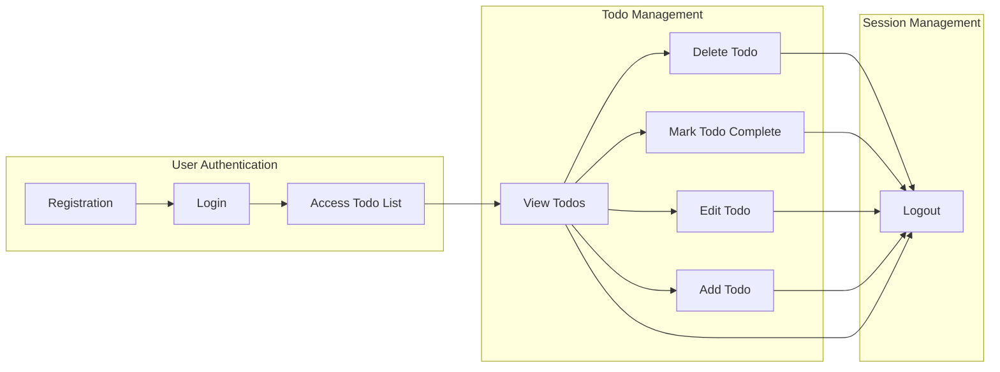

# User Journey for Minimal Todo List Application

## Typical Day-in-the-Life Scenario
A registered user with active credentials interacts with the Todo list application during a typical day to keep track of essential personal tasks. The user expects to securely log in, manage their list of Todos (including creating, viewing, marking as complete, updating, and deleting), and log out securely at the end of their session. All actions are performed individually and only impact their own data. There are no advanced or collaborative functions.

---

## Onboarding and First Use
### Registration
WHEN a new user wishes to use the Todo list, THE system SHALL provide a way to register using a unique identifier (such as email) and password. 
WHEN registration is successful, THE system SHALL create a new user account and allow immediate login.
IF registration fails (e.g., duplicate email or missing data), THEN THE system SHALL return a clear error message indicating the reason for failure without exposing technical details.

### Login
WHEN a user attempts to log in with email and password, THE system SHALL authenticate credentials and grant access to the Todo management features if valid.
IF login credentials are invalid, THEN THE system SHALL return a clear error message and not grant access.

---

## Workflow for Managing Todos

### View Todos
WHEN a user logs in, THE system SHALL display the user’s current list of Todos (if any exist) in a consistent order (most recent first).
IF no Todos exist, THEN THE system SHALL display an empty state indicating that no Todos have been created.

### Add Todo
WHEN a user submits a new Todo entry (containing, at minimum, a text description), THE system SHALL add it to the user’s list and make it immediately visible upon success.
IF the Todo entry is invalid (e.g., missing text), THEN THE system SHALL return an error and not create the Todo.

### Edit Todo
WHEN a user edits an existing Todo, THE system SHALL validate the changes and update the Todo only if the user is the creator and the data meets all requirements.
IF the updated data is invalid, THEN THE system SHALL return an appropriate error message.

### Mark Todo as Complete
WHEN a user marks a Todo as complete, THE system SHALL update the completion status so it is visually and logically distinct from incomplete Todos.

### Delete Todo
WHEN a user initiates deletion of a Todo, THE system SHALL remove the Todo from the list only if it belongs to the user. THE system SHALL confirm deletion or return an error if action is invalid (e.g., Todo does not exist or does not belong to user).

### Safety and Ownership
THE system SHALL ensure that users can view, modify, mark complete, and delete ONLY their own Todos.

---

## Logout and End Session
WHEN a user initiates logout, THE system SHALL immediately terminate the session and prevent further access to Todo management features until login occurs again.

---

## User Journey Workflow Diagram

---

## Additional Notes
- This user journey describes the absolute minimum steps required for a functional Todo list application.
- Sessions must be handled securely; all operations are scoped to individual users.
- There are no advanced features such as sharing, tagging, due dates, notifications, or subtasks in this workflow.

For a detailed breakdown of feature-by-feature requirements, refer to the [Functional Requirements Document](./05-functional-requirements.md).