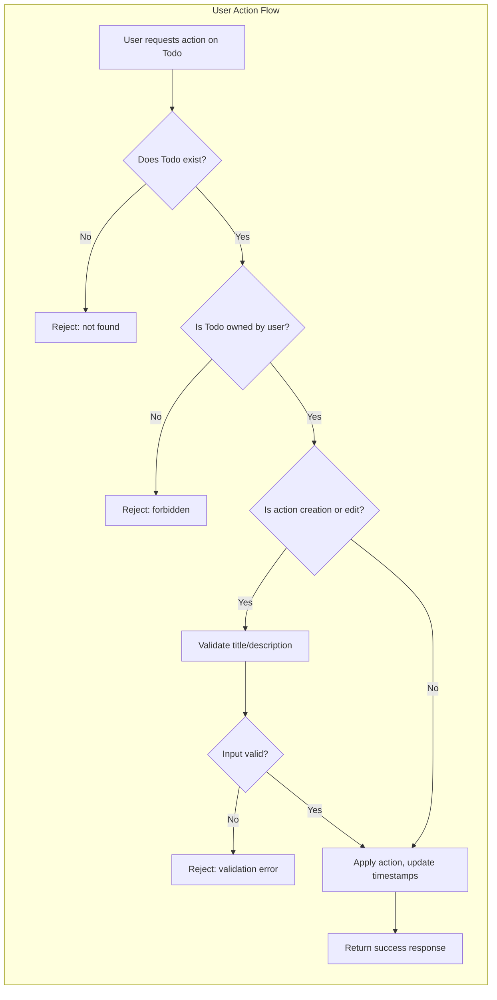

# Business Rules and Validation for Minimal Todo List Application

## Todo Creation Rules

### Data Content and Structure
- THE minimal Todo item SHALL consist of:
  - A required "title" as a concise summary of the task
  - An optional "description" field for further details
  - A completion status (boolean, defaulting to false when created)

- THE "title" field SHALL require non-empty text, and SHALL be limited to a maximum of 100 characters.
- THE "description" field, if provided, SHALL be limited to a maximum of 500 characters.
- THE completion status SHALL always be a boolean (true/false).
- WHEN a user submits a request to create a Todo, THE system SHALL associate the Todo only with that user's identity.

### EARS Format: Creation
- WHEN a user attempts to create a Todo, THE system SHALL reject creation IF the "title" field is empty or exceeds maximum length.
- WHEN a user attempts to create a Todo, THE system SHALL reject creation IF the "description" field, if provided, exceeds maximum length.
- WHEN a user creates a Todo, THE system SHALL initialize the completion status to false by default.
- WHEN a user creates a Todo, THE system SHALL record the creation timestamp for auditing purposes.
- WHEN a user creates a Todo, THE system SHALL store only the user's identity, title, optional description, completion status, and timestamps (created, updated, completed if applicable).

## Editing and Deletion Rules

### Editing Rules
- WHEN a user attempts to edit a Todo, THE system SHALL permit modifications only if the Todo belongs to the authenticated user.
- WHEN editing a Todo, THE system SHALL apply all validation rules from the creation logic (title and description).
- WHEN a user modifies a Todo, THE system SHALL update the 'last updated' timestamp.
- WHEN a user attempts to edit a non-existent or unauthorized Todo, THEN THE system SHALL deny the operation and return an appropriate error.

### Deletion Rules
- WHEN a user requests deletion of a Todo, THE system SHALL allow deletion only if the Todo belongs to the requesting user.
- WHEN a Todo is deleted, THE system SHALL permanently remove the item and all related data from that user's list.
- WHEN a user attempts to delete a non-existent or unauthorized Todo, THEN THE system SHALL deny the operation and return an appropriate error.

## Completion and Filtering Rules

### Marking as Complete/Incomplete
- WHEN a user toggles the completion status of a Todo, THE system SHALL allow this action only if the Todo belongs to the authenticated user.
- WHEN the completion status is changed, THE system SHALL update the 'completed at' timestamp (only if status is set to complete; null or removed if incomplete).
- THE system SHALL maintain the most recent state for each Todo.

### Filtering and Listing
- WHEN listing Todos, THE system SHALL return only Todos belonging to the requesting user.
- THE system SHALL support filtering by completion status:
  - WHERE a user requests to view only completed tasks, THE system SHALL return all Todos with completion status true.
  - WHERE a user requests to view only incomplete tasks, THE system SHALL return all Todos with completion status false.
  - WHERE no filter is applied, THE system SHALL return all Todos for that user regardless of completion status.

## Error States and Recovery

### Unwanted Behavior (EARS Format)
- IF a user attempts any action (view, edit, delete, toggle completion) on a Todo that does not exist or does not belong to them, THEN THE system SHALL reject the request and return a clear error indicating lack of permission or resource not found.
- IF a user submits invalid data (empty or too-long title/description), THEN THE system SHALL return a validation error with a descriptive message specifying the problematic field.
- IF a request is malformed or required parameters are missing, THEN THE system SHALL return an error indicating the missing or incorrect field.

### Recovery
- WHEN a user receives an error due to invalid input, THE system SHALL provide guidance in the error message to help the user correct it.
- WHEN an action is rejected for lack of permissions or non-ownership, THE system SHALL return an error message indicating either resource not found or access denied (to avoid information disclosure about existence of other users' data).
- WHEN a deletion or edit operation is successful, THE system SHALL return the updated list of Todos (or confirmation of deletion) to the user.

## Business Rule Summary Table

| Operation                | Rule Description                                                                                                                                   |
|--------------------------|----------------------------------------------------------------------------------------------------------------------------------------------------|
| Create Todo              | Title required, max 100 chars; optional description max 500 chars; default status = false; link only to creator                                      |
| Edit Todo                | Only owner may edit; all fields re-validated; updates timestamp                                                                                     |
| Delete Todo              | Only owner may delete; permanent removal; error if not found/not owned                                                                              |
| Toggle Completion        | Only owner may change; updates 'completed at' (if status true)                                                                                      |
| List Todos               | Only user’s own Todos visible; supports filter by completed/incomplete/all                                                                          |
| Invalid Input            | Error with field-specific message; clarifies what must be corrected                                                                                |
| Unauthorized/Not Found   | Error indicating access denied or not found, never leaks other users' information                                                                   |

## Example Business Rule Flow Chart

## Constraints and Implementation Notes
- No Todo can ever be accessed, edited, or deleted by a user other than its creator
- All state-changing actions (edit, deletion, completion) require strict owner validation
- All logic covers only essential Todo management functionality (no advanced features, no additional fields or labels, no sharing, no prioritization)
- No technical details, APIs, or data model descriptions are included — business logic only
- For further technical guidance, developers should reference the [Functional Requirements Document](./05-functional-requirements.md) and [Exception and Error Handling Scenarios](./08-exception-handling-and-error-scenarios.md)
