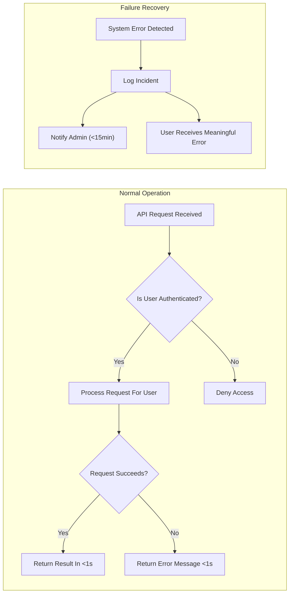

# Non-Functional Requirements for Minimal Todo List Application

## Introduction
This document specifies all non-functional requirements for the minimal Todo list backend service, based on user expectations for a private, simple, and dependable personal task manager. Requirements are stated in a clear, measurable manner, focusing on user-perceptible performance, security, privacy, reliability, and scalability expectations. Where possible, requirements are documented in EARS (Easy Approach to Requirements Syntax) format for unambiguous backend implementation.

## Performance Expectations

### Response Time
- THE system SHALL respond to all standard API requests (e.g., create, read, update, delete todo, authentication actions) within 1 second under normal operating conditions.
- THE system SHALL respond to user authentication actions within 1 second under normal conditions.
- IF the system is under heavy load, THEN THE system SHALL respond within 3 seconds for any single API request.
- THE system SHALL provide a confirmation or error message to the user in all cases within 3 seconds.
- WHERE network latency is outside the application’s control, THE system SHALL process requests internally within 0.5 seconds averaged across a 1-minute interval.

### Throughput
- THE system SHALL be able to accommodate up to 100 concurrent users without degradation in response time or reliability.
- THE system SHALL support a sustained throughput of at least 20 requests per second for basic todo and account management operations.
- WHERE user base is low or single-user, THE system SHALL optimize for lowest possible latency.

### User Experience and Feedback
- WHEN an operation is successful, THE system SHALL return success feedback in the response payload.
- WHEN an operation fails, THE system SHALL return an informative error message within 1 second.

## Security Policies

### Authentication and Authorization
- THE system SHALL require authentication via valid credentials (email and password) for any access to personal todo data.
- THE system SHALL reject and not process any unauthenticated requests to the todo endpoints.
- WHEN a user logs in, THE system SHALL issue a secure, signed JWT (JSON Web Token) as the authentication mechanism.
- WHILE a user's JWT is valid, THE system SHALL grant access only to todos owned by that user.
- THE system SHALL not allow any user to view, modify, or delete todos belonging to another user.
- IF a JWT is missing, malformed, expired, or invalid, THEN THE system SHALL reject the request and provide an authentication failure message.

### Data Protection
- THE system SHALL hash all passwords with a secure, up-to-date algorithm before storing in the database.
- THE system SHALL never store or transmit plaintext passwords.
- THE system SHALL use HTTPS for all network traffic between clients and backend servers.
- THE system SHALL not expose any secrets, password hashes, or sensitive tokens in any API response.

### Session and Token Management
- THE system SHALL expire access tokens (JWT) after 30 minutes.
- WHERE token renewal is supported, THE system SHALL use refresh tokens expiring within 30 days.
- THE system SHALL provide an immediate way for users to revoke all sessions (log out everywhere) by invalidating refresh tokens.

## Privacy and Data Handling

### Data Minimization and Collection
- THE system SHALL collect only the minimal information necessary for user authentication and todo management (e.g., email address, name, password hash, todo content).
- THE system SHALL not collect or store any analytics, behavioral tracking, or user profiling data unless explicitly required elsewhere.

### Data Access and Visibility
- THE system SHALL ensure each user's data is only accessible to that specific user.
- THE system SHALL restrict all data queries and actions to the authenticated user's scope.

### Data Retention and Deletion
- WHEN a user deletes their account, THE system SHALL permanently delete all user-associated todos and personal information within 7 days.
- WHEN a user deletes a todo, THE system SHALL remove todo data immediately and irreversibly.
- IF a user requests a data export, THEN THE system SHALL provide a full export of their todos and personal data in a commonly readable format (e.g., JSON or CSV) within 48 hours.

### Regulatory Compliance
- WHERE required by relevant privacy laws (such as GDPR or local regulations), THE system SHALL provide mechanisms for user data access, correction, and deletion upon verified request.

## Reliability and Availability Targets

### Uptime and Service Levels
- THE system SHALL maintain a monthly uptime of at least 99%.
- THE system SHALL implement automatic error recovery for transient backend or network failures, including retry logic and safe error messaging.

### Error Tolerance and Recovery
- WHEN a request fails due to system error, THE system SHALL log the incident with minimal necessary details (never including user secrets or sensitive information) and notify the development team within 15 minutes.
- THE system SHALL provide meaningful error feedback to users for all recoverable failures, avoiding cryptic or technical error codes.

### Backup and Restoration
- THE system SHALL perform automated, daily backups of all user data to a secure, access-controlled storage location.
- WHERE backup retention is possible, THE system SHALL retain daily backups for at least 7 days before automatic deletion.

## Scalability Considerations

- THE system SHALL be designed to support growth from a single user up to at least 100 active concurrent users without additional engineering.
- WHERE scaling is needed, THE system SHALL allow horizontal scaling (adding additional backend replicas) with minimal manual intervention.
- THE system SHALL maintain consistent behavior and data integrity even as the number of users or todo items grows.

## Visual Summary

## Conclusion
These non-functional requirements ensure that the minimal Todo list application delivers a secure, private, reliable, and high-performance experience aligned with user expectations. All technical implementation details, architectures, and interfaces are delegated to backend developers, who have full autonomy on how to realize these business-level requirements. For related requirement details, see the [Functional Requirements Document](./03-requirements.md) and [Business Rules and Validation Guide](./05-business-rules.md).