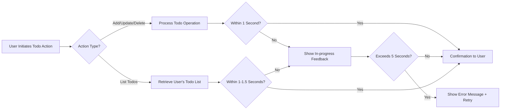

# Todo List Application – Performance and Responsiveness Requirements

## 1. Performance Targets

### 1.1 Response Times
- WHEN a user requests to view, create, edit, or delete a Todo, THE system SHALL respond within 1 second under normal operating conditions for at least 95% of transactions.
- WHEN a user loads their complete Todo list of up to 100 items, THE system SHALL deliver the result in under 1 second; for lists up to 500 items, THE system SHALL respond within 1.5 seconds.
- WHEN network latency exceeds 1 second, THE system SHALL show a visible progress indicator to inform the user of ongoing operation.
- WHEN a user creates, updates, or deletes a Todo, THE new state SHALL be reflected in their UI list within 1 second of action completion.
- THE system SHALL maintain the above response times consistently during business hours (08:00–22:00 local time) for up to 100 concurrent users.

### 1.2 Consistent Experience
- THE system SHALL ensure key operations (add, view, update, delete) for Todos are consistently fast, with no deterioration due to number of users up to defined service capacity.
- WHEN more than 100 concurrent users are active, THE system SHALL degrade gracefully and critical operations SHALL complete within 3 seconds or present an appropriate delay message to users.

### 1.3 High Throughput
- THE system SHALL process at least 10 user requests per second per user, maintaining defined speed and responsiveness for up to 100 users concurrently performing Todo operations.
- WHEN experiencing a spike up to 500 concurrent users, THE system SHALL prioritize core Todo operations over non-essential background tasks and preserve consistency for main workflows.

### 1.4 Failure and Error Feedback
- WHEN a user operation (view, add, edit, delete) takes longer than 1.5 seconds, THE system SHALL present an in-progress message or visual indicator until resolution or error is detected.
- IF an operation cannot succeed within 5 seconds, THEN THE system SHALL return a user-friendly error, explain the delay, and offer retry guidance.
- WHEN automated tests or monitoring log service times over the documented limits, THE system SHALL record these events for later review and continuous improvement.

## 2. User Experience Expectations

### 2.1 Immediate Feedback
- THE system SHALL give clear, instantaneous visual or tactile feedback for every user action: success, error, pending, or invalid actions while using the Todo list.
- WHEN operation completes, THE user SHALL immediately see updated data (new/edited/deleted Todo) or a message of successful completion.
- WHEN a user’s action is pending, THE interface SHALL visually indicate this state and update status every 2 seconds until completed or failed.

### 2.2 Consistency Across Devices
- THE system SHALL provide equivalent performance and consistency for both desktop and mobile environments, for all supported browsers and OS.
- PER business requirements, response time and feedback standards SHALL be identical regardless of interface or device.

## 3. System Load and Scalability

### 3.1 Normal Load Operation
- THE system SHALL perform to all standards for at least 100 concurrent users performing typical Todo list actions.
- WHEN under normal load, THE system SHALL maintain all defined timing, feedback, and throughput requirements.

### 3.2 Graceful Degradation
- WHEN the system is beyond capacity (e.g. >500 concurrent users), THE system SHALL warn users of expected delays, prioritize core workflows, and guarantee data integrity above performance.
- WHEN high load subsides, THE system SHALL recover and resume standard performance within 30 seconds automatically.

### 3.3 Conflict Handling and Contention
- WHEN multiple users edit, delete, or add to the same Todo list data at the same time, THE system SHALL avoid conflicts, preserve data integrity, and transparently inform users of any synchronization issues.

## 4. Comprehensive EARS-Formatted Global Performance Requirements
- THE system SHALL maintain all response, throughput, and user experience standards for every supported business workflow related to Todo management.
- WHEN users interact with their Todo lists, THE end-to-end process for add, view, update, or delete SHALL complete (with all UI feedback) within 2 seconds of action.
- IF the system cannot fulfill a user’s operation within documented time limits due to load or error, THEN THE system SHALL clearly display actionable next steps, error details, and (where appropriate) a retry option.
- WHEN user actions are blocked by backend limits, THE user SHALL see a specific explanation suitable for a nontechnical audience.
- THE system SHALL automatically monitor, record, and report all cases where performance requirements are not satisfied, to enable system operators to intervene and improve service.

## 5. Diagram – Critical Performance Flows

## 6. Business Rules and Monitoring
- All performance times refer to actual user-perceived time, including all backend and network factors.
- All requirements SHALL apply equally for mobile and web clients.
- System SHALL offer usable service at all hours, informing users of rare maintenance or downtime.
- System SHALL include monitoring features to log, analyze, and alert on any performance or reliability failures in the Todo workflow.
- System SHALL provide a means for operators to review long-duration transactions and address user complaints with accurate data.

---
These requirements set measurable targets and user experience standards for the Todo List backend, ensuring core actions always remain reliable, fast, and understandable to all users and supporting further feature growth.