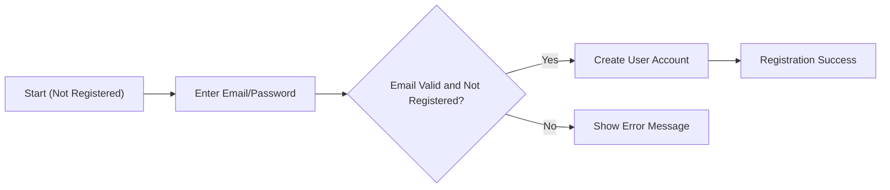
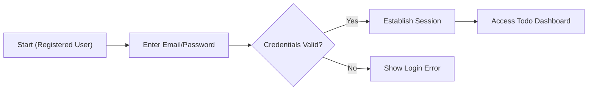
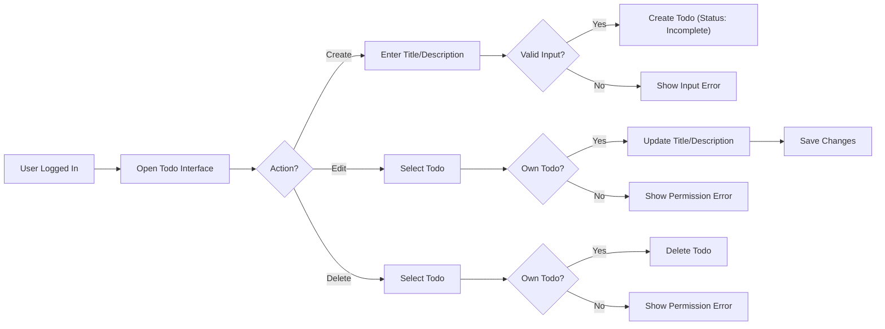
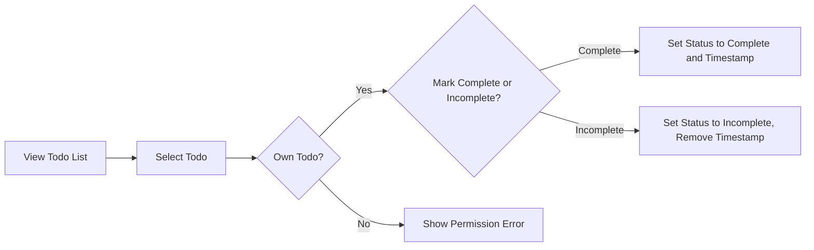

# Minimal Todo Application Requirements

## 1. Introduction
A minimal Todo application enables registered users to manage their personal todo items, including registration, login, creation, update, completion status toggling, and secure deletion. No non-essential features outside this user flow are included. All users act independently with strict isolation; there is no sharing or cross-user access under any circumstance. This document replaces all ambiguity with explicit, testable requirements.

## 2. User Actor
- There is one actor: the registered user, referred to as "user".
- THE system SHALL ensure each user can only access, view, modify, or delete their own todos.
- THE system SHALL prevent any user from seeing, affecting, or learning any details about other users’ todos.

## 3. User Onboarding and Authentication

### Registration
- THE service SHALL allow registration using only an email (validated as unique and properly formatted) and password (subject to minimum strength requirements and length).
- WHEN a new registration attempt is made, THE system SHALL verify that the email is not already registered.
- IF a duplicate email exists, THEN THE system SHALL reject the registration and notify the user about duplication.
- WHEN all details are valid, THE system SHALL create the user account, securely store the password, and confirm registration.

### Login
- THE system SHALL provide login using previously registered email and password.
- WHEN a correct login is submitted, THE system SHALL authenticate and establish a secure session, allowing access to only the user’s own data.
- IF credentials are incorrect, THEN THE system SHALL show an authentication error without revealing which field was invalid.

### Session Management
- THE system SHALL provide a logout operation, revoking the current session.
- A session SHALL expire with at least 30 days inactivity or immediately upon logout.
- WHEN a session expires, THE system SHALL require re-authentication before permitting further actions.
- IF a user attempts any action without a valid session, THEN THE system SHALL deny access and prompt the user to log in.

## 4. Todo Features and Workflow

### Creating Todos
- THE user SHALL be able to create todos, each requiring a non-empty title up to 255 characters; an optional description under 1,000 characters MAY be included.
- WHEN an attempt is made to create a todo with missing or invalid fields, THEN THE system SHALL reject it and return actionable, clear validation errors.
- THE system SHALL assign new todos to their creator as incomplete by default, with a persistent record of ownership.

### Reading Todos
- THE user SHALL view a list of all their own todos.
- THE system SHALL ensure the user’s list contains only their todos.
- IF a user requests another user’s todo (by any means), THEN THE system SHALL deny the request and present a permission error.

### Updating Todos
- THE user SHALL be able to update the title and description of any own todo.
- WHEN updating, THE system SHALL apply the same validation rules as during creation.
- THE system SHALL update only fields included in the input request (no overwriting omitted properties).
- IF a user attempts to update a todo not belonging to them, THEN THE system SHALL deny the request and display a permission error.

### Deleting Todos
- THE user SHALL be able to delete any of their own todos.
- WHEN a delete is requested, THE system SHALL verify ownership before making any change.
- WHEN deletion is valid, THE system SHALL immediately remove the todo from the user’s list and ensure recovery is not possible through ordinary means.
- IF a user tries to delete a todo belonging to someone else, THEN THE system SHALL present a permission error and deny the operation.

### Marking as Complete or Incomplete
- THE user SHALL toggle the completion state (complete/incomplete) of their own todos.
- WHEN marking a todo as complete, THE system SHALL record the change along with a timestamp.
- WHEN marking as incomplete, THE system SHALL unset the completed timestamp.
- IF a user tries to change status of someone else’s todo, THEN THE system SHALL deny the attempt and present a suitable error.

## 5. Permission, Isolation, and Security
- THE system SHALL enforce strict access: no user, under any condition, may view, edit, or delete todos belonging to another user.
- WHEN any action is attempted on a todo not owned by the authenticated user, THE system SHALL block the action and return a precise permission error.
- THE system SHALL never leak any indirect information (e.g., via errors or system behavior) about the existence of other users’ data.

## 6. Error Handling and Feedback
- WHEN validation errors occur (e.g., empty or overlimit fields), THE system SHALL promptly display clear reasons for rejection.
- WHEN operations fail (such as not found or permission denied), THE user SHALL receive unambiguous feedback with a generalized explanation not revealing sensitive details.
- THE system SHALL provide all successful operation feedback within 2 seconds.
- THE system SHALL reject any unauthenticated operation on todos, requiring login.
- WHEN a non-existent todo is referenced, THE system SHALL show a user-friendly “not found or inaccessible” message.

## 7. Mermaid Diagrams: Key User Workflows

### Registration

### Login

### Create/Edit/Delete Todo

### Mark as Complete/Incomplete

## 8. Edge Cases and Clarified Process Rules

### Registration and Login
- IF registration uses invalid email or password format, THEN THE system SHALL display a clear validation error.
- IF registration uses a weak password (e.g., too short), THEN THE system SHALL reject it with explanatory feedback.
- IF login is attempted with invalid or missing fields, THEN THE system SHALL always fail the attempt without specifying which field was invalid.

### Authenticated Access Requirements
- IF the user is not authenticated when performing any todo action, THEN THE system SHALL reject the operation and prompt for authentication.
- WHEN a user’s session expires, ALL actions SHALL require re-authentication.

### Todo Data Integrity
- IF invalid data (e.g., too long description, empty title) is supplied for todo creation or updates, THE system SHALL reject and specify the requirement.
- IF a user attempts any todo operation (toggle, update, delete) on a nonexistent or non-owned todo, THE system SHALL always return a permission or not found error without leaking clues about others’ data.

### Performance
- WHEN any valid user action is attempted, THE system SHALL provide feedback within 2 seconds of input to ensure responsiveness.

---

All requirements are written for backend implementation with the intent of removing development ambiguity. Requirements are exhaustive for the minimal todo application, prohibit all user-to-user interaction, and enable secure, isolated business logic for future technical design.