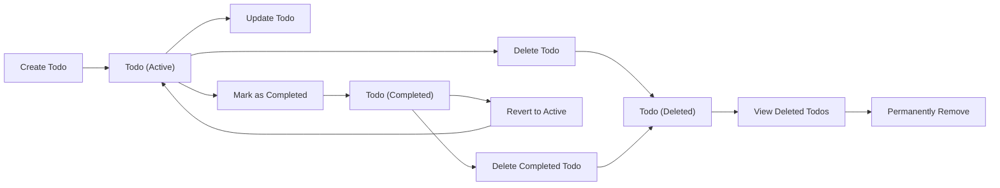

# Todo List Business Process Flow

## Todo Lifecycle Overview

The todo list application centers around individual "todo items" managed by authenticated users (todoUser). Each todo item progresses through a simple lifecycle, starting at creation, possibly being updated or completed, and eventually being deleted. The system is intentionally minimal, containing only the core features necessary for an efficient todo management process.

The possible states for a todo item are: Active, Completed, and Deleted.

### Step-by-Step Lifecycle Description

1. **Creation**
   - WHEN a todoUser submits details for a new todo item, THE system SHALL create a new active todo item associated only with that user.
   - Fields required at creation, validation logic, and constraints are defined in detail in the [Business Rules and Validation](./09-business-rules-and-validation.md) document.

2. **Viewing**
   - WHEN a todoUser accesses their todo list, THE system SHALL retrieve and display all non-deleted todo items belonging to that user, grouped by state (Active/Completed).

3. **Updating**
   - WHEN a todoUser chooses to modify an existing todo item in their list, THE system SHALL allow updates to permissible fields (as enumerated in business rules) as long as the todo item is not deleted.
   - IF a todo item is already marked as deleted, THEN THE system SHALL reject update attempts with a business error response.

4. **Completion**
   - WHEN a todoUser marks an active todo item as complete, THE system SHALL update its state to completed and record the completion timestamp.
   - IF a todo item is already completed or deleted, THEN THE system SHALL prevent it from being completed again.

5. **Uncompletion (Revert to Active)**
   - WHEN a todoUser wants to move a completed todo back to active, THE system SHALL allow reverting a completed item to active, clearing any completion timestamp.
   - IF a todo item is deleted, THEN THE system SHALL prevent any state changes.

6. **Deletion**
   - WHEN a todoUser chooses to delete a todo item, THE system SHALL set its state to deleted, making it invisible in the standard todo list view, but retaining the record for this user.
   - IF a todo item is already deleted, THEN THE system SHALL prevent duplicate deletions.

7. **Viewing Deleted Todos**
   - WHEN a todoUser chooses to view deleted items (if supported), THE system SHALL display only those todo items the user previously deleted.

8. **Clearing All Completed or Deleted Todos**
   - WHERE such an option is present, THE system SHALL permanently remove completed or deleted todos at the user's explicit request; this is a non-recoverable action.

### Mermaid Diagram: Todo Lifecycle

## User Decision Points

The core business logic of the todo list application is driven by user decisions at the following points. Every action must be validated against business rules and permission boundaries (i.e., only authenticated users acting on their own items).

| Decision Point            | Trigger                        | Business Requirement                                   |
|--------------------------|--------------------------------|-------------------------------------------------------|
| Create Todo              | User provides fields; Create   | WHEN a todoUser submits required fields, THE system SHALL create an active todo item. |
| Update Todo              | Edit request on own item       | WHEN a todoUser modifies a non-deleted todo, THE system SHALL allow updates to permissible fields only. |
| Mark as Completed        | User marks active as complete  | WHEN a todoUser marks an active todo as complete, THE system SHALL change its state to completed and add a timestamp. |
| Revert to Active         | User reverts completed todo    | WHEN a todoUser reverts a completed todo, THE system SHALL move it back to active and clear the completion timestamp. |
| Delete Todo              | User deletes a todo            | WHEN a todoUser deletes a todo, THE system SHALL mark it as deleted and hide it in standard views. |
| View Deleted Todos       | User opts into deleted view    | WHEN a todoUser opts to see deleted items, THE system SHALL show only their deleted todos. |
| Clear Completed/Deleted  | User confirms clear            | WHERE user requests permanent removal, THE system SHALL irrevocably delete all selected todos. |

### Edge Cases & Special Scenarios
- IF a todoUser tries to update, complete, or revert a deleted todo, THEN THE system SHALL deny the action with a business error.
- IF required fields are missing or invalid at creation/update, THEN THE system SHALL return specific validation errors (see [Business Rules and Validation](./09-business-rules-and-validation.md)).
- WHEN a todoUser requests to view todos, THE system SHALL only show items they own. No cross-user access is permitted.

## Role of Business Rules

Business rules apply at every decision and state change in the todo lifecycle, reinforcing data consistency, permission boundaries, and security. These rules are detailed in the [Business Rules and Validation](./09-business-rules-and-validation.md) and [Functional Requirements](./05-functional-requirements.md) documents; however, this section summarizes where those rules are enforced within the process flow:

1. **Creation**: Required fields, input types, and length constraints checked on user input. Duplicate or blank todos not allowed.
2. **Updating**: Only permissible fields can be modified; completed/deleted todos cannot be updated.
3. **Completion/Reverting**: State transitions validated to prevent illogical updates (e.g., completing a completed todo, reverting a deleted one).
4. **Deletion**: Todos cannot be deleted twice or if already deleted.
5. **Ownership/Permission**: Every operation is checked to ensure a user can only interact with their own todos.

### Workflow Enforcement Using EARS
- WHEN a todoUser attempts any action, THE system SHALL confirm ownership before processing.
- IF a todoUser action fails a business rule, THEN THE system SHALL reject the operation and provide a user-facing error.
- THE system SHALL never expose or allow actions on another user’s data.

### Integration with Other Documents
For the full list of validation, error, and constraint rules, refer to the [Business Rules and Validation](./09-business-rules-and-validation.md), [Functional Requirements](./05-functional-requirements.md), and [Error Handling Scenarios](./06-error-handling-scenarios.md).

## Summary

The todo list application's business process is a streamlined, state-driven flow where every action and state transition flows from user intent and is strictly controlled by business validation rules. Each operation the user takes is validated both for proper business logic and for security (ownership). There are no features beyond the minimal set described here, ensuring maximum clarity, user focus, and developer autonomy for technical implementation.

