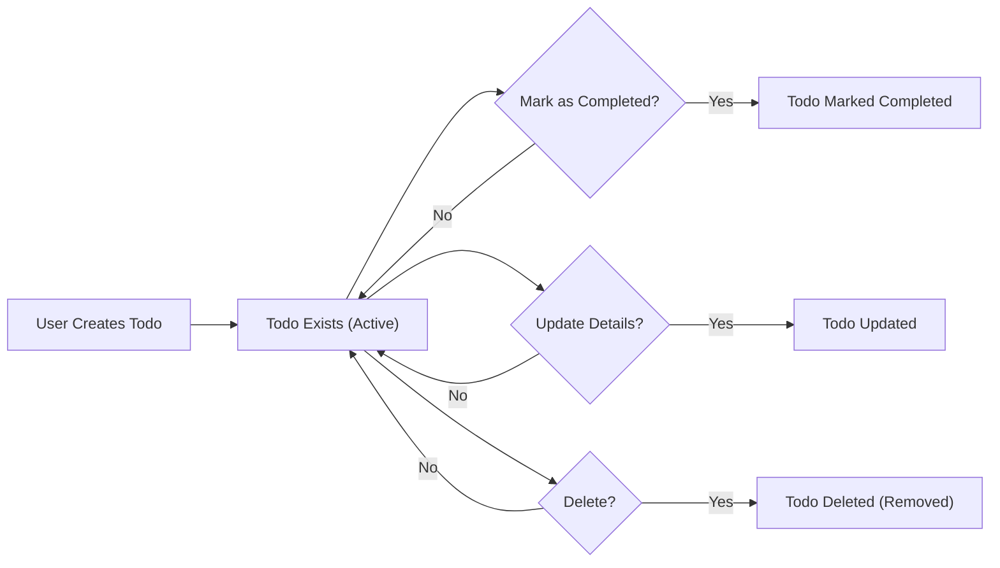
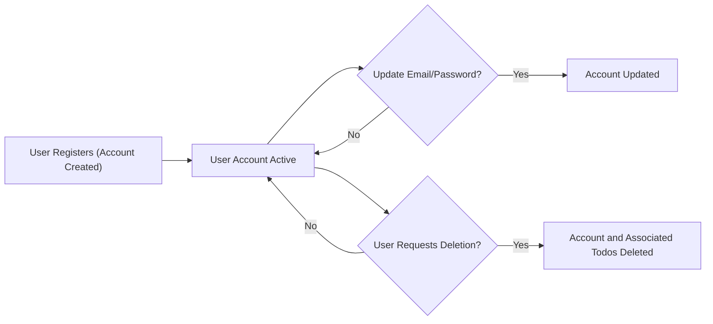

# Data Lifecycle and Flow for the Todo List Application

## High-level Data Flow for Todos
The todo list application is designed to manage personal todo items for each registered user. Todo data progresses through a straightforward lifecycle, ensuring clear ownership, privacy, and minimal complexity.

### Todo Lifecycle Overview
- **Creation**: WHEN a registered user submits a request to add a new personal task, THE system SHALL create a new todo item associated only with that user.
- **Management**: AFTER creation, THE user SHALL be able to view, mark as completed, update (e.g., change title or description), or delete their own todos.
- **Completion**: WHEN a user marks a todo as completed, THE system SHALL update the completion status and store the change for future views.
- **Update**: WHEN a user modifies any detail of their todo, THE system SHALL only allow modifications to fields provided and SHALL update only the owned todo.
- **Deletion**: WHEN a user requests to delete a todo, THE system SHALL remove the todo immediately and irreversibly from their list and system storage.
- **Visibility & Access Control**: Todos SHALL only be visible or accessible to the account that created them, guaranteeing that no user may see or affect another user’s items. THERE SHALL NOT be any public, shared, or group todos.

### Todo Process Flow (Conceptual)

## User Journey and Data Mapping
Todos are always tied to the account of the user who created them. Data lifecycle for both todos and user accounts should make clear what happens to data on every user action.

### Mapping User Actions to Data Changes
| User Action                | Event Description                                      |
|---------------------------|--------------------------------------------------------|
| Register an account        | WHEN a new user completes registration, THE system SHALL create a new user account ready to own todos.             |
| Login                      | WHEN an existing user logs in, THE system SHALL allow access to their own todos.                                    |
| Create a todo              | WHEN a user creates a todo, THE system SHALL generate a todo item owned by that user only.                          |
| View todo list             | WHEN a user views their list, THE system SHALL only display that user’s todos.                                     |
| Edit or update a todo      | WHEN a user updates a todo, THE system SHALL permit changes only to that todo and for that user.                    |
| Mark todo as completed     | WHEN a user completes a todo, THE system SHALL update completion status and store the state.                        |
| Delete a todo              | WHEN a user deletes a todo, THE system SHALL remove it permanently so it cannot be accessed or recovered.           |
| Logout                     | WHEN a user logs out, THE session is ended; no persistent data is removed but access is suspended.                  |
| Delete account             | WHEN a user requests deletion and confirms, THE system SHALL erase the user account and all owned todos irreversibly.|

### Data Ownership and Scope (Business View)
- WHEN a user creates or manages their todos, THE system SHALL guarantee that the todo is visible and accessible only to the creator’s authenticated session.
- IF any request is made to access, update, or delete a todo not owned by the requester, THEN THE system SHALL deny the request and provide an error message, ensuring privacy and data segregation by-business requirement.
- WHEN a todo is deleted (by owner, or via account deletion), THE system SHALL make it irretrievable by any method—no trash or archive.

## Data Creation/Update/Deletion Events

### Creation Events
- WHEN a user creates a todo, THE system SHALL require all mandatory fields (such as title) and SHALL assign ownership only to the creating account.
- WHEN a new account is registered, THE system SHALL initialize a private space for that user’s data.

### Update Events
- WHEN updating a todo, THE system SHALL allow only the owner to apply changes, and only to the specified fields (title, description, completion status, etc). Unauthorized update attempts SHALL be rejected with a clear error.
- WHEN a user updates their profile or changes account settings, THE system SHALL only allow modifications to the active user's account.

### Deletion Events
- WHEN a user deletes a todo, THE system SHALL erase it completely, ensuring there is no way to access or recover it later.
- WHEN a user deletes their account, THE system SHALL also delete all associated todos at the same time, with no backup or archive remaining.
- WHEN a user deletes a todo and then tries to access it again, THE system SHALL respond that the todo no longer exists.

### Error Path Events
- IF invalid or missing input is provided during todo creation or update, THEN THE system SHALL reject the request and inform the user of exact problem fields, referencing business validation rules.
- IF a user tries to update or delete a todo not owned by them or already deleted, THE system SHALL deny and state that the requested item is unavailable.

## Account Lifecycle

### Account Lifecycle Stages
- **Registration**: WHEN a user provides valid credentials, THE system SHALL create a persistent account uniquely tied to the user’s email; no two users may share ownership.
- **Active Period**: WHILE the account remains active, THE user SHALL be able to create, manage, and delete their own todos with full privacy.
- **Modification**: WHEN a user changes account information (such as password or email), THE system SHALL validate new values and apply the changes only to the user's own account.
- **Session Management**: WHEN a user logs in, logs out, or lets a session expire, these processes affect only session state, not persistent data. Todos remain to be accessed next time.
- **Account Deletion**: WHEN a user confirms account deletion, THE system SHALL erase the account and all owned todos, with no possibility of future recovery.

### Conceptual Flow (Account)

### Account and Todo Relationship
- Todos can only exist when owned by an active account. WHEN an account is deleted, all of its todos are deleted together. THERE SHALL NOT be any orphaned todos in the system.
- All deletion processes are permanent—THERE SHALL NOT be recovery or archive by business requirement.
- THE system SHALL deny all requests from non-authenticated users to manage or view todos; authentication is mandatory.

### EARS Business Requirements for the Data Lifecycle
- WHEN any change (create, update, delete) is made to todos or accounts, THE system SHALL confirm the change to the user with a success or actionable error message.
- IF any input or business rule is violated, THEN THE system SHALL reject the action and explain the issue clearly and specifically.
- WHEN an account is removed, THE system SHALL ensure all user data is purged simultaneously and irreversibly; there is no backup for business privacy.

## Data Journey Summary Principles
- All todos are created, owned, updated, and deleted solely by the account that created them.
- No user SHALL be able to view or affect another user’s data under any circumstance.
- All deletion actions (either todo or account) are permanent and non-reversible by business design.
- All business flows assume authenticated users only; anonymous access is not permitted for any data interaction.
- The backend must enforce these flows and boundaries without exception or ambiguity to guarantee privacy, clarity, and user trust.

---
For further examples and the complete context of user flows, refer to "User Scenarios for Minimal Todo List Application."
For input validation and business rules, see "Business Rules and Validation Specification for Todo List Service."
