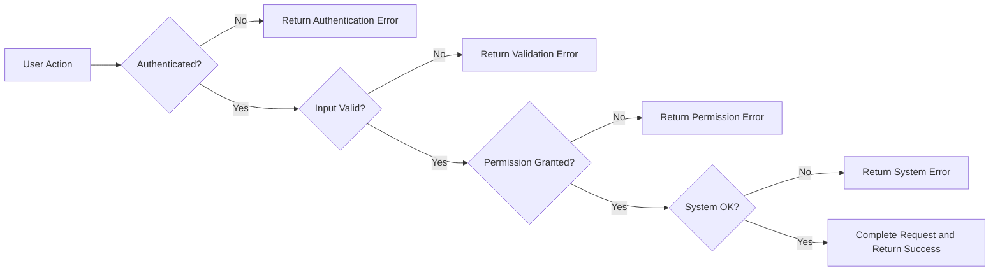

# Error Handling and System Responses for Todo Service

Robust, transparent error handling is essential for trust and usability. All error messaging and system responses in the Todo backend follow business-driven requirements to ensure users receive actionable, informative feedback in every scenario. The system shall prevent data loss or unauthorized access by enforcing rigorous validation, granular permission checks, and clear error reporting.

## 1. Authentication Errors

Authentication is mandatory for all user-specific todos. The system strictly enforces authentication for every operation involving protected data.

- WHEN a login request is received with credentials that do not match any existing account,
  THE system SHALL deny access and return the message: "Your login information is incorrect. Please try again."
- WHEN any unauthenticated access is made to a protected resource,
  THE system SHALL return an error message: "You must be logged in to access this feature." and SHALL NOT reveal whether the requested resource exists.
- WHEN a user’s session has expired by timeout or manual invalidation,
  THE system SHALL prompt for re-authentication, returning the message: "Your session has expired. Please log in again."
- WHEN a deactivated user attempts any action,
  THE system SHALL block the action and return: "Your account is disabled. Contact support for assistance."
- WHEN the authentication subsystem or identity provider is unavailable,
  THE system SHALL present a generic error: "Login services are unavailable. Please try again later." and SHALL NOT leak system or internal error details to the client.
- WHEN a user attempts login more than 5 times in a row with invalid credentials,
  THE system SHALL temporarily lock further attempts from the IP address and return the above error, with a silent lockout enforced for 10 minutes.

## 2. Validation Errors

All user-submitted data must pass strict validation for presence, type, format, and contextual business rules. No field or request parameter can be omitted or malformed.

- WHEN a request submits invalid, missing, or malformed data for any todo item,
  THE system SHALL reject the request and return a targeted message indicating all issues found.
- WHEN the title field is blank, THE system SHALL return: "Title is required."
- WHEN todo description exceeds maximum allowed length, THE system SHALL return: "Todo description exceeds maximum allowed length." (limit to 255 characters)
- WHEN input contains invalid or prohibited characters (e.g., control codes, emoji, SQL meta-characters), THE system SHALL reject with: "Invalid characters detected."
- WHEN a todo item with identical title/context already exists for user,
  THE system SHALL return: "Duplicate todo. This item already exists."
- WHEN a state transition is invalid (e.g., marking a deleted todo as completed),
  THE system SHALL return: "Invalid operation: Cannot modify a deleted todo."
- WHEN a required input (title, state, or ownerId) is missing,
  THE system SHALL return: "Missing required information. Please check your input."
- WHEN any batch action includes an invalid item, THE system SHALL reject the entire batch and return a consolidated error summary per item (not partial success).

Examples:
- User omits todo title: Returns specific message; request fails
- User attempts to add same todo twice: Duplicate detection is case-insensitive per user, always enforced

## 3. Permission Denied

Data segregation is mandatory. Every user may only manipulate their own todo items. Any attempt to access, modify, or delete todos outside one’s permitted scope is blocked.

- WHEN a user tries to access a todo owned by another user,
  THE system SHALL return: "You do not have permission to access this todo item." and SHALL log the event for monitoring/audit purposes.
- WHEN batch processes attempt to cross boundaries (multi-user update), THE system SHALL reject all unauthorized actions and proceed only with valid items, returning a separate error per denied entry.
- WHEN a user requests a feature that is not enabled for their actor role (e.g., try to access admin or other user's todos), THE system SHALL block with: "You can only manage your own todos."

## 4. System Errors

System-level failures are handled gracefully. Technical issues never expose stack traces, database details, or any implementation-specific information.

- WHEN any infrastructure or application error (DB outage, internal exception) occurs,
  THE system SHALL return: "A system error occurred. Please try again later." and internally log the incident with all technical data (server-side only).
- WHEN current operation fails due to a transient backend outage, THE system SHALL return: "Cannot save your todo due to a technical issue. Try again soon."
- WHEN the service is under maintenance or unavailable,
  THE system SHALL return: "Service is temporarily unavailable. We are working to restore access."
- WHEN a user operation is affected by technical error, THE system SHALL guarantee user data is never lost, and partial mutations are rolled back (transactional integrity required).
- IF any unhandled/critical error occurs,
  THE system SHALL automatically notify support/ops teams and return only a generalized error message to user.

Examples:
- Backend crash during todo creation: User receives friendly error message, backend logs full stack, no user data lost
- Network disconnect: Client receives network error (not handled at application layer)

## 5. Error Response Structure Requirements

- EVERY error response SHALL include:
  - HTTP error status code (per context: 400, 401, 403, 409, 500, 503)
  - Machine-readable error code (unique per error class)
  - Human-friendly, actionable error message in English
  - Correlation ID for tracing (if available)
  - Empty/null data payload on error
- ALL business logic SHALL be implemented in a way that error responses are uniform for all endpoints
- THE system SHALL never return ambiguous, technical, or untranslated error messages to the user

## 6. Error Handling Flows

## 7. Summary & Supportive Response Strategies

All error handling in the Todo service shall:
- Prioritize security (no data leaks, consistent permission enforcement)
- Focus on user clarity and empowerment (plain language, recovery suggestions)
- Provide actionable, specific feedback for each error scenario
- Standardize error responses (structure, codes, messages)
- Log all errors for audit and quality improvement purposes

Supportive strategies:
- All errors SHALL be logged with sufficient context for support teams to investigate
- All error messages SHALL have a unique error code for support references
- Where practical, each error SHALL include hints or links to help documentation or FAQ

## 8. References
- See [User Actor Definitions and Authentication Requirements](./06-user-actors.md)
- See [Business Rules Documentation](./05-business-rules.md)
- See [Functional Requirements Document](./03-functional-requirements.md)
