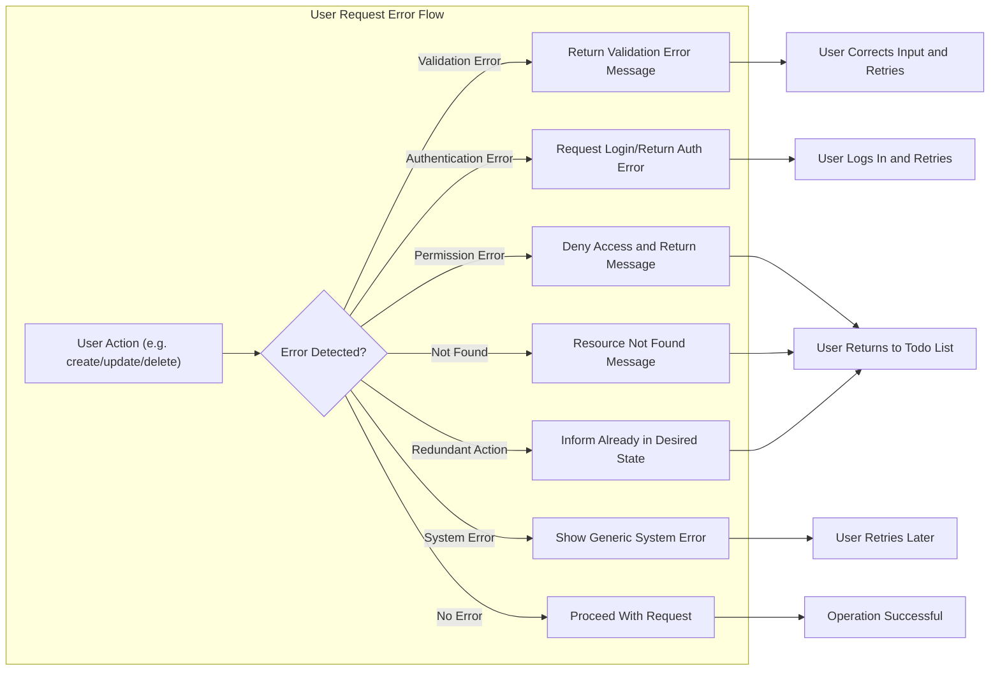

# Exception Handling and Error Scenarios

## Introduction
This document defines the comprehensive requirements for managing exceptions and error scenarios in the minimal Todo list application. The focus is on ensuring clarity, reliability, and a seamless user experience when errors occur. All requirements use EARS format where appropriate, in professional English, to remove ambiguity and ensure backend implementation meets business expectations.

## Error Categories
### 1. Validation Errors
- WHEN a user submits incomplete or invalid Todo data (e.g., missing title), THE system SHALL reject the request and return a descriptive error message.
- WHEN a request payload contains invalid data types or exceeds allowed field lengths, THE system SHALL return an error specifying the exact field and violation.

### 2. Authentication and Access Errors
- WHEN a user attempts an operation without valid authentication, THE system SHALL reject the action and provide a clear message that login is required.
- WHEN a user tries to access or manipulate a Todo item that does not belong to them, THE system SHALL deny access and return a message indicating insufficient permissions.

### 3. Resource Existence Errors
- WHEN a user requests a Todo item by an id not present in the system, THE system SHALL return a not-found error informing the user the item does not exist or was already deleted.

### 4. System-Level Errors
- IF an unexpected server error occurs, THEN THE system SHALL return a generic message apologizing for the temporary problem and instructing the user to retry later.

### 5. Business Logic Errors
- WHEN a user attempts to complete, update, or delete a Todo that is already in the desired state (e.g., marking an already-completed Todo as complete), THE system SHALL prevent redundant action and inform the user.

## User-Facing Error Messages
All error messages must be clear, actionable, and avoid technical jargon, reflecting the actual business problem encountered. For each error category:

| Error Category             | Example User Message                                     |
|---------------------------|---------------------------------------------------------|
| Validation                | "Title cannot be empty."                                |
| Authentication            | "Please log in to continue."                            |
| Permission                | "You do not have permission to modify this Todo."       |
| Not Found                 | "The requested Todo does not exist or was already deleted." |
| System                    | "An unexpected error occurred. Please try again later."   |
| Redundant Action          | "This Todo is already marked as completed."             |

- THE system SHALL always return user-friendly error messages in response payloads, matching the context and root cause.

## Business-Level Recovery Paths
### Validation Errors
- WHEN a validation error occurs, THE system SHALL return explicit details about the violation, enabling users to correct and resubmit.
- THE system SHALL NOT process or store invalid data under any circumstance.

### Authentication and Access Errors
- WHEN authentication fails, THE system SHALL not provide access to personal data and SHALL prompt for (re-)login.
- WHERE permission is lacking, THE system SHALL not disclose any information about restricted items, only indicate lack of access.

### Not Found Handling
- WHEN a resource is not found, THE system SHALL plainly state the missing resource nature and suggest a valid navigation step (e.g., "Return to your Todo list.").

### System-Level Recovery
- WHEN system-level errors occur, THE system SHALL log the incident for maintenance purposes and instruct the user to retry at a later time.
- THE system SHALL NOT disclose internal error details or stack traces to the user.

### Redundant or Invalid State Changes
- WHEN redundant operations are attempted, THE system SHALL simply reassure the user of the current state and prevent double-modification.

## Visual Error and Recovery Workflow

## Summary
This document specifies error categories, user-facing messages, and required recovery paths for the minimal Todo list application. Adherence to these rules ensures that all error conditions are predictable, actionable, and maintain business logic integrity. All requirements are formalized using EARS syntax and provide explicit expectations for backend responses in every error scenario.