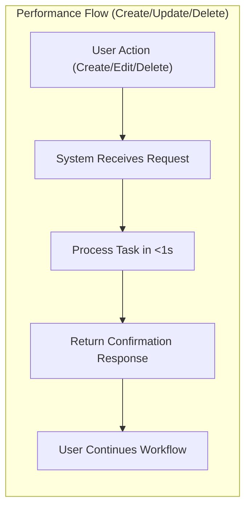
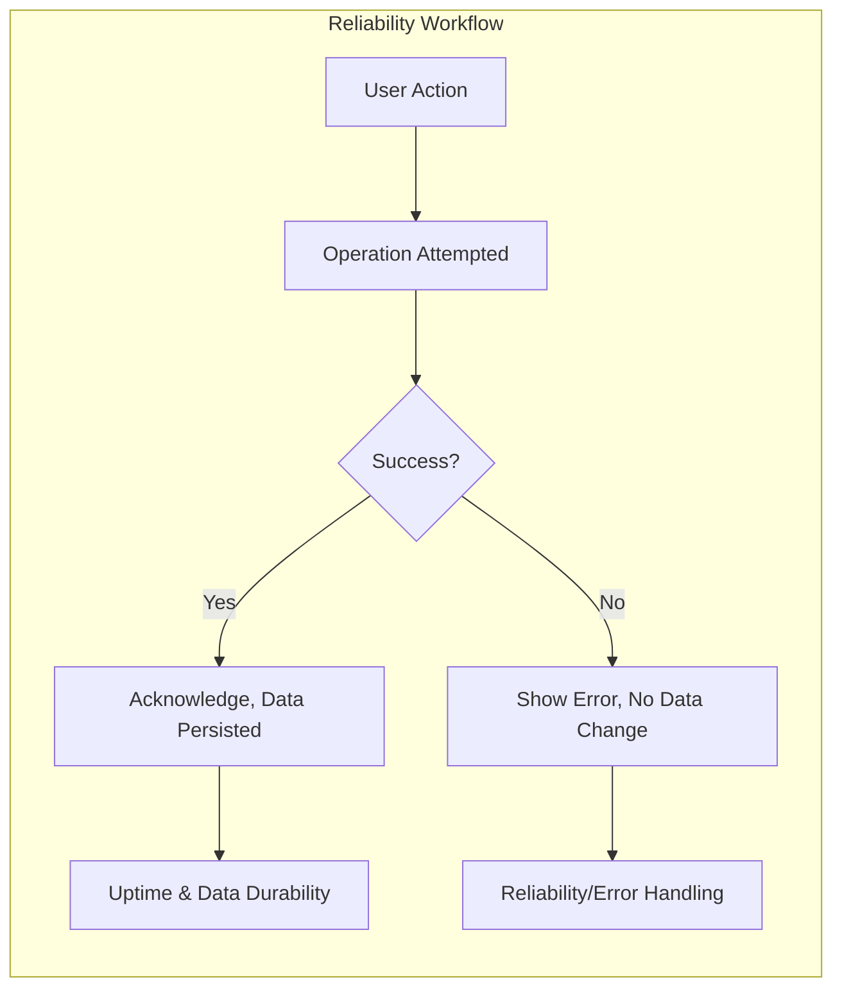
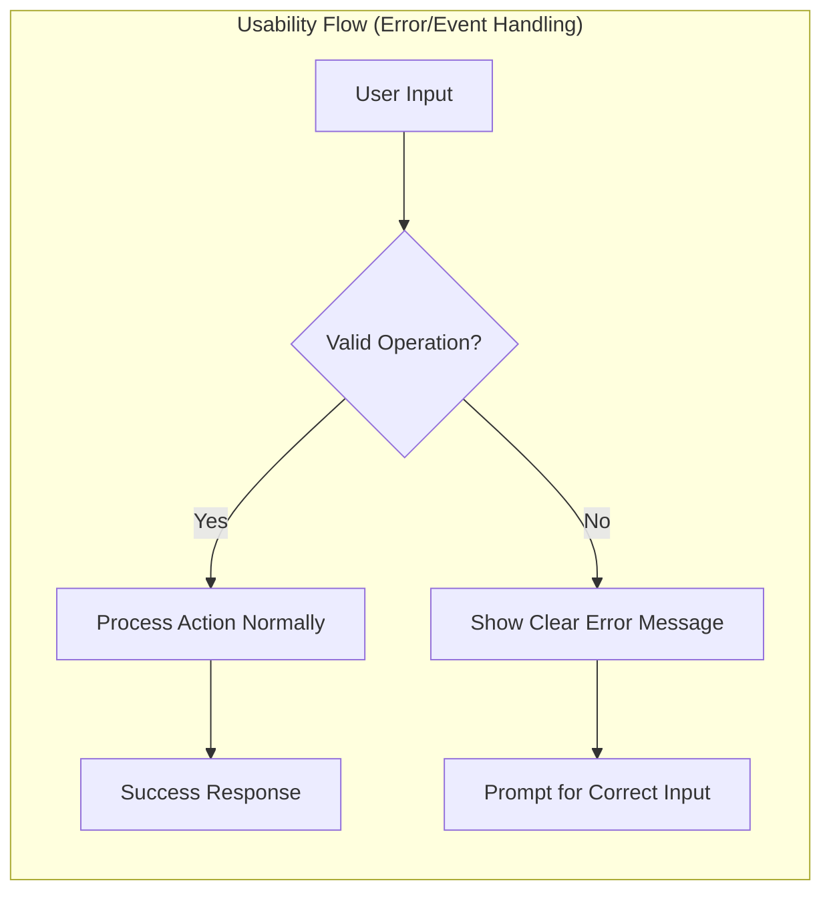

# Non-Functional Requirements for Todo List Application

## Performance Expectations
- WHEN a user interacts with any Todo feature (create, update, mark complete/incomplete, or delete a task), THE system SHALL respond within 1 second under normal operating conditions in a single-user context.
- WHEN a user initiates a request to create, update, or delete a todo item, THE system SHALL process that request and return a confirmation response to the user within 1 second.
- WHEN a user retrieves all their todo items, THE system SHALL return the full list to the user within 2 seconds, except under rare system-wide failure conditions.
- WHERE a typical daily use case exists (no more than 500 tasks per user), THE system SHALL maintain consistent responsiveness and SHALL NOT degrade noticeably in speed, regardless of the number of successful or failed actions taken by the user.
- WHEN a user initiates multiple requests (up to 10 concurrent actions, such as marking multiple todos complete rapidly), THE system SHALL process all valid requests without performance degradation for that user, maintaining the same response times as with single actions.
- IF an operation is not completed within specified time frames (1 second for changes, 2 seconds for retrieval), THE system SHALL display or return a user-friendly timeout or error notification without ambiguity regarding the operation’s status.

## Reliability Requirements
- THE system SHALL maintain a minimum measured uptime of 99.5% over any rolling 30-day period.
- WHEN a user performs any operation (create, update, delete, mark completed), AND the system returns a success acknowledgement, THE system SHALL guarantee that user’s data changes are durably persisted.
- IF a system, network, or internal error occurs during a user’s operation, THE system SHALL provide a clear, actionable error message, and SHALL NOT falsely acknowledge successful completion for changes that were not persisted.
- WHEN the system recovers from a failure (internal or external), THE system SHALL restore data integrity and full service operation without requiring further user intervention, preserving the latest acknowledged state for each user.
- THE system SHALL ensure complete data isolation between users at all times, even under error or load conditions (strict single-user context enforcement for minimum feature scope).
- WHEN under high load, experiencing partial outages, or recovering from downtime, THE system SHALL guarantee atomic operations to prevent data corruption or partial writes.
- WHEN a user repeats the same request (e.g., retrieving todos), THE system SHALL provide consistent and repeatable results within that user’s own data context, as long as the underlying data has not changed.

## Usability Concerns
- THE Todo List Application SHALL be intuitive, ensuring that any registered user can add, view, edit, mark complete/incomplete, or delete a todo without reference to external documentation or manuals.
- WHEN a user attempts to perform an unsupported operation or submits invalid input data (e.g., empty title, overly long field, invalid characters), THE system SHALL return or display a clear, actionable error message specifying the problem and the expected correction.
- WHILE users interact with the Todo features, THE system SHALL provide consistent behavior and interface responses across all operations (add, edit, list, complete, delete) to foster predictability and confidence.
- IF performance, reliability, or connectivity interruptions prevent an operation from succeeding, THE system SHALL NOT leave the user in doubt about the outcome, and SHALL always explicitly report final status (success or precise failure reason).
- WHEN a user needs to retry a previously failed operation (e.g., due to a network timeout), THE system SHALL allow safe, idempotent retries, guaranteeing that no duplicate, partial, or corrupted todo items will result from repeated submissions.
- THE backend SHALL accept requests from both desktop and mobile web browsers, ensuring that backend APIs do not block or discriminate based on user agent or device.
- THE backend SHALL use standardized response formats for success and error messages, promoting clear client-side feature discoverability and integration.
- WHEN user authentication is required, AND a session has expired or become invalid, THE system SHALL prompt the user to re-authenticate before proceeding, integrating with the minimal authentication workflow for this single-user context and ensuring a seamless re-login flow whenever possible.

---

These non-functional requirements are written in measurable terms (EARS format), contain user/business-centric acceptance criteria, and provide backend developers with clear go/no-go standards for the Todo List Application’s minimum viable design. Compliance with these requirements is mandatory for staging or production readiness.