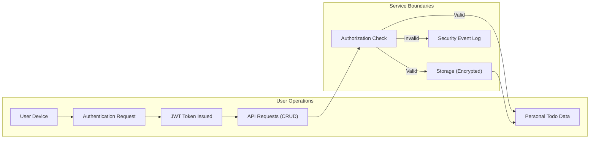

# Security and Privacy Requirements for Todo List Application

## Introduction
The Todo List application prioritizes user privacy, rigorous security, and regulatory compliance. Users manage personal Todo data—such as title, content, status, deadlines, and timestamps—within a system that enforces strict access controls, data minimization, and transparency. Every requirement in this document employs the EARS (Easy Approach to Requirements Syntax), ensuring clarity, measurability, and robust testability. This specification is mandatory for backend implementation and is designed for the development team.

---

## Data Privacy

### Personal Data Handling
- THE service SHALL treat all user Todo data (including title, content, completion state, due date, timestamps) as personal data exclusively accessible to the authenticated user.
- WHEN a user requests access to their data, THE system SHALL ONLY return data bound to that user’s authenticated identity.
- WHEN processing personal data, THE service SHALL ensure that no unauthorized party—including system administrators or other users—shall access this information, unless mandated by applicable law.

### User Control Over Data
- WHEN a user requests to delete a Todo, THE system SHALL erase all related data from the primary storage immediately.
- WHEN a user requests to modify a Todo, THE system SHALL update only the specified fields, ensuring all other information remains unaltered.
- WHEN a user requests to retrieve all their personal data, THE system SHALL provide a well-structured export (such as JSON or CSV) with all active Todos within 10 seconds.

### Data Minimization
- THE service SHALL collect and store only the minimal data required to operate Todo management features.
- THE service SHALL NOT gather or retain sensitive or non-essential data (such as IP addresses, device IDs, or location) unrelated to the Todo service.

### Data Retention and Deletion
- WHEN a user account is deleted, THE system SHALL permanently erase all user Todos and related data from active storage within 7 days.
- WHEN data retention is mandated by law, THE service SHALL pseudo-anonymize or encrypt any retained data so it cannot be reversed or re-linked to an individual user, except under explicit legal requirement.

### Consent and User Rights
- WHEN a user registers, THE service SHALL present a transparent, plain-language statement on data usage and privacy rights.
- WHEN a user consents to service terms, THE service SHALL record timestamped proof for audit purposes.
- WHEN a user exercises the right to withdraw consent, THE system SHALL immediately stop processing their personal data and initiate the erasure process as described above.

---

## Security Requirements

### Authentication & Access Control
- THE system SHALL require all users to perform identity authentication before accessing any Todo management functionality.
- WHEN any user attempts to access, modify, or delete a Todo not assigned to their identity, THE system SHALL deny the request and record the event in the security log.
- THE system SHALL issue JWT tokens on successful authentication, containing only non-sensitive identifying claims (e.g., user id) and a digital signature.
- JWT access tokens SHALL expire within 30 minutes; refresh tokens SHALL expire within 30 days, ensuring temporal access limits on all sessions.

### Data Transmission and Storage Security
- ALL communications between client and server SHALL use HTTPS exclusively, with modern TLS encryption.
- ALL user credentials and secret data (including passwords) SHALL be encrypted at rest using industry standards (e.g., bcrypt for passwords); plain-text storage is strictly prohibited.

### Security Event Logging
- WHEN security-related events occur (e.g., failed login, unauthorized access attempt, privilege escalation), THE system SHALL log the event with timestamp, anonymized actor information, and event details.
- THE system SHALL enforce log retention for a maximum of 90 days, after which logs SHALL be deleted securely.

### Incident Detection and Response
- WHEN a potential security incident (such as repeated failed logins or anomalous access) is detected, THE system SHALL trigger a security alert for administrator review within 1 hour.
- WHEN a confirmed data breach occurs, THE system SHALL notify all impacted users via their registered email within 72 hours, providing details on what happened, what data was involved, and guidance for further action.

### API Security
- THE system SHALL validate and sanitize all API input data to prevent injection, denial of service, or other attacks.
- WHEN invalid or malicious requests are made, THE system SHALL return meaningful error codes without leaking sensitive system information.

---

## Compliance Obligations

### Regulatory Requirements
- THE service SHALL comply with all applicable privacy legislation relevant to the user's location (e.g., GDPR, CCPA, as appropriate).
- WHEN regulatory requirements are updated, THE system SHALL implement any necessary compliance changes within 30 days of notice.

### User Consent and Legal Rights
- WHEN a user exercises legal rights (such as request for data access or data erasure), THE service SHALL respond and process such requests within 30 days.
- WHEN a user requests export of their Todos, THE system SHALL deliver the data in a machine-readable, industry-standard format (JSON or CSV).

### Breach Notification Obligations
- WHEN personal data is compromised during a data breach, THE system SHALL inform users in a non-technical, easily understood language, including description, impact, and next steps.
- WHEN a breach is confirmed, THE system SHALL provide users an explicit support contact for follow-up questions and support.

---

## Roles and Responsibilities

| Actor | Responsibilities | Access Rights |
|-------|------------------|--------------|
| user  | Create, manage, export, and erase their own Todos; manage consent and exercise data rights | Full control over only their own data |

---

## Mermaid Diagram: Data Access and Security Boundaries

---

## Acceptance and Success Criteria
- All requirements and rules herein SHALL be fully and consistently implemented, auditable, and continuously enforced.
- Authentication and authorization procedures SHALL be tested to prevent unauthorized access under all foreseeable attack scenarios.
- All privacy, consent, and security controls SHALL be thoroughly documented and kept up to date across codebases and releases.
- The system SHALL pass independent security and privacy audits annually.
- All user notifications, terms, and responses to legal rights SHALL be written in clear, non-technical English.
- Data breach notifications and user data handling must strictly adhere to defined timelines and regulatory needs.

---

By strictly following these requirements, the Todo List backend will deliver robust, privacy-first, and secure service to all users, in compliance with business, legal, and ethical standards.