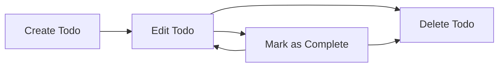

# Business Rules and Operational Constraints for Todo List Application

## Todo Item Lifecycle

A Todo item in this application follows a strict, private lifecycle to ensure robust usability and precision in management by its owner. The stages are as follows:

1. **Creation**: A user creates a new Todo item. Each Todo must have a non-empty description (up to 250 characters) and may have a due date, which must be a valid ISO 8601 date in the future if provided. Upon creation, the Todo is exclusively assigned to the creating user.
2. **Modification**: The owner may edit the description or change the due date (new due date must be valid and not in the past). All modifications are limited to the owner and subject to the same validation as creation.
3. **Completion**: The owner may mark a Todo as completed at any time unless it has already been deleted. Upon completion, the system records a precise completion timestamp. Edits to description or due date remain permitted after completion unless otherwise restricted by business logic.
4. **Deletion**: Only the owner can delete a Todo. Deletion is final: the item and all historical data are erased and cannot be restored. Users cannot act on deleted Todos, nor view them afterward.

There is no feature for sharing, delegation, or collaborative editing. Every Todo is private to its owner in this minimal product.

### Visual Process: Todo Item Lifecycle

---

## Operational Constraints

### User Permissions
- THE system SHALL require authentication for every user wishing to create, read, update, complete, or delete Todo items.
- THE system SHALL enforce strict access control: a user may only perform any action on their own Todos.
- WHEN any unauthenticated operation is attempted, THE system SHALL deny access, return a clear error message, and log the event.

### Todo Item Boundaries
- THE system SHALL require each Todo have a non-empty text description.
- Todo descriptions SHALL be limited to a maximum of 250 characters.
- WHEN a due date is provided, THE system SHALL require it to be a valid ISO 8601 date in the future, not in the past.
- THE system SHALL limit each user to a maximum of 1,000 Todo items. Any attempt to exceed this will be rejected and an error message returned.
- THE system SHALL prohibit duplicate Todos (case-insensitive match on both description and due date for the same user).
- THE system SHALL enforce a minimum interval of one second between any two create, update, or delete actions by the same user.

### Validation Rules
- WHEN a Todo is created or updated, THE system SHALL validate all required fields and reject any request with missing or invalid data, returning detailed error feedback.

### Prohibited Scenarios
- THE system SHALL prohibit any action on non-existent Todos, always returning a clear "not found" error.
- IF a user tries to act on a Todo not belonging to them, THE system SHALL deny the action and log the unauthorized attempt.
- WHEN rate limits are exceeded, THE system SHALL return a specific error detailing the limit and when requests may be retried.

---

## Rule Definitions (EARS Format)

### Creation Rules
- THE system SHALL require a non-empty description for each new Todo.
- THE system SHALL reject any attempt to create a Todo if the description exceeds 250 characters.
- WHEN a due date is provided, THEN THE system SHALL require it not be in the past.
- IF a user attempts to create a Todo with identical description and due date as an existing one for the same user (case-insensitive), THEN THE system SHALL reject the new Todo and return a duplicate error.
- IF a user exceeds 1,000 Todos, THEN THE system SHALL reject new creation attempts and display an error message.
- WHEN a user performs create, update, or delete actions more than once per second, THEN THE system SHALL throttle the request and return a rate limit error.

### Ownership, Modification, and Deletion
- WHEN a user attempts to view, update, or delete a Todo not owned by them, THEN THE system SHALL deny the action and log the unauthorized access.
- WHEN any user attempts to update a non-existent Todo, THEN THE system SHALL return a not-found error and log the event.
- WHILE a Todo exists, only its owner SHALL be allowed to update its fields.
- WHEN the description of a Todo is updated, the same validations as creation SHALL apply.
- WHEN a due date is updated, THE system SHALL require the new value not be in the past.
- WHEN a Todo is deleted, it SHALL be immediately removed and inaccessible to all future operations, with no soft-delete or recovery process.

### Completion Status
- WHEN a user marks a Todo as complete, THEN THE system SHALL record the exact timestamp of completion.
- WHILE a Todo is marked as complete, the owner SHALL be allowed to update description and due date, unless restricted by further business requirements.
- IF a user attempts to mark an already completed Todo as complete, THEN THE system SHALL take no additional action but return the current completed state in response.

---

## Example Scenarios

### Valid Scenario
WHEN a user creates a Todo with description "Buy groceries" and a due date two days in the future, THE system SHALL allow creation and record the Todo.

### Invalid Scenario
IF a user tries to create a Todo with the same description and due date as an existing one (matching case-insensitively), THEN THE system SHALL reject it and specify that it's a duplicate.

### Unauthorized Scenario
IF User A attempts to read, update, or delete a Todo belonging to User B, THEN THE system SHALL deny access and log the event as an unauthorized attempt.

### Rate Limit Scenario
WHEN a user submits five delete requests within one second, THE system SHALL process one and reject the remaining four with a rate limit error.

### Exceeding Todo Limit
IF a user with 1,000 active Todos attempts to create another, THEN THE system SHALL reject the request and cite the 1,000 item limit.

---

## Summary Table of Business Rules

| Rule                                      | Requirement Type    | Condition/Trigger                                                        | System Action                                      |
|--------------------------------------------|--------------------|-------------------------------------------------------------------------|----------------------------------------------------|
| Require description                       | Creation/Update    | Todo creation or update initiated                                        | Enforce non-empty & <=250 characters               |
| Unique per description+due date            | Creation           | Identical description+due date exists for user                           | Reject with duplicate error                        |
| Due date not in past                       | Creation/Update    | Due date is set                                                          | Enforce future date                                |
| 1,000 Todo limit                          | Creation           | User has 1,000 Todos                                                     | Reject creation                                   |
| Rate limit 1/sec                          | Create/Update/Del  | Multiple actions same second                                             | Reject excess requests with rate-limit error       |
| Only owner access                         | Any operation      | Actor is not owner                                                       | Deny and log unauthorized attempt                  |
| No operation on non-existent Todo          | Any operation      | Todo not found                                                           | Return not-found error                            |
| Store completion timestamp                 | Mark as complete   | User marks as complete                                                   | Record completion time                            |
| Allow edit after completion                | Edit/Update        | Todo is completed                                                        | Allow description/due date edits                   |
| Finality on deletion                       | Delete             | Todo deleted                                                             | Permanently remove, do not allow further access    |

---

## Closing Notes

All business logic and operational boundaries for the Todo List application are now documented comprehensively. Developers must adhere strictly to these requirements for all backend logic concerning creation, modification, completion, viewing, and deletion of Todos. Strict validation, rate limiting, and privacy must be enforced at every level to guarantee a secure and robust application, with detailed, actionable feedback for all user-facing errors and strict enforcement of every rule listed in this document.