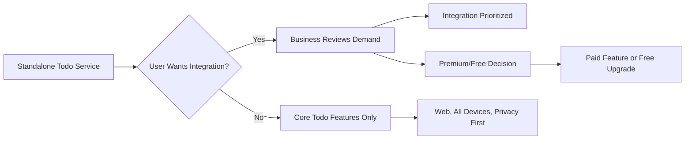

# External Integrations and Environment for Todo List Service

## Introduction and Purpose

The Todo List service is designed as a simple, standalone personal task manager at launch, but future business goals include possible integrations and enhancements. Integration and environment decisions guide user accessibility, privacy, and feature evolution, so they are described in natural language for business, product, and backend teams.

## 1. Potential Future Integrations

THE initial release operates entirely standalone without third-party connections. Future business-driven integrations are described to align with evolving user needs and business priorities. Each is marked as out-of-scope for launch, with actionable EARS requirements for evaluation and potential inclusion.

### 1.1 Calendar Synchronization
- WHEN users desire to organize Todo deadlines in their external calendars, THE system SHALL offer, as a future enhancement, business integration with widely-used calendar providers (Google Calendar, Microsoft Outlook) to maximize user productivity.
- IF calendar sync is enabled, THEN THE system SHALL allow users to link todo due dates to personal calendar events, so that users never miss task deadlines and can visualize todos in their daily/weekly planning.
- THE system SHALL not ship with calendar sync at MVP launch; business development will review user demand and competitive advantage post-launch to prioritize.

### 1.2 Notification and Reminder Services
- WHEN users want timely reminders about upcoming, overdue, or critical todos, THE system SHALL support integration with notification channels (email, push, or SMS) as a future enhancement.
- WHEN a todo is due or newly overdue, THE system SHALL be able to notify the user through their chosen channel, enabling users to complete tasks on time.
- THE business SHALL review notification demand no sooner than post-launch, to ensure the core service remains minimal and distraction-free by default.

### 1.3 Voice Assistant Integration
- WHERE hands-free or accessibility use-cases arise, THE Todo List service SHALL consider business-driven voice assistant integrations (Google Assistant, Alexa, Siri) after launch.
- IF enabled in the future, THEN users SHALL be able to create or check todos by voice, increasing inclusivity and convenience.
- THE business SHALL not prioritize this feature for the MVP without explicit user demand.

### 1.4 Cross-Device Synchronization
- WHEN users express a desire for cross-platform data (desktop, tablet, mobile), THE service SHALL support synchronized access to todos on all authorized devices.
- THE system SHALL initially launch as a web-only application, but SHALL be planned for easy extension to mobile or desktop through standard web browsers.

### Monetization and Premium Policy
- WHEN a business-relevant integration or feature (such as calendar sync or advanced reminders) offers clear added value, THE system MAY offer it as part of a paid or premium tier, always requiring user opt-in and transparent pricing.
- THE system SHALL not introduce ad-based integrations or sell user data for any future monetization; privacy remains a core business value.

## 2. Deployment and Operation Environment

Deployment, hosting, and operational expectations are described in business-accessible language:

### 2.1 Deployment Model
- WHEN deployed, THE Todo List service SHALL be accessible as an online, cloud-based application via standard browsers, supporting the SaaS model with maximum user reach.
- THE user SHALL NOT need to install any native application or plug-in for initial use; a modern browser is sufficient.

### 2.2 Hosting, Availability, and Global Access
- WHEN high-traffic periods are expected (morning, workday start, pre-deadline), THE service SHALL scale to remain available without planned downtime.
- THE service SHALL plan for global access, without platform lock-in, except where constrained by legal or privacy regulations.

### 2.3 Maintenance and Service Transparency
- IF major downtime or maintenance is required, THEN THE system SHALL inform users in clear, timely, accessible language on service status, with advance notice whenever possible.

## 3. Accessibility and Device Assumptions

### 3.1 Web Accessibility
- THE service SHALL be available to any user with internet access and a modern web browser.
- WHEN accessibility needs are identified (e.g., vision impairment), THE business SHALL plan for compliance with recognized standards (such as screen-reader support), prioritizing inclusivity for all users.

### 3.2 Device Support
- THE initial web-only model SHALL prioritize desktop and mobile browser use.
- IF significant user demand for dedicated mobile or desktop applications is found post-launch, THEN the business SHALL invest in those platforms accordingly.

### 3.3 Offline and Low-connectivity
- WHERE business use cases support, THE Todo List service SHALL evaluate, for future releases, features for limited offline access (such as cached or local todos), with all changes synchronized when a connection resumes.

### 3.4 User Privacy and Regulatory Compliance
- WHEN deploying globally, THE service SHALL adhere to all user privacy and accessibility regulations pertinent to each operating region (such as GDPR).

## 4. Key Business Assumptions and Opportunities

### 4.1 Platform Agnosticism
- THE system SHALL never restrict users to a proprietary operating system, device, or browser; broad inclusion and business risk reduction are strategic principles.

### 4.2 User-driven Evolution
- THE service SHALL regularly collect user feedback to prioritize next integrations and environment enhancements based on real business/user demand, not technology preference.

### 4.3 Monetization Pathways
- WHERE integrations introduce significant ongoing business cost or value, premium or paid tiers SHALL be transparently offered, never interfering with the free basic todo experience.

## 5. Visual Summary Diagram

## 6. Summary of Constraints and Recommendations

- Launch with minimal, standalone business features only
- Future integrations to be prioritized strictly by business/user need, never technology-first
- Ensure web and device inclusivity, privacy, and accessibility at all times
- Monetization is opt-in and never ad-based; user trust is paramount
- Platform-agnostic and regionally-compliant rollout is a core business strategy
