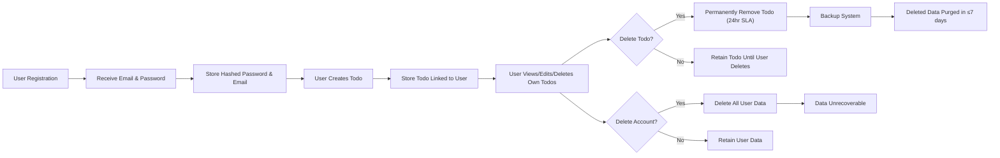

# Security and Privacy Requirements for Todo List Application

## Personal Data Handling

### Types of Personal Data Collected
- Email addresses, strictly for registration and authentication.
- User-generated todo items, including text content, optional due dates, and completion status/metadata.

### Data Collection Principles
- WHEN a user registers or authenticates, THE system SHALL collect only the minimum information: email and password.
- WHEN a user creates or manages a todo, THE system SHALL collect only the todo content and any optional metadata provided by the user.
- WHEN personal data is in transit or at rest, THE system SHALL ensure it is protected in a secure environment, using encrypted channels for transmission and secure storage mechanisms with access restriction.
- THE system SHALL never request or store unnecessary or sensitive personal information (e.g., phone numbers, government IDs, financial data).

### User Data Rights
- WHEN a user requests access to their data, THE system SHALL present a complete and accurate listing of user's own todos, email/account information, and all associated metadata.
- WHEN a user requests that their account be deleted, THE system SHALL irreversibly delete all associated personal information, including todos and authentication credentials.
- WHEN a user requests deletion of specific todo items, THE system SHALL permanently erase the item from all records within 24 hours.

### Data Sharing, Use, and Disclosure
- THE system SHALL NOT disclose, sell, or share user data with any third party.
- THE system SHALL NOT use user data for any purpose other than providing core todo list functionality and authentication.

### Data Storage and Breach Response
- All user data SHALL be stored in a secure, access-restricted environment.
- IF a data breach occurs or unauthorized access is detected, THEN THE system SHALL log all details and notify technical administrators without delay. User-facing notifications may be omitted at this MV(Minimum Viable) phase but must be planned for future compliance requirements.

## Authentication Security

### Credential Security
- WHEN a user chooses a password, THE system SHALL hash and salt the user's password using a modern cryptographic algorithm (e.g., bcrypt, argon2), and SHALL never store passwords in plaintext.
- WHEN a user authenticates, THE system SHALL compare the hashed password, never the plaintext value.

### Authentication Methods and Session Management
- THE system SHALL support email and password-based authentication only.
- WHEN a user authenticates successfully, THE system SHALL issue a signed JSON Web Token (JWT) as access token.
- WHEN verifying requests, THE system SHALL validate the JWT for authenticity and expiration.
- JWT tokens SHALL expire after a maximum of 30 minutes.
- WHEN a user logs out, THE system SHALL expire or otherwise invalidate the token to prevent unauthorized reuse.
- IF authentication fails, THEN THE system SHALL return a generic error regardless of whether the email exists, to avoid information leakage.
- THE system SHALL store authentication tokens using HTTP-only cookies or secure frontend storage (depending on client), but SHALL never expose them to global JS variables.

### Rate Limiting and Abuse Prevention
- IF a user or IP makes repeated failed authentication attempts in a short period, THEN THE system SHALL temporarily block or throttle requests to prevent brute-force attacks.

## Data Retention and Deletion Policy

### Storage Duration and Backup
- THE system SHALL retain user information and todos only while the account is active and in good standing.
- WHEN todo items are deleted by the user, THE system SHALL permanently erase them from active databases within 24 hours.
- WHEN user accounts are deleted, THE system SHALL irreversibly remove all data, including todos and credentials.
- THE system SHALL ensure that all periodic backups reflect user-initiated deletions within maximum of 7 days; erased data SHALL be purged from backup archives as soon as practical, and always within this period.

### Confirmation and Unrecoverability
- WHEN a user requests account deletion, THE system SHALL require confirmation prior to deleting all data.
- WHEN deletion is confirmed, THEN THE system SHALL make all user-specific data unrecoverable by any means available.

## Compliance and Transparency
- THE system SHALL make these privacy and security policies available to users, when the UI allows.
- THE system SHALL commit to upgrading its privacy and security posture to comply with stricter regulatory and business requirements in future releases.
- THE minimum requirements described here are a baseline for future, stronger controls.

## Mermaid Diagram: Data Lifecycle Flow

