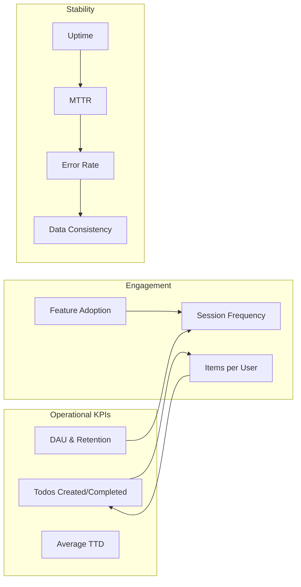

# Success Metrics and KPIs for Todo List Service

## Introduction
Success metrics are defined to enable comprehensive, objective assessment of the backend Todo list application's performance and ongoing value delivery. These indicators allow business stakeholders and technical staff to monitor daily health, anticipate issues, and focus improvements according to measurable business outcomes.

## Operational KPIs

### Daily Active Users (DAU)
WHEN a new day begins, THE todo service SHALL calculate the number of distinct registered users who create, modify, complete, or delete a todo within the 24-hour period. DAU tracks service health and user base engagement.

### Todo Creation Rate
WHEN a user creates a todo, THE todo service SHALL record the action, updating daily/weekly/monthly creation totals. Persistent or rising creation rates SHALL be interpreted as evidence of enduring service value.

### Active User Retention Rate
WHEN analyzing user activity, THE todo service SHALL compute the fraction of users who perform actions on their todos in future days compared to new or one-time users. The system SHALL benchmark above 40% next-day retention and 60% at seven days.

### Todo Completion Rate
WHEN a user marks a todo as complete, THE todo service SHALL update completion statistics and derive the overall percentage of completed todos per period. Healthy service targets are above 70% completion.

### Average Time to Complete (TTD)
WHEN a todo is created and subsequently completed, THE system SHALL record both timestamps, calculate the elapsed time, and compute the average completion interval per period. Lower TTD demonstrates user productivity; the target is under 48 hours.

## User Engagement Metrics

### Session Frequency
WHEN a user starts a session (login), THE system SHALL increment the user's session count for that day/week. Frequent session starts indicate habit-forming use and deeper engagement.

### Items Managed per User
WHEN compiling user statistics, THE system SHALL divide the total number of active todos by the count of unique users, maintaining a healthy average (target 3-10 active todos per user).

### Feature Adoption Rate
IF advanced features (such as due dates or priorities) exist, WHEN a user utilizes such features on a todo, THE system SHALL record feature adoption per user. At least 25% of the active user base SHOULD engage with at least one advanced feature.

## System Stability Targets

### Uptime Percentage
THE todo service SHALL maintain at minimum 99.9% uptime over any rolling one-month period. Outages exceeding five minutes SHALL be logged and categorized for operational review.

### Mean Time to Recovery (MTTR)
WHEN service degradation or outage occurs, THE system SHALL record incident start and full recovery timestamps, aiming for an MTTR under 30 minutes per incident.

### Error Rate
THE backend SHALL track the number of unhandled or unexpected error responses as a percentage of total API calls in real time, with a target to keep this below 0.5%.

### Data Consistency Guarantee
THE todo service SHALL ensure that todos are never lost except via explicit user deletion. Regular audits SHALL confirm zero unintended data loss.

## Diagram: Success Metrics Relationship

## Conclusion
Success will be measured by the system’s ability to consistently deliver high uptime, low error rates, high user engagement, timely todo completion, and reliable data retention. Ongoing reviews derived from these KPIs SHALL drive further product development and operational excellence.