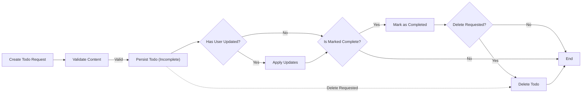
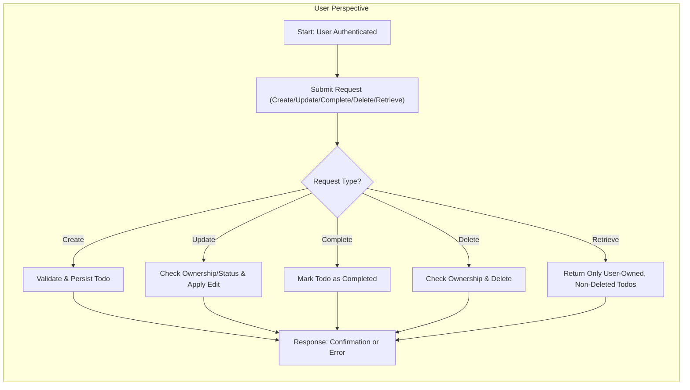

# Minimal Todo List Application Requirements

## 1. Introduction
A Todo List application enables users to manage personal tasks with the simplest possible functionality. The application scope is limited strictly to essential Todo management actions: creating, viewing, modifying, marking as completed, and deleting Todos. All advanced or non-essential features are intentionally excluded to ensure a minimalistic product focused on core requirements.

## 2. Business Actors
- **User:** An authenticated individual who manages their own Todos. Each user’s data is strictly isolated; no user can access the Todos of another user at any time or in any context.
- **System:** The backend application responsible for securely storing, validating, and updating users’ Todos according to business logic and security requirements.

## 3. Core Business Requirements (EARS format)
- WHEN a user is authenticated, THE system SHALL allow them to create new Todo items with required content.
- WHEN a user creates a Todo, THE system SHALL validate that content is present and does not exceed allowable limits.
- WHEN a user views their Todo list, THE system SHALL show only their own active (non-deleted) Todos, in an order determined by business logic (e.g., creation time, status).
- WHEN a user updates a Todo, THE system SHALL only allow it if the requesting user owns the Todo, and IF the Todo is not completed or deleted.
- WHEN a user marks a Todo as completed, THE system SHALL change its status to completed and record the completion time.
- WHEN a Todo is completed, THE system SHALL prevent any further updates except for deletion by the owner.
- WHEN a user deletes a Todo, THE system SHALL remove it permanently (or mark it as deleted), only if the Todo exists and belongs to the user.
- WHEN a user attempts to view, update, complete, or delete a Todo that they do not own, THE system SHALL deny the request and not reveal any information about the Todo.
- WHEN a user requests their Todo list, THE system SHALL not show any deleted or inaccessible items.

## 4. Todo Lifecycle and Data Flow
Todos follow a well-defined, linear business lifecycle. Each item begins with creation (pending/incomplete), may be updated any number of times, can be marked completed (after which no further edits are possible except deletion), and can be deleted at any stage.

All actions are performed strictly in the context of the owning user. Data never crosses user boundaries. There is no group/shared feature and no administrative override.

### Mermaid Diagram: Todo Data Lifecycle

## 5. User Scenarios and Workflows
- **Scenario 1: Create Todo**  
  - User logs in.  
  - User submits content to create a Todo.  
  - System validates, persists, and returns the new Todo.

- **Scenario 2: Update Todo**  
  - User locates their own Todo that is not yet completed or deleted.  
  - User submits a request to modify the text/due date.  
  - System validates ownership and state, applies update.

- **Scenario 3: Complete Todo**  
  - User marks an incomplete Todo as completed.  
  - System marks as complete and prevents further edits.

- **Scenario 4: Delete Todo**  
  - User sends delete request for one of their own Todos.  
  - System verifies ownership, deletes or marks as deleted, and excludes from future lists.

- **Scenario 5: View Todo List**  
  - User requests all active Todos.  
  - System returns only user-owned, non-deleted Todos.

- **Scenario 6: Unauthorized Access Attempt**  
  - User tries to access or modify another user’s Todo (by guessing an ID, etc.).  
  - System denies access and returns a generic error without leaking information.

## 6. Business Rules and Validation
- Content must be present (not empty) and respect maximum length (e.g., 255 characters).  
- Only the Todo owner can perform actions on their Todos.  
- Completed Todos cannot be modified; only deletion is allowed after completion.  
- Deleted Todos are permanently excluded from all user views and queries.  
- No cross-user access is permitted at any time.
- Update and delete operations are atomic and must guarantee consistency.

## 7. Error Handling Requirements
- WHEN the user is unauthenticated, THEN THE system SHALL reject Todo-related requests and require login.
- WHEN the user submits invalid data (e.g., empty content), THEN THE system SHALL return informative errors specifying the issue.
- WHEN a user attempts to access or act on a Todo that does not exist or does not belong to them, THEN THE system SHALL deny the action, return a generic error (to avoid information leakage), and NOT reveal the Todo’s details.
- WHEN a user tries to modify a completed Todo, THEN THE system SHALL reject the update and provide a clear error message.
- WHEN a user attempts any action on a deleted Todo, THEN THE system SHALL return an error indicating the item is inaccessible.

## 8. Authentication and Data Privacy
- All users must authenticate before accessing any Todo functions.
- Each Todo is strictly and permanently associated with the authenticated user who created it.
- THE system SHALL never allow data visibility or operations across user boundaries, even in edge cases (e.g., bulk operations, system failures).
- Authentication sessions must be managed securely (timeouts, logout, etc.).

## 9. Summary Table: Todo Lifecycle Events

| Event        | Triggered By        | Pre-Condition             | Result/Next State             |
|--------------|--------------------|---------------------------|-------------------------------|
| Creation     | User action        | Valid input, not empty    | Incomplete Todo stored        |
| Update       | User action        | Owner, not completed      | Details updated               |
| Completion   | User action        | Owner, not completed      | Status set to completed       |
| Deletion     | User action        | Owner, exists             | Todo deleted/hidden           |
| Retrieval    | User or system     | Owner, not deleted        | Todos returned (isolated)     |

## 10. Mermaid Diagram: User-Operation Flow

## 11. Conclusion
This Todo List application enforces strict user data isolation, minimal features, and clear lifecycle rules. All features and flows are described in natural language, EARS-style requirements, and with validated diagrams. These requirements guarantee a minimal, reliable, and secure backend foundation for user-centric Todo management.