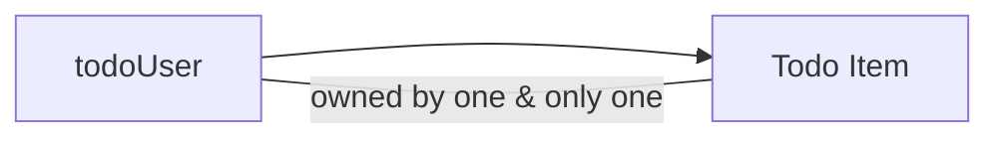

# Data Flow and Relationships in the Todo List Application

## Introduction
Understanding the flow and relationships of data within the Todo List application is essential for maintaining accountability, privacy, and the correct implementation of business rules. This document provides a business-level description of how information moves through the system, identifies who owns which data, explains how users and todo items are conceptually related, and codifies high-level principles to ensure information privacy and security throughout.

## Data Ownership

### Personal Data Ownership
- THE todoUser SHALL own all personal information they provide, including but not limited to email, display name, and authentication credentials. This information is solely associated with the user who provided it and is not accessible by other users, in accordance with privacy-sensitive business requirements.

### Todo Item Ownership
- THE todoUser SHALL be the sole owner of each todo they create. A todo item SHALL only be accessible, modifiable, or removable by its creating user. No user SHALL be able to view, update, or delete todo items belonging to another user. There are no shared todos or administrative accesses in the scope of this application.

### Data Segregation
- WHEN data is stored, THE system SHALL logically separate each user’s set of todos such that cross-user access cannot occur through any standard business process. All forms of aggregation or reporting SHALL operate at the individual user level.

## User-Todo Relationships

### Relationship Structure
- THE system SHALL establish a strict one-to-many relationship such that each todoUser can have multiple todo items, but each todo item SHALL belong to one and only one todoUser. There is no scenario where a todo item is shared among users or assigned to multiple users.

#### Mermaid Diagram: User-Todo Relationship

### Todo Creation, Modification, and Deletion
- WHEN a todoUser creates a new todo item, THE system SHALL associate that todo strictly with their user identity.
- WHEN a todoUser requests a list of their todos, THE system SHALL return only todo items owned by that user.
- WHEN a todoUser updates or marks a todo item as complete, THE system SHALL only allow modifications for items they own.
- IF a todoUser attempts to access, update, or delete a todo that is not owned by them, THEN THE system SHALL deny access and notify the user of unauthorized action.

## Information Privacy and Security Principles

### Data Privacy
- THE system SHALL ensure that no personal or todo data is visible to any user except the data’s owner. No aggregate or anonymized statistics are shown to end users.
- THE system SHALL not display or transmit user identifiers in todo items in ways that other users could view, explicitly or implicitly.

### Data Security
- WHEN performing operations on data (create, read, update, delete), THE system SHALL always verify user identity and authorization at the business level before proceeding.
- THE system SHALL implement business logic to prevent all forms of unintended data disclosure, including accidental exposure through edge cases or data leaks.
- IF a data privacy failure occurs, THEN THE system SHALL block the transaction and display a business-level error message, instructing the user to retry securely.

### Data Retention and Deletion
- WHEN a todoUser deletes a todo item, THE system SHALL remove the todo only from their data space, without affecting any other user’s data.
- WHEN a todoUser deletes their own account, THE system SHALL permanently delete all data owned by that user, including all associated todos.
- WHERE user account or todo data is deleted due to inactivity, THE system SHALL provide notice to the user (if possible) before removal, aligning with privacy best practices.

### Data Integrity
- THE system SHALL maintain integrity of ownership relations such that a todo item can never exist without a user, and orphaned todos SHALL never occur.
- IF a user is deleted for any business reason, THEN THE system SHALL ensure all associated todos are deleted instantly and irretrievably.

## Summary: Key Takeaways
- Each todoUser exclusively owns their profile and their todo items; there is no shared or collective ownership aspect.
- Every todo item is uniquely assigned to a single todoUser and cannot be accessed by others.
- All data flows must respect the strict privacy, security, and integrity requirements, ensuring that users have confidence that their information is never exposed, shared, or mishandled.
- These principles act as fundamental constraints for all future backend and business processes, and every system extension or update must conform to this conceptual data framework.