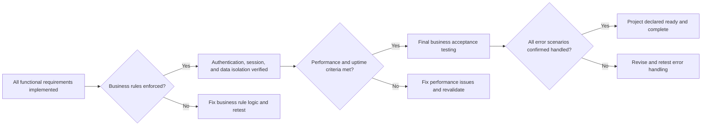

# Success Criteria and Glossary for the Todo List Application

## Business Success Criteria

This application is considered complete and production-ready when the following concrete business and operational criteria are met, in accordance with all relevant user and stakeholder requirements. Criteria are written using the EARS format and drawn from the core requirements and specification context:

### 1. Feature Completeness
- WHEN a registered user creates, updates, marks complete or incomplete, views, and deletes their own todo items without error, THE application SHALL be considered minimum viable for user task management.
- WHEN only essential features required for a Todo list are present and functional, AND NO extraneous features or complexity exist, THE application SHALL meet the minimum feature scope for simplicity and focus.
- WHEN all CRUD (Create, Read, Update, Delete) and completion tracking are implemented AND verified, THE core user-facing requirements SHALL be satisfied.

### 2. Accessibility and Usability
- THE application SHALL grant uninterrupted, self-service access to all authenticated users to view and manage their own todos, absent planned downtime/maintenance.
- WHEN any authentication, input, or submission error occurs, THE system SHALL provide user-friendly, actionable feedback within 2 seconds.
- WHEN users manage tasks, THE system SHALL keep all their todo data strictly separate from other users' data—data isolation is always enforced.
- THE application SHALL require users to register/login before creating or managing todos; user session must persist via JWT authentication with a secure expiry timeout.

### 3. Business Rule Conformance
- WHEN a user submits a todo item, THE application SHALL enforce all business rules: required title, restrict description to allowed length and characters, valid dates, and no duplicate entries.
- IF a user attempts any action on another user’s todos, THEN THE system SHALL prevent the action and return an access denied message.
- IF any invalid/malicious input is detected, THEN THE system SHALL reject it with an appropriate error that guides the user to correct it.

### 4. Data Quality and Integrity
- WHEN a user retrieves their todo list, THE system SHALL ensure all items returned are current, accurate, complete, and owned by the requesting user.
- THE application SHALL never allow leaking or cross-access of todo entries between users, regardless of workflow or attack vector.
- IF a data corruption or loss event occurs, THEN THE system SHALL preserve and/or guide recovery according to administrative and backup policy.

### 5. Operational Stability and Performance
- THE system SHALL respond to all primary requests (create, update, delete, mark complete, login, register) within 2 seconds, meeting the agreed performance standards.
- THE application SHALL maintain monthly uptime of at least 99.5%, with any exceptions or planned maintenance periods documented for stakeholders.

### 6. Privacy and Security
- THE application SHALL handle, store, and process only the minimal necessary personal data needed for the Todo list features.
- THE system SHALL neither expose nor provide raw authentication tokens, secrets, or password hashes through any user-facing endpoint.

### 7. Project Completion Gate
- WHEN all above criteria are independently verified by end-to-end (black-box) business acceptance testing, THE application and project SHALL be considered complete and ready for stakeholder sign-off.

---

## KPIs and Service Milestones

This section defines measurable indicators and milestone events that demonstrate operational achievement and service readiness.

### Core KPIs
| Metric                                        | Target Value                    | Description                                                                   |
|-----------------------------------------------|----------------------------------|-------------------------------------------------------------------------------|
| Functional Coverage Ratio                     | 100%                            | All CRUD and completion features in place as per requirements.                |
| Monthly Active Users (MAU)                    | At least 1 (for MVP)            | At least one unique login per month.
| Data Integrity Rate                           | 100%                            | No user data leak/mix; perfect enforcement of ownership.                      |
| Critical Action Response Time                 | ≤2 seconds                      | All user-facing endpoints respond within 2s.                                  |
| Service Uptime                               | ≥99.5% per month                | High availability, minimal downtime.                                          |
| Invalid Data Rejection Rate                   | 100% of invalid submits         | System rejects all improper/invalid user input.                               |
| Error Recovery Confirmation                   | 100% guidance coverage          | Every error scenario provides actionable user feedback.                       |

---

### Service Delivery Milestones
- Business requirements signed off by all key stakeholders before implementation
- Registration, login, and secure session capability implemented using JWT
- Todo item creation, editing, completion toggling, and deletion working correctly (verified by human user acceptance)
- Data isolation, validation logic, and access restriction functioning as tested
- 30 consecutive days of live system operational stability and meeting required KPIs
- Black-box business acceptance test results confirming all criteria are satisfied
- Project declared ready for production handoff

---

## Glossary of Terms

| Term               | Definition                                                                                           |
|--------------------|------------------------------------------------------------------------------------------------------|
| Todo Item          | A single, user-managed task or note with a title, optional description, status (complete/incomplete), and timestamps. |
| User               | Any individual who registers and manages their own todos, authenticated by email and password.         |
| CRUD               | Create, Read, Update, Delete – core actions supported for todo items by end users.                    |
| JWT                | JSON Web Token; secure technology for stateless user session and authentication.                      |
| Ownership          | Business rule: Each user only views or manages their own todos—no cross-user data access.             |
| Uptime             | Monthly percentage of time when the system is available and operating for users.                      |
| Data Integrity     | Guarantee that user todo data is consistent, correct, and not altered without authorization.          |
| Business Acceptance Testing (BAT) | Verification process where testers check satisfaction of requirements (outside development team).|
| Functional Coverage | The extent to which all required features are implemented and meet requirements.                      |
| Invalid Data Rejection | System behavior of refusing all incomplete, malicious, or non-conforming input.                    |
| Data Isolation     | Absolute enforcement that all user data is logically separated.                                       |
| Personal Data      | Minimal set of information used to identify/login user (email, password securely stored).             |

---

## Mermaid Diagram – Success Validation Flow

---

The Todo List application is considered delivered and successful when it enables users to reliably manage their todos, meets all defined business rules and KPIs, demonstrates operational stability and data privacy, and passes business acceptance testing as described above.