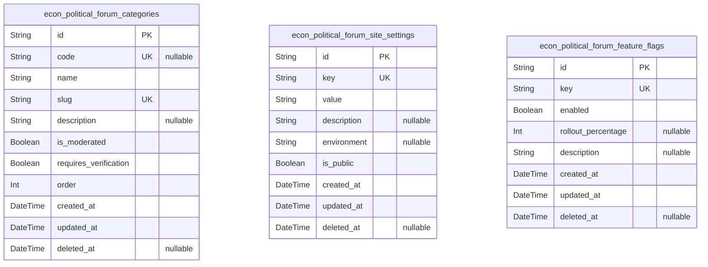
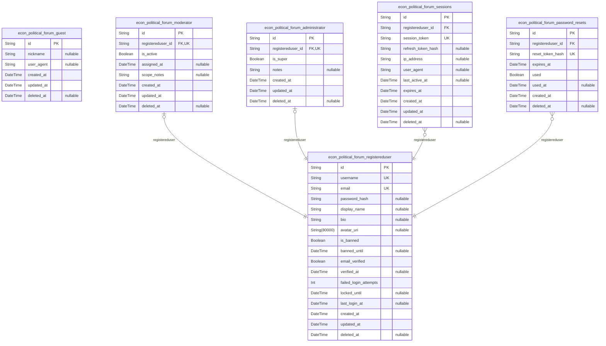
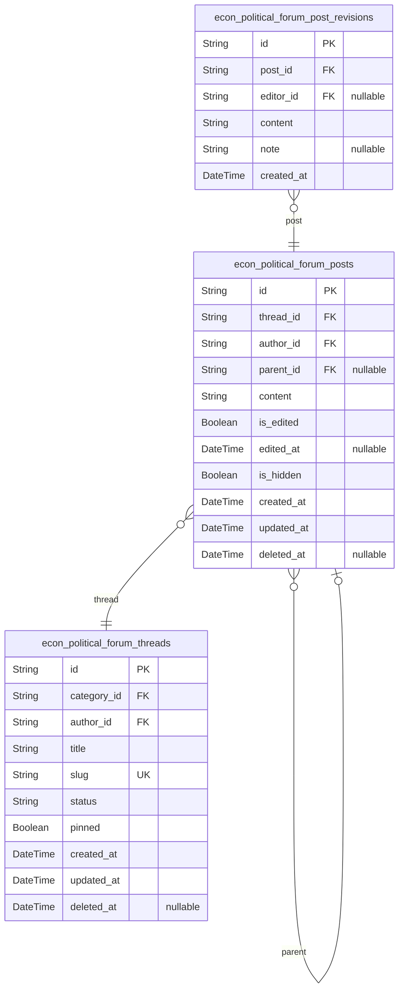
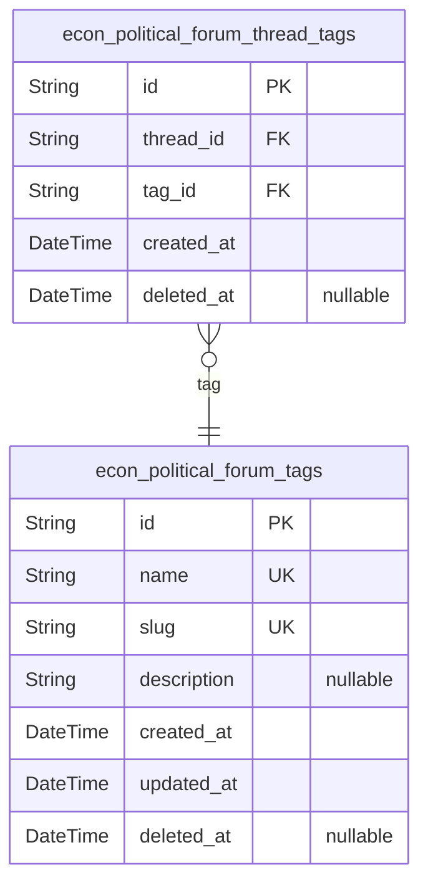
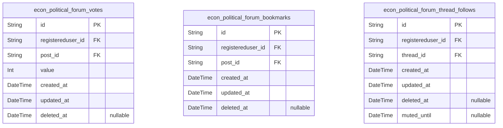
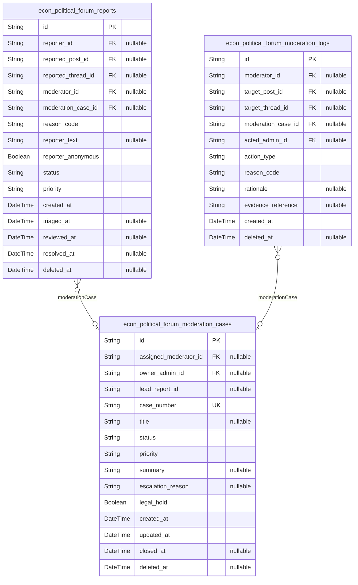
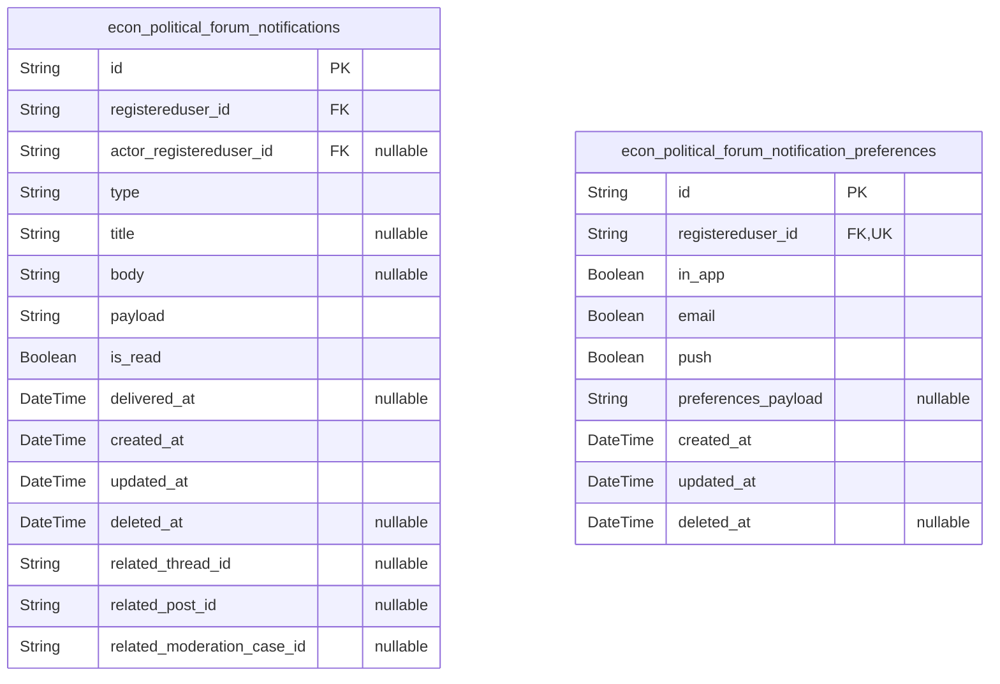
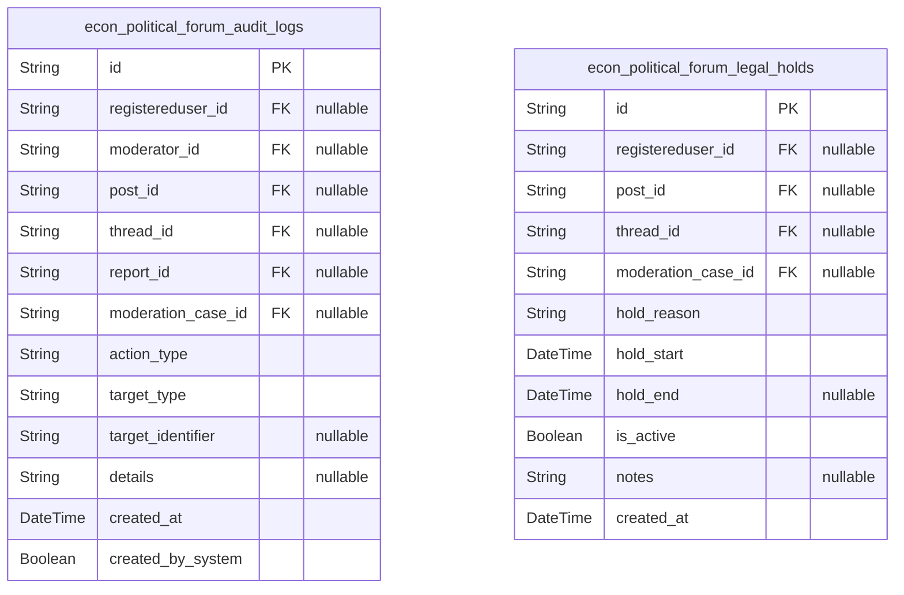

# Prisma Markdown

> Generated by [`prisma-markdown`](https://github.com/samchon/prisma-markdown)

- [Systematic](#systematic)
- [Actors](#actors)
- [Content](#content)
- [Taxonomy](#taxonomy)
- [Interactions](#interactions)
- [Moderation](#moderation)
- [Notifications](#notifications)
- [Audit](#audit)

## Systematic

### `econ_political_forum_categories`

Categories for econPoliticalForum. Represents the canonical
classification of threads and content. Categories drive visibility rules
(public, moderated, restricted), may require verification for posting,
and are referenced by threads and moderation workflows. Contains business
identifiers (code, slug), display metadata, and flags used by content
gating and moderator routing.

Properties as follows:

- `id`: Primary Key.
- `code`
  > Optional short business code for the category (e.g., 'fiscal', 'trade').
  > Unique when present.
- `name`: Human-visible category name (for display in UI and navigation).
- `slug`: URL-friendly unique slug for the category (used for routing and lookups).
- `description`
  > Longer textual description explaining the purpose and scope of the
  > category.
- `is_moderated`
  > Whether new posts in this category require moderator approval before
  > public publishing.
- `requires_verification`
  > If true, posting in this category requires a verified account (email
  > verified or other verification).
- `order`: Display order hint for UI lists; lower values are shown earlier.
- `created_at`: Record creation timestamp.
- `updated_at`: Record last update timestamp.
- `deleted_at`: Soft delete timestamp; null when active.

### `econ_political_forum_site_settings`

Site-level configuration settings for econPoliticalForum. Key/value pairs
used by application code and business logic to control runtime behavior,
feature gating defaults, moderation thresholds, and environment-specific
overrides. Intended to be small, read-mostly, and administrable via an
admin UI. Keys must be unique.

Properties as follows:

- `id`: Primary Key.
- `key`
  > Unique configuration key (namespace.form). Example:
  > 'moderation.report_threshold'.
- `value`
  > Configuration value stored as string. Typed interpretation handled by
  > application logic (boolean/int/json as needed).
- `description`: Human-readable description and intent of the setting for administrators.
- `environment`
  > Optional environment tag (e.g., 'production', 'staging') to scope
  > overrides.
- `is_public`
  > Whether this setting is visible to non-admin clients/UI (for example for
  > feature exposure).
- `created_at`: Record creation timestamp.
- `updated_at`: Record last update timestamp.
- `deleted_at`: Soft delete timestamp; null when active.

### `econ_political_forum_feature_flags`

Runtime feature flags controlling experimental features, gradual
rollouts, and admin toggles. This table is read-mostly and is consulted
at runtime to enable/disable features per key. Includes rollout
percentage for progressive exposure and an administrable description.
Keys are unique.

Properties as follows:

- `id`: Primary Key.
- `key`: Unique feature flag key (e.g., 'new_search_ui').
- `enabled`: Whether the feature is currently enabled globally.
- `rollout_percentage`
  > Optional rollout percentage (0-100) used for gradual exposure to a subset
  > of users; null indicates not used.
- `description`: Human-readable description explaining the feature and purpose.
- `created_at`: Record creation timestamp.
- `updated_at`: Record last update timestamp.
- `deleted_at`: Soft delete timestamp; null when active.

## Actors

### `econ_political_forum_guest`

Lightweight guest identity record for unauthenticated or ephemeral
visitors. Guests can browse and may file reports but cannot create
persistent content. Stored to support anonymous or limited interactions
and moderation traceability. Linked content references should point to
specific actor tables when applicable. This table is primarily for
tracking ephemeral identities and basic metadata.

Properties as follows:

- `id`: Primary Key.
- `nickname`
  > Optional display nickname provided by the guest for ephemeral
  > identification in a session. Not verified.
- `user_agent`
  > User-agent string captured at first interaction for basic device/context
  > information.
- `created_at`: Record creation timestamp.
- `updated_at`: Last update timestamp for the guest record.
- `deleted_at`: Soft-delete timestamp. Null if active.

### `econ_political_forum_registereduser`

Primary persistent registered user account. Contains authentication and
profile fields used throughout the platform. Supports email/password or
external auth (password_hash nullable). Includes verification and lockout
fields to support email verification, account lockout policies, and basic
security telemetry. Uniqueness enforced on username and email.

Properties as follows:

- `id`: Primary Key.
- `username`: Unique account username used for login and display (normalized).
- `email`: Verified email address for account recovery and notifications.
- `password_hash`
  > Password hash for local authentication. Nullable for accounts created via
  > external OAuth providers.
- `display_name`: Optional display name shown publicly; may differ from username.
- `bio`: Optional short biography or profile description.
- `avatar_uri`: URI to user's avatar image (may be proxied via CDN).
- `is_banned`: Flag indicating whether the account is currently banned.
- `banned_until`: Optional suspension expiry timestamp when temporarily banned.
- `email_verified`: Whether the account's email has been verified (true) or not (false).
- `verified_at`: Timestamp when the account's email was verified; null if not verified.
- `failed_login_attempts`
  > Rolling counter of recent failed login attempts used to enforce temporary
  > lockouts.
- `locked_until`
  > If present, authentication is blocked until this timestamp as part of
  > lockout policy.
- `last_login_at`: Most recent successful login timestamp for security analytics.
- `created_at`: Account creation timestamp.
- `updated_at`: Last profile update timestamp.
- `deleted_at`: Soft-delete timestamp for account deletion requests or anonymization.

### `econ_political_forum_moderator`

Moderator role record linking back to a registered user. Stores
moderator-specific metadata such as assignment, active status, and
moderation scope. The registereduser_id is unique enforcing a 1:1
relationship between a moderator record and the registered user identity.

Properties as follows:

- `id`: Primary Key.
- `registereduser_id`
  > Linked registered user identity. {@link
  > econ_political_forum_registereduser.id}.
- `is_active`: Whether the moderator is active and assigned to triage duties.
- `assigned_at`: Timestamp when moderator privileges were granted or assigned.
- `scope_notes`
  > Optional notes describing moderator scope or jurisdiction (e.g.,
  > categories assigned).
- `created_at`: Moderator record creation timestamp.
- `updated_at`: Last update timestamp for moderator metadata.
- `deleted_at`
  > Soft-delete timestamp if moderator privileges are revoked and record
  > retained for audit.

### `econ_political_forum_administrator`

Administrator role record linking to a registered user. Stores
admin-specific metadata and flags for global privileges. This enforces a
1:1 mapping to a registered user to centralize identity while separating
admin attributes and auditability.

Properties as follows:

- `id`: Primary Key.
- `registereduser_id`
  > Linked registered user identity. {@link
  > econ_political_forum_registereduser.id}.
- `is_super`: Flag indicating whether the administrator has full (super) privileges.
- `notes`: Optional administrative notes for audit or delegation purposes.
- `created_at`: Administrator record creation timestamp.
- `updated_at`: Last update timestamp for admin metadata.
- `deleted_at`
  > Soft-delete timestamp used when admin privileges are revoked while
  > preserving audit trail.

### `econ_political_forum_sessions`

Session records for registered users. Stores session tokens, expiration,
client metadata, and last activity to enable session revocation and
rotation. This is a subsidiary table managed through the registered user
lifecycle APIs and is not a primary business entity by itself.

Properties as follows:

- `id`: Primary Key.
- `registereduser_id`: Owning registered user. [econ_political_forum_registereduser.id](#econ_political_forum_registereduser).
- `session_token`
  > Opaque session token or token identifier used for session validation.
  > Should be unique per active session.
- `refresh_token_hash`
  > Hash of refresh token for rotation and verification; storing hash
  > improves security.
- `ip_address`
  > IP address observed at session creation for risk analysis and security
  > logs.
- `user_agent`: User agent string captured at session creation.
- `last_active_at`: Timestamp of the last observed activity for the session.
- `expires_at`: Session expiry timestamp.
- `created_at`: Session creation timestamp.
- `updated_at`: Last update timestamp for session record.
- `deleted_at`: Soft-delete timestamp for revoked sessions retained for audit.

### `econ_political_forum_password_resets`

Password reset requests for registered users. Stores a single-use reset
token (or its hash), expiry, usage flag, and timestamps. This is a
subsidiary table used by account recovery flows and is managed through
registered user lifecycle operations.

Properties as follows:

- `id`: Primary Key.
- `registereduser_id`
  > Target registered user for the password reset request. {@link
  > econ_political_forum_registereduser.id}.
- `reset_token_hash`
  > Hash of the single-use reset token. Storing a hash avoids storing
  > plaintext tokens.
- `expires_at`: Expiry timestamp for the reset token.
- `used`: Flag indicating whether the reset token has been consumed.
- `used_at`: Timestamp when the token was consumed, if applicable.
- `created_at`: Creation timestamp for the password reset request.
- `deleted_at`
  > Soft-delete timestamp for expired or revoked reset requests kept for
  > audit.

## Content

### `econ_political_forum_threads`

Discussion threads (top-level topics). Canonical thread metadata only —
no pre-calculated aggregates. Refer to category ({@link
econ_political_forum_categories.id}) and author ({@link
econ_political_forum_registereduser.id}). Temporal fields included for
audit and soft-delete. Counters (view_count, post_count) removed per
normalization rules; use materialized views (mv_*) for aggregates.

Properties as follows:

- `id`: Primary Key.
- `category_id`: Belonged category. [econ_political_forum_categories.id](#econ_political_forum_categories).
- `author_id`: Authoring registered user. [econ_political_forum_registereduser.id](#econ_political_forum_registereduser).
- `title`: Thread title used for listing and search.
- `slug`: URL-friendly identifier for the thread (unique).
- `status`: Thread lifecycle status (e.g., 'open','closed','pinned').
- `pinned`: Whether the thread is pinned for prominent display.
- `created_at`: Creation timestamp.
- `updated_at`: Last update timestamp.
- `deleted_at`: Soft-delete timestamp; null when active.

### `econ_political_forum_posts`

Posts and replies belonging to threads. Canonical post content only (no
cached counters or rendered HTML). Parent relation kept for replies.
Revision history stored in econ_political_forum_post_revisions
(snapshot). Removed derived fields (vote_count, upvote_count,
downvote_count, content_html) to comply with normalization rules; move
aggregates to materialized views.

Properties as follows:

- `id`: Primary Key.
- `thread_id`: Belonged thread. [econ_political_forum_threads.id](#econ_political_forum_threads).
- `author_id`: Authoring registered user. [econ_political_forum_registereduser.id](#econ_political_forum_registereduser).
- `parent_id`: Optional parent post for replies. [econ_political_forum_posts.id](#econ_political_forum_posts).
- `content`: Raw post content (plaintext or sanitized markdown).
- `is_edited`: Flag indicating whether the post was edited after creation.
- `edited_at`: Timestamp of the latest edit; null if never edited.
- `is_hidden`: Moderator hide flag; when true the post is not shown in public listings.
- `created_at`: Creation timestamp.
- `updated_at`: Last update timestamp.
- `deleted_at`: Soft-delete timestamp; null when active.

### `econ_political_forum_post_revisions`

Append-only revision history for posts. Each revision captures the full
post content at a point in time, the editor (if different from author),
and a created_at timestamp. This table is snapshot-like and intended for
audit/history and moderator review.

Properties as follows:

- `id`: Primary Key.
- `post_id`: Referenced post. [econ_political_forum_posts.id](#econ_political_forum_posts).
- `editor_id`
  > Editor (registered user) who made the revision, if applicable. {@link
  > econ_political_forum_registereduser.id}.
- `content`: Full post content snapshot at the time of revision.
- `note`: Optional short editor note describing the change.
- `created_at`: Revision timestamp (when the snapshot was recorded).

## Taxonomy

### `econ_political_forum_tags`

Normalized tag catalog used for discovery and search across the
econPoliticalForum. Each tag is a primary, independently managed entity.
Tags are referenced by threads through the join table {@link
econ_political_forum_thread_tags}. Includes temporal fields for auditing
and soft-delete support.

Properties as follows:

- `id`: Primary Key.
- `name`
  > Human-readable tag name. Examples: 'fiscal-policy', 'inflation'.
  > Normalized and unique.
- `slug`: URL-safe lower-case slug for the tag. Unique and indexed for fast lookup.
- `description`: Optional longer description of the tag's purpose or scope.
- `created_at`: Creation timestamp (UTC).
- `updated_at`: Last update timestamp (UTC).
- `deleted_at`: Soft-delete timestamp. Null when active.

### `econ_political_forum_thread_tags`

Join table mapping threads to tags. Renamed foreign key field to tag_id
for naming consistency and added index optimized for tag->threads
lookups. Preserves UUID primary key, created_at and soft-delete fields
for audit. References: [econ_political_forum_threads.id](#econ_political_forum_threads), {@link
econ_political_forum_tags.id}.

Properties as follows:

- `id`: Primary Key.
- `thread_id`: Belonged thread. [econ_political_forum_threads.id](#econ_political_forum_threads).
- `tag_id`: Belonged tag. [econ_political_forum_tags.id](#econ_political_forum_tags).
- `created_at`: Timestamp when the tag was attached to the thread.
- `deleted_at`: Soft-delete timestamp for the join. Null when active.

## Interactions

### `econ_political_forum_votes`

User votes on posts. One vote per user per post is enforced via a
composite unique constraint. Stores vote value (application-enforced
domain: 1 = upvote, -1 = downvote), timestamps, and soft-delete to
support audit and rollback. References {@link
econ_political_forum_registereduser.id} and {@link
econ_political_forum_posts.id}.

Properties as follows:

- `id`: Primary Key.
- `registereduser_id`: Owning registered user's [econ_political_forum_registereduser.id](#econ_political_forum_registereduser).
- `post_id`: Target post's [econ_political_forum_posts.id](#econ_political_forum_posts).
- `value`
  > Vote value. Business domain: 1 = upvote, -1 = downvote. Application
  > should validate allowed values; consider DB CHECK or string enum if
  > preferred.
- `created_at`: Creation timestamp for the vote record.
- `updated_at`: Last update time for the vote record (used when vote is changed).
- `deleted_at`: Soft-delete timestamp; null when active.

### `econ_political_forum_bookmarks`

User bookmarks (saved posts). Enforces one bookmark per user per post via
composite unique constraint. Soft-delete used to allow unbookmark while
preserving an audit trail. References {@link
econ_political_forum_registereduser.id} and {@link
econ_political_forum_posts.id}.

Properties as follows:

- `id`: Primary Key.
- `registereduser_id`: Owning registered user's [econ_political_forum_registereduser.id](#econ_political_forum_registereduser).
- `post_id`: Bookmarked post's [econ_political_forum_posts.id](#econ_political_forum_posts).
- `created_at`: Bookmark creation timestamp.
- `updated_at`: Last update time for the bookmark (if metadata changes).
- `deleted_at`: Soft-delete timestamp; null when bookmark is active.

### `econ_political_forum_thread_follows`

Tracks thread subscriptions (follows) by users for notification and feed
generation. Enforces one follow per user per thread. Includes optional
muted_until for temporary notification suppression. References {@link
econ_political_forum_registereduser.id} and {@link
econ_political_forum_threads.id}.

Properties as follows:

- `id`: Primary Key.
- `registereduser_id`: Owning registered user's [econ_political_forum_registereduser.id](#econ_political_forum_registereduser).
- `thread_id`: Followed thread's [econ_political_forum_threads.id](#econ_political_forum_threads).
- `created_at`: Timestamp when the follow was created.
- `updated_at`: Last update time for the follow (e.g., mute toggles).
- `deleted_at`: Soft-delete timestamp; null when follow is active.
- `muted_until`: Optional timestamp until which notifications for this follow are muted.

## Moderation

### `econ_political_forum_reports`

Structured user reports of potentially violating content (post or
thread). Captures reporter identity (when available), selected reason
code, optional reporter details, linkage to target content (post or
thread), current processing status, moderation_case association, and SLA
timestamps for triage and review. Adjusted to ensure referential
integrity and audit preservation: reporter FK uses SET NULL semantics
(preserve reports if user removed), removed incorrect generated
reverse-array relation, and added composite indexes and GIN index for
search. Includes explicit temporal fields and soft-delete for retention.
[econ_political_forum_posts.id](#econ_political_forum_posts) {@link
econ_political_forum_threads.id} {@link
econ_political_forum_registereduser.id}

Properties as follows:

- `id`: Primary Key.
- `reporter_id`
  > Reporting user's [econ_political_forum_registereduser.id](#econ_political_forum_registereduser). Null if
  > reporter requested anonymity or is unauthenticated.
- `reported_post_id`
  > Target post's [econ_political_forum_posts.id](#econ_political_forum_posts). Nullable if the
  > report targets a thread instead.
- `reported_thread_id`
  > Target thread's [econ_political_forum_threads.id](#econ_political_forum_threads). Nullable if the
  > report targets a post.
- `moderator_id`
  > Reviewing moderator's [econ_political_forum_moderator.id](#econ_political_forum_moderator).
  > Populated when a moderator triages or acts on the report.
- `moderation_case_id`
  > Associated moderation case {@link
  > econ_political_forum_moderation_cases.id} aggregating related reports for
  > admin review.
- `reason_code`
  > Structured reason code selected by the reporter (e.g.,
  > 'harassment','doxxing','misinformation','illegal_content','spam','other').
  > Stored as string for flexibility and clarity.
- `reporter_text`
  > Optional free-text provided by reporter giving additional context (max
  > 2000 chars recommended).
- `reporter_anonymous`
  > Whether the reporter requested anonymity from the content author/public.
  > Moderators retain reporter identity in internal UI when available.
- `status`
  > Processing state of the report (e.g.,
  > 'pending','triaged','dismissed','action_taken','escalated').
- `priority`
  > Operational priority label for triage (e.g.,
  > 'low','normal','high','urgent').
- `created_at`: Report creation timestamp (immutable).
- `triaged_at`: Timestamp when a moderator first acknowledged or triaged the report.
- `reviewed_at`: Timestamp when a final review/action was recorded for the report.
- `resolved_at`: Timestamp when the report was resolved (action taken or dismissed).
- `deleted_at`
  > Soft-delete timestamp for the report record when removal is required. Use
  > sparingly; legal holds may prevent deletion.

### `econ_political_forum_moderation_logs`

Immutable moderation log entries recording actions taken by moderators or
system actors. Each entry is append-only and includes actor reference,
action type, linked content (post or thread), optional linkage to a
moderation case, structured reason codes, and free-text rationale.
Designed for legal audit, retention, and chronological reconstruction of
moderation decisions. {@\link econ_political_forum_moderator.id} {@\link
econ_political_forum_posts.id} {@\link econ_political_forum_threads.id}
{@\link econ_political_forum_moderation_cases.id}

Properties as follows:

- `id`: Primary Key.
- `moderator_id`
  > Acting moderator's {@\link econ_political_forum_moderator.id}. Nullable
  > for system or automated actions.
- `target_post_id`
  > Target post affected by the action ({@\link
  > econ_political_forum_posts.id}). Nullable if action targets a thread or
  > user record.
- `target_thread_id`
  > Target thread affected by the action ({@\link
  > econ_political_forum_threads.id}). Nullable if action targets a post.
- `moderation_case_id`
  > Associated moderation case {@\link
  > econ_political_forum_moderation_cases.id} for grouped investigations.
- `acted_admin_id`
  > Acting administrator id when an admin performed or finalized the action
  > ({@\link econ_political_forum_administrator.id}). Nullable.
- `action_type`
  > Type of moderation action (e.g.,
  > 'hide','remove','warning','suspend','approve','escalate','merge','flag').
- `reason_code`
  > Structured policy reason code applied by the moderator (maps to policy
  > clauses).
- `rationale`
  > Moderator-provided free-text rationale explaining the action (up to
  > recommended 1000 chars).
- `evidence_reference`
  > Optional URI or reference id pointing to stored evidence bundles or
  > archived snapshots (could be internal object id or URL).
- `created_at`: Timestamp when the moderation action was recorded (immutable).
- `deleted_at`: Soft-delete marker for the log entry (rare; prefer append-only retention).

### `econ_political_forum_moderation_cases`

Moderation case entity that aggregates related reports and moderation
logs for administrator investigation, escalation, and appeals processing.
Contains operational metadata for triage, assignment, legal hold
flagging, and case lifecycle timestamps. Cases provide a single
coordination point for researchers and admins while preserving immutable
moderation_logs for audit.

Properties as follows:

- `id`: Primary Key.
- `assigned_moderator_id`
  > Moderator assigned to manage the case {@link
  > econ_political_forum_moderator.id}. Nullable when unassigned.
- `owner_admin_id`
  > Administrator owner or final approver for the case {@link
  > econ_political_forum_administrator.id}. Nullable.
- `lead_report_id`
  > Representative report id that initiated the case {@link
  > econ_political_forum_reports.id}. Stored as uuid rather than a DB-level
  > foreign key to avoid circular dependency.
- `case_number`
  > Human-friendly unique case identifier used in operations and
  > communication (e.g., 'CASE-2025-0001').
- `title`: Short case title summarizing the issue for quick identification.
- `status`
  > Lifecycle status of the case (e.g.,
  > 'open','investigating','closed','on_hold').
- `priority`: Operational priority label (e.g., 'low','normal','high','urgent').
- `summary`
  > Concise summary or executive note for the case; suitable for dashboards
  > and quick reviews.
- `escalation_reason`
  > If escalated, the reason for escalation (e.g.,
  > 'legal','law_enforcement','coordinated_activity').
- `legal_hold`
  > Whether a legal hold applies to the case and associated evidence; when
  > true archival/deletion operations must be inhibited.
- `created_at`: Case creation timestamp.
- `updated_at`: Last update timestamp for the case.
- `closed_at`: Timestamp when the case was closed/resolved.
- `deleted_at`: Soft-delete timestamp for the case record (rare).

## Notifications

### `econ_political_forum_notifications`

User-facing notification events. Each record represents a single
notification targeted to a registered user (recipient). Notifications are
append-only events by business practice with soft-delete support. Records
contain a small, flexible JSON payload (stored as string) for extensible
delivery payloads (mentions, replies, moderation actions, system
messages). Key relations: recipient ({@link
econ_political_forum_registereduser.id}), optional actor ({@link
econ_political_forum_registereduser.id}) who triggered the notification,
and optional references to related domain entities (thread, post,
moderation_case) stored as UUIDs for cross-component linkage. Optimized
for fast per-recipient reads and supports marking notifications as read,
delivery timestamps, and light audit fields.

Properties as follows:

- `id`: Primary Key.
- `registereduser_id`
  > Recipient registered user's {@link
  > econ_political_forum_registereduser.id}.
- `actor_registereduser_id`
  > Optional actor (triggering user) {@link
  > econ_political_forum_registereduser.id}. Nullable when system-generated.
- `type`: Notification type code (e.g., 'mention', 'reply', 'moderation', 'system').
- `title`
  > Short human-readable title for the notification. Optional; used in UI
  > summaries.
- `body`: Optional short message body or plain-text excerpt for display in lists.
- `payload`
  > Flexible JSON payload (serialized as string) containing structured
  > delivery data (links to thread/post ids, excerpt, metadata).
- `is_read`: Whether the recipient has marked this notification as read.
- `delivered_at`
  > When the notification was delivered to the user (for push/email).
  > Nullable if not yet delivered or for in-app only events.
- `created_at`: Record creation timestamp.
- `updated_at`: Record last update timestamp.
- `deleted_at`
  > Soft-delete timestamp. When set, notification is treated as removed from
  > normal listings but retained for audit.
- `related_thread_id`
  > Optional related thread id (referencing {@link
  > econ_political_forum_threads.id}) stored as UUID for linkage. Nullable to
  > avoid hard FK to other component in this schema file.
- `related_post_id`
  > Optional related post id (referencing {@link
  > econ_political_forum_posts.id}) stored as UUID for linkage.
- `related_moderation_case_id`
  > Optional related moderation case id (referencing {@link
  > econ_political_forum_moderation_cases.id}) stored as UUID for linkage.

### `econ_political_forum_notification_preferences`

Per-user notification delivery preferences. One row per registered user
controls channel-level toggles (in-app, email, push) and a flexible JSON
string for per-notification-type overrides. Designed to be small and
infrequently updated; referenced when enqueuing or delivering
notifications. Links to registered users via a one-to-one foreign key
constraint.

Properties as follows:

- `id`: Primary Key.
- `registereduser_id`
  > Belonged registered user's {@link
  > econ_political_forum_registereduser.id}. One-to-one relationship enforced
  > with a unique constraint.
- `in_app`: Whether in-app notifications are enabled for the user.
- `email`: Whether email notifications are enabled for the user.
- `push`: Whether push notifications are enabled for the user.
- `preferences_payload`
  > Optional JSON-serialized per-type preference overrides (e.g.,
  > {"mentions": {"email": false}}) stored as string for portability.
- `created_at`: Record creation timestamp.
- `updated_at`: Record last update timestamp.
- `deleted_at`: Soft-delete timestamp for preference records.

## Audit

### `econ_political_forum_audit_logs`

Immutable audit log entries capturing system and moderation events for
compliance and incident investigation. Each record references acting
principals and related objects (post, thread, report, moderation case).
Relations intentionally use nullable foreign keys and MUST use SET NULL
or RESTRICT on delete to preserve audit history when referenced objects
are removed. This model is append-only and classified as a snapshot for
retention and legal export workflows.

Properties as follows:

- `id`: Primary Key.
- `registereduser_id`
  > Acting user's [econ_political_forum_registereduser.id](#econ_political_forum_registereduser). Nullable
  > for system actions.
- `moderator_id`
  > Acting moderator's [econ_political_forum_moderator.id](#econ_political_forum_moderator). Nullable
  > when action is not by a moderator.
- `post_id`
  > Referenced post [econ_political_forum_posts.id](#econ_political_forum_posts). Nullable to
  > preserve audit when posts are removed.
- `thread_id`
  > Referenced thread [econ_political_forum_threads.id](#econ_political_forum_threads). Nullable to
  > preserve audit when threads are removed.
- `report_id`
  > Associated report [econ_political_forum_reports.id](#econ_political_forum_reports). Nullable to
  > preserve audit records independent of report lifecycle.
- `moderation_case_id`
  > Associated moderation case {@link
  > econ_political_forum_moderation_cases.id}. Nullable to preserve audit
  > records independent of case lifecycle.
- `action_type`
  > Categorical action type (e.g., 'create', 'edit', 'delete', 'hide',
  > 'warn', 'suspend', 'escalate', 'legal_disclosure').
- `target_type`
  > Type of target object (e.g.,
  > 'post','thread','user','report','moderation_case').
- `target_identifier`
  > Canonical identifier of the target as a string for cross-domain queries;
  > nullable when not applicable.
- `details`
  > Free-text or JSON-serialized details of the event (evidence snapshot,
  > moderator rationale, metadata). Keep size reasonable; heavy binary
  > artifacts should be stored externally and referenced by
  > evidence_reference.
- `created_at`: Timestamp when the audit entry was recorded (ISO 8601).
- `created_by_system`
  > Whether the entry was generated by an automated system (true) or by a
  > human actor (false).

### `econ_political_forum_legal_holds`

Legal hold records that prevent deletion or purging of content subject to
legal or investigatory requirements. Holds must persist independently of
target object lifecycle; relations use nullable FKs and application/DB
logic must prevent purge while holds are active. Classified as subsidiary
because holds support enforcement rather than user-facing CRUD.

Properties as follows:

- `id`: Primary Key.
- `registereduser_id`
  > Administrator or legal officer who placed the hold. {@link
  > econ_political_forum_registereduser.id}. Nullable when placed by
  > system/legal process.
- `post_id`
  > If the hold targets a specific post, reference to {@link
  > econ_political_forum_posts.id}. Nullable when the hold targets a thread
  > or case.
- `thread_id`
  > If the hold targets a thread, reference to {@link
  > econ_political_forum_threads.id}. Nullable when not applicable.
- `moderation_case_id`
  > Optional link to a related moderation case {@link
  > econ_political_forum_moderation_cases.id} that motivated the hold.
- `hold_reason`
  > Short human-readable reason for the legal hold (e.g., 'subpoena', 'law
  > enforcement request', 'litigation').
- `hold_start`: Timestamp when the hold became effective (ISO 8601).
- `hold_end`: Optional timestamp when the hold is scheduled to end; null if indefinite.
- `is_active`: Whether the hold is currently active and prevents purging.
- `notes`
  > Optional free-text notes or case identifiers for internal use; do not
  > expose sensitive PII in this field without access controls.
- `created_at`: Timestamp when the hold record was created.
