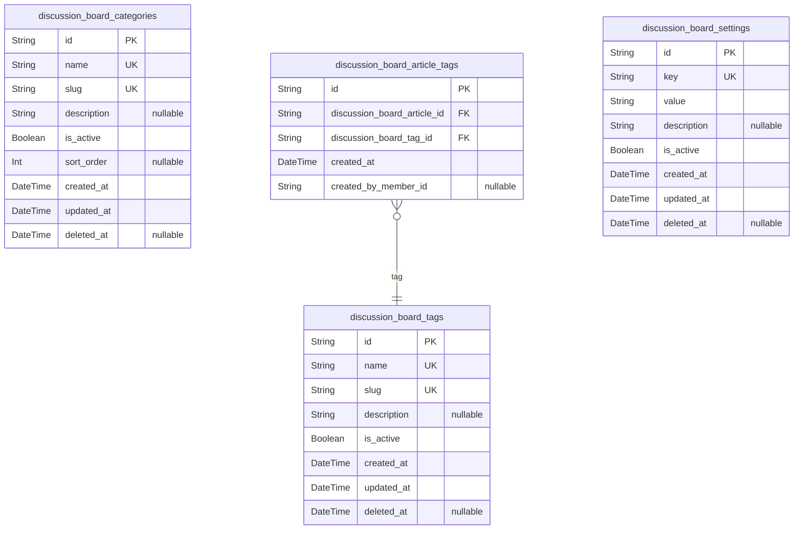
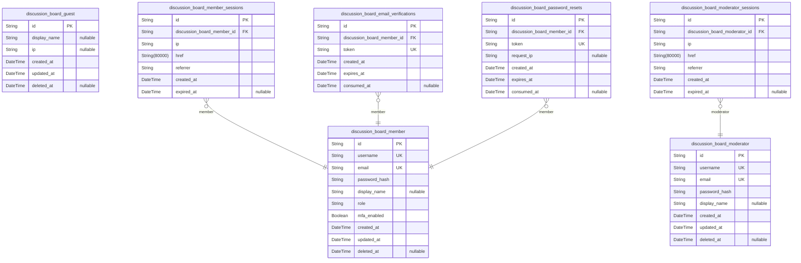
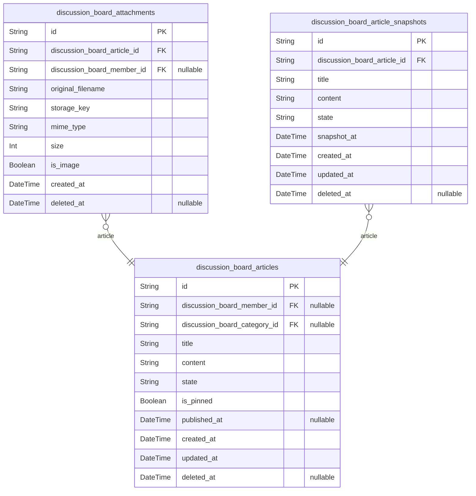
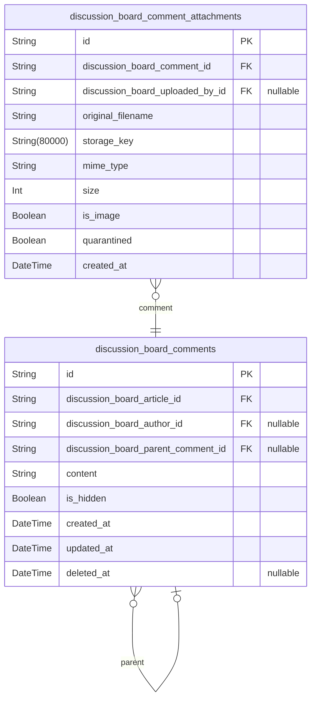
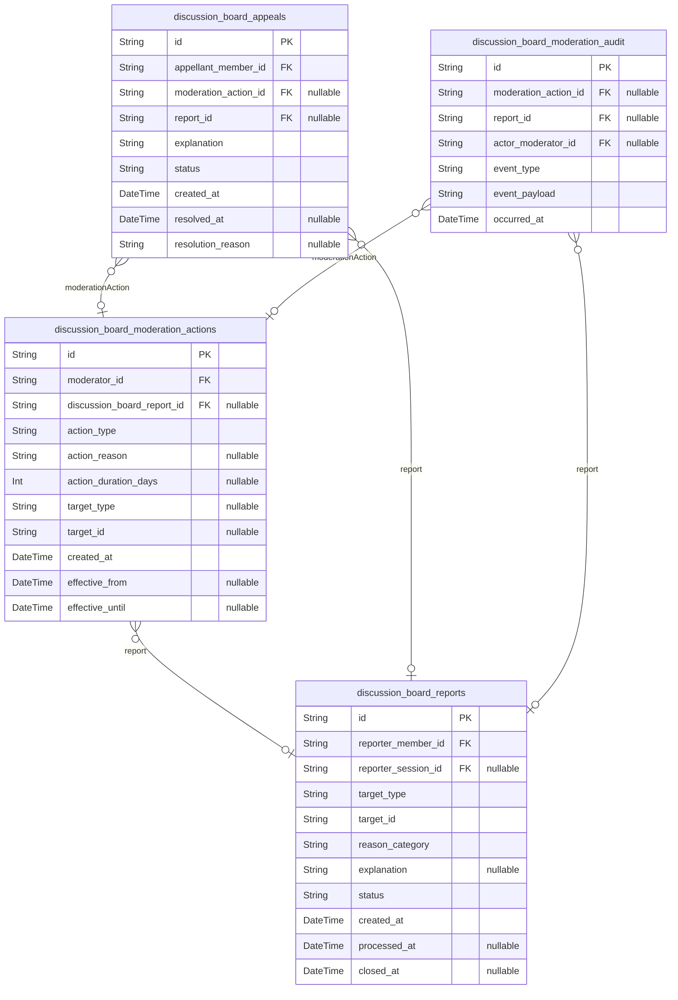
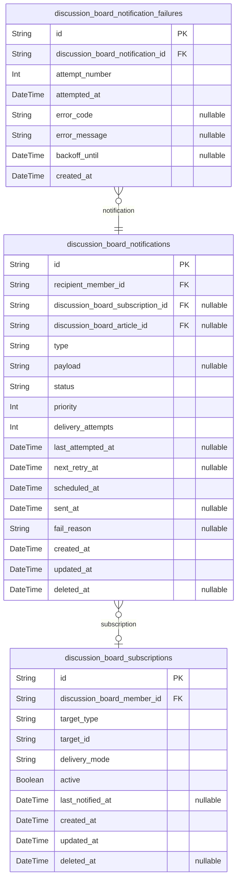
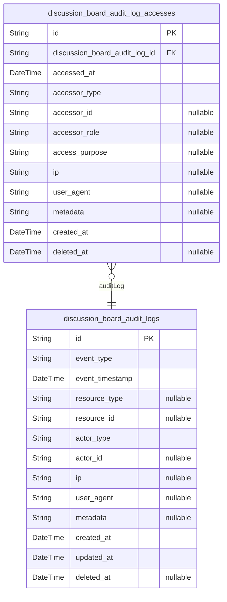

# Prisma Markdown

> Generated by [`prisma-markdown`](https://github.com/samchon/prisma-markdown)

- [Systematic](#systematic)
- [Actors](#actors)
- [Content](#content)
- [Comments](#comments)
- [Moderation](#moderation)
- [Notifications](#notifications)
- [Audit](#audit)

## Systematic

```mermaid
erDiagram
"discussion_board_categories" {
  String id PK
  String name UK
  String slug UK
  String description "nullable"
  Boolean is_active
  Int sort_order "nullable"
  DateTime created_at
  DateTime updated_at
  DateTime deleted_at "nullable"
}
"discussion_board_tags" {
  String id PK
  String name UK
  String slug UK
  String description "nullable"
  Boolean is_active
  DateTime created_at
  DateTime updated_at
  DateTime deleted_at "nullable"
}
"discussion_board_article_tags" {
  String id PK
  String discussion_board_article_id FK
  String discussion_board_tag_id FK
  DateTime created_at
  String created_by_member_id "nullable"
}
"discussion_board_settings" {
  String id PK
  String key UK
  String value
  String description "nullable"
  Boolean is_active
  DateTime created_at
  DateTime updated_at
  DateTime deleted_at "nullable"
}
"discussion_board_article_tags" }o--|| "discussion_board_tags" : tag
```

### `discussion_board_categories`

Categories for organizing published articles. Each category represents a
primary organizational bucket (e.g., Economics, Policy, Commentary).
Categories are independently managed by administrators and referenced by
articles via a primary_category_id in the Content component. Contains
activation flags and temporal audit fields for lifecycle management.
Recommended: add DB-level defaults for created_at and updated_at and
consider case-insensitive uniqueness for slug if desired.

Properties as follows:

- `id`: Primary Key.
- `name`: Human-readable category name used in listings and UI (e.g., 'Economics').
- `slug`
  > URL-friendly unique identifier for category (e.g., 'economics'). Consider
  > enforcing lower-case uniqueness (citext or functional index lower(slug)).
- `description`
  > Optional longer description explaining the category's scope and usage
  > guidance.
- `is_active`
  > Whether the category is active and available for assignment to new
  > articles.
- `sort_order`
  > Optional integer used to order categories in curated lists; lower values
  > appear first.
- `created_at`
  > Record creation timestamp. Recommendation: add DB default @default(now())
  > to ensure value at insert.
- `updated_at`: Record last modification timestamp. Recommendation: use Prisma's
- `deleted_at`: Soft-delete timestamp; null when active.

### `discussion_board_tags`

Tag catalogue for articles. Tags provide flexible, many-to-many labeling
for articles to aid discovery and search. Tags are managed independently
and may be applied to multiple articles via the junction table {@link
discussion_board_article_tags}. Recommended: add DB-level defaults for
created_at and updated_at; consider case-insensitive slug uniqueness if
product requires it.

Properties as follows:

- `id`: Primary Key.
- `name`: Tag display name (e.g., 'inflation').
- `slug`
  > URL-friendly unique tag key (e.g., 'inflation'). Consider enforcing
  > lower-case uniqueness (citext or functional index lower(slug)).
- `description`: Optional description or guidance for tag usage.
- `is_active`: Whether the tag is currently active and assignable.
- `created_at`: Record creation timestamp. Recommendation: add DB default @default(now()).
- `updated_at`
  > Record last modification timestamp. Recommendation: add @updatedAt or DB
  > trigger to maintain this value.
- `deleted_at`: Soft-delete timestamp; null when active.

### `discussion_board_article_tags`

Junction table implementing the many-to-many relationship between
articles and tags. Each row links one article (existing {@link
discussion_board_articles.id}) to one tag ({@link
discussion_board_tags.id}). Composite uniqueness prevents duplicate tag
assignments per article. Recommendation: add created_at DB default

Properties as follows:

- `id`: Primary Key.
- `discussion_board_article_id`: Referenced article. [discussion_board_articles.id](#discussion_board_articles).
- `discussion_board_tag_id`: Referenced tag. [discussion_board_tags.id](#discussion_board_tags).
- `created_at`: Link creation timestamp. Recommendation: add DB default @default(now()).
- `created_by_member_id`
  > Optional actor (member) who created the tag assignment; references {@link
  > discussion_board_member.id} in other components.

### `discussion_board_settings`

Global key/value configuration entries used by the application for
runtime feature flags, thresholds, and SLO parameters. Settings are
managed by administrators and read by other components at runtime. Keys
are unique business identifiers. Recommendation: add
created_at/updated_at DB defaults and consider jsonb for structured
values if necessary.

Properties as follows:

- `id`: Primary Key.
- `key`: Unique settings key (e.g., 'moderation.auto_hide_report_threshold').
- `value`
  > Settings value stored as string; consumer interprets type (boolean,
  > number, JSON) as needed. Consider jsonb if structured queries are
  > necessary.
- `description`: Human-friendly description explaining purpose of the setting.
- `is_active`
  > Whether the setting entry is active and should be considered by runtime
  > code.
- `created_at`: Record creation timestamp. Recommendation: add DB default @default(now()).
- `updated_at`
  > Record last modification timestamp. Recommendation: add @updatedAt or
  > equivalent mechanism.
- `deleted_at`: Soft-delete timestamp; null when active.

## Actors

```mermaid
erDiagram
"discussion_board_guest" {
  String id PK
  String display_name "nullable"
  String ip "nullable"
  DateTime created_at
  DateTime updated_at
  DateTime deleted_at "nullable"
}
"discussion_board_member" {
  String id PK
  String username UK
  String email UK
  String password_hash
  String display_name "nullable"
  String role
  Boolean mfa_enabled
  DateTime created_at
  DateTime updated_at
  DateTime deleted_at "nullable"
}
"discussion_board_moderator" {
  String id PK
  String username UK
  String email UK
  String password_hash
  String display_name "nullable"
  DateTime created_at
  DateTime updated_at
  DateTime deleted_at "nullable"
}
"discussion_board_member_sessions" {
  String id PK
  String discussion_board_member_id FK
  String ip
  String(80000) href
  String referrer
  DateTime created_at
  DateTime expired_at "nullable"
}
"discussion_board_moderator_sessions" {
  String id PK
  String discussion_board_moderator_id FK
  String ip
  String(80000) href
  String referrer
  DateTime created_at
  DateTime expired_at "nullable"
}
"discussion_board_email_verifications" {
  String id PK
  String discussion_board_member_id FK
  String token UK
  DateTime created_at
  DateTime expires_at
  DateTime consumed_at "nullable"
}
"discussion_board_password_resets" {
  String id PK
  String discussion_board_member_id FK
  String token UK
  String request_ip "nullable"
  DateTime created_at
  DateTime expires_at
  DateTime consumed_at "nullable"
}
"discussion_board_member_sessions" }o--|| "discussion_board_member" : member
"discussion_board_moderator_sessions" }o--|| "discussion_board_moderator" : moderator
"discussion_board_email_verifications" }o--|| "discussion_board_member" : member
"discussion_board_password_resets" }o--|| "discussion_board_member" : member
```

### `discussion_board_guest`

Guest identity record for transient or tracked visitors. Stores minimal
attribution for anonymous or pseudo-guest actors when the system requires
a persisted guest entity (for example, to track pre-authored drafts or
anonymous report tracking). Guests are lightweight actors and are
primarily used for audit correlation and temporary workflows. Related
actor tables: [discussion_board_member](#discussion_board_member), {@link
discussion_board_moderator}.

Properties as follows:

- `id`: Primary Key.
- `display_name`
  > Optional display name supplied by the guest for a short-lived
  > contribution or draft.
- `ip`: IP address observed when the guest session or action was recorded.
- `created_at`: Record creation time (UTC).
- `updated_at`: Last update timestamp for guest record (UTC).
- `deleted_at`: Soft-delete timestamp for guest records (nullable).

### `discussion_board_member`

Member accounts for authenticated users. Contains credentials and profile
fields required for publishing, commenting, subscriptions and
notification preferences. Members must verify email before gaining
publishing privileges; verification artifacts are stored in {@link
discussion_board_email_verifications}. Passwords are stored as hashes
only (password_hash).

Properties as follows:

- `id`: Primary Key.
- `username`: Unique username chosen by the member.
- `email`: Verified email address for account recovery and notifications.
- `password_hash`: Password hash (never store plain text).
- `display_name`: Optional display name shown publicly.
- `role`
  > Actor role identifier (e.g., 'USER'). Use application-level enum
  > enforcement; stored as string.
- `mfa_enabled`: Whether the member has enabled MFA (true/false).
- `created_at`: Account creation timestamp (UTC).
- `updated_at`: Last update timestamp (UTC).
- `deleted_at`: Soft-delete timestamp (nullable) to enable recovery workflows.

### `discussion_board_moderator`

Moderator accounts with elevated privileges for reviewing reports, taking
moderation actions, and accessing moderation audit trails. Moderators are
distinct actor records to clearly separate permissions and auditing from
regular members.

Properties as follows:

- `id`: Primary Key.
- `username`: Unique moderator username.
- `email`: Moderator contact email.
- `password_hash`: Password hash for moderator login.
- `display_name`: Moderator display name for audit records.
- `created_at`: Moderator account creation timestamp (UTC).
- `updated_at`: Last update timestamp (UTC).
- `deleted_at`: Soft-delete timestamp for moderator account (nullable).

### `discussion_board_member_sessions`

Session records for members. Follows the required per-actor session table
pattern: minimal connection context (ip, href, referrer), created_at and
expired_at timestamps. Composite index on (discussion_board_member_id,
created_at) is used for efficient session lifecycle queries.

Properties as follows:

- `id`: Primary Key.
- `discussion_board_member_id`: Belonged member's [discussion_board_member.id](#discussion_board_member).
- `ip`: Client IP address for the session.
- `href`: Connection URL (referring href) for the session context.
- `referrer`: Referrer URL for the session.
- `created_at`: Session creation time (UTC).
- `expired_at`: Session expiry time (nullable when session is open-ended until revoked).

### `discussion_board_moderator_sessions`

Session records for moderators. Mirrors member session table structure
and provides auditability for privileged sessions. Composite index on
(discussion_board_moderator_id, created_at) supports session listing and
revocation workflows.

Properties as follows:

- `id`: Primary Key.
- `discussion_board_moderator_id`: Belonged moderator's [discussion_board_moderator.id](#discussion_board_moderator).
- `ip`: Client IP address observed for the moderator session.
- `href`: Connection URL for the moderator session.
- `referrer`: Referrer URL for the moderator session.
- `created_at`: Session creation time (UTC).
- `expired_at`: Session expiry time (nullable).

### `discussion_board_email_verifications`

Email verification tokens for members. Stores single-use verification
tokens with expiration and consumption timestamps. Tokens are unique and
tied to a member account for verification flows.

Properties as follows:

- `id`: Primary Key.
- `discussion_board_member_id`
  > Target member for the verification token. {@link
  > discussion_board_member.id}.
- `token`: Unique single-use verification token.
- `created_at`: Token issuance time (UTC).
- `expires_at`: Token expiration time (UTC).
- `consumed_at`: Time when the token was used (nullable).

### `discussion_board_password_resets`

Password reset requests for members. Stores single-use reset tokens with
expiry and consumption timestamps and limited context for security
(request ip). Tokens are unique to prevent replay.

Properties as follows:

- `id`: Primary Key.
- `discussion_board_member_id`: Member who requested password reset. [discussion_board_member.id](#discussion_board_member).
- `token`: Unique single-use password reset token.
- `request_ip`: IP address from which the reset was requested.
- `created_at`: Reset request timestamp (UTC).
- `expires_at`: Reset token expiration time (UTC).
- `consumed_at`: Time the token was consumed (nullable).

## Content

```mermaid
erDiagram
"discussion_board_articles" {
  String id PK
  String discussion_board_member_id FK "nullable"
  String discussion_board_category_id FK "nullable"
  String title
  String content
  String state
  Boolean is_pinned
  DateTime published_at "nullable"
  DateTime created_at
  DateTime updated_at
  DateTime deleted_at "nullable"
}
"discussion_board_attachments" {
  String id PK
  String discussion_board_article_id FK
  String discussion_board_member_id FK "nullable"
  String original_filename
  String storage_key
  String mime_type
  Int size
  Boolean is_image
  DateTime created_at
  DateTime deleted_at "nullable"
}
"discussion_board_article_snapshots" {
  String id PK
  String discussion_board_article_id FK
  String title
  String content
  String state
  DateTime snapshot_at
  DateTime created_at
  DateTime updated_at
  DateTime deleted_at "nullable"
}
"discussion_board_attachments" }o--|| "discussion_board_articles" : article
"discussion_board_article_snapshots" }o--|| "discussion_board_articles" : article
```

### `discussion_board_articles`

Primary articles posted by members. Stores current live state for each
post and references the owning member and optional primary category.
Author FK uses ON DELETE SET NULL to preserve article content when member
accounts are anonymized or removed; published_at is recorded separately
to support edit windows and publication visibility semantics. Contains
temporal audit fields and indexes for listing and moderation workloads.
[discussion_board_member.id](#discussion_board_member) [discussion_board_categories.id](#discussion_board_categories)

Properties as follows:

- `id`: Primary Key.
- `discussion_board_member_id`
  > Authoring member. [discussion_board_member.id](#discussion_board_member). Nullable to allow
  > anonymization/set-null on account removal.
- `discussion_board_category_id`
  > Primary category for the article. [discussion_board_categories.id](#discussion_board_categories).
  > Nullable for uncategorized drafts.
- `title`: Article title (business constraint: min 5, max 250 characters).
- `content`
  > Article body content. Store raw text/markdown; render sanitization is an
  > application concern.
- `state`
  > Article lifecycle state: one of
  > 'draft','published','pending_review','hidden'.
- `is_pinned`: Whether the article is pinned in listings.
- `published_at`
  > Timestamp when the article was published to public listings. Null for
  > drafts.
- `created_at`: Creation timestamp (ISO 8601 UTC).
- `updated_at`: Last update timestamp (ISO 8601 UTC).
- `deleted_at`: Soft-delete timestamp; null if not deleted.

### `discussion_board_attachments`

Attachments uploaded for articles. Each attachment belongs to an article
and optionally references the uploading member. Uploader FK uses ON
DELETE SET NULL so attachments persist when the account is removed;
application-level purge logic should remove storage objects when
attachments are permanently purged. Attachments inherit parent retention
windows and are indexed for article-based queries. {@link
discussion_board_articles.id} [discussion_board_member.id](#discussion_board_member)

Properties as follows:

- `id`: Primary Key.
- `discussion_board_article_id`
  > Belonged article. [discussion_board_articles.id](#discussion_board_articles). This FK prevents
  > orphan attachments; application purge must explicitly remove attachments
  > before deleting articles.
- `discussion_board_member_id`
  > Uploading member. [discussion_board_member.id](#discussion_board_member). Nullable to allow
  > SET NULL when member accounts are anonymized or removed.
- `original_filename`: Filename as provided by the uploader.
- `storage_key`: Object storage key or path referencing the persisted file.
- `mime_type`: MIME type of the attachment.
- `size`: File size in bytes.
- `is_image`: Whether the attachment is an image (true) or not (false).
- `created_at`: Upload timestamp.
- `deleted_at`: Soft-delete timestamp for the attachment.

### `discussion_board_article_snapshots`

Append-only snapshots capturing historical states of articles for audit
and versioning. Relationship to article must NOT cascade deletes to
preserve audit history. Use ON DELETE RESTRICT or an archive-first purge
flow so snapshots survive accidental article removal. Each snapshot
denormalizes article fields at snapshot time and is retained for
compliance. [discussion_board_articles.id](#discussion_board_articles)

Properties as follows:

- `id`: Primary Key.
- `discussion_board_article_id`
  > Referenced article. [discussion_board_articles.id](#discussion_board_articles). Application
  > must ensure snapshots are preserved; DB-level FK should use ON DELETE
  > RESTRICT or snapshot FK made nullable with explicit archival workflow.
- `title`: Article title at snapshot time.
- `content`: Article content at snapshot time.
- `state`: State value captured at snapshot time.
- `snapshot_at`: Timestamp when snapshot was taken.
- `created_at`: Original article creation time (denormalized).
- `updated_at`: Original article update time (denormalized).
- `deleted_at`: Original article deleted_at value (denormalized).

## Comments

```mermaid
erDiagram
"discussion_board_comments" {
  String id PK
  String discussion_board_article_id FK
  String discussion_board_author_id FK "nullable"
  String discussion_board_parent_comment_id FK "nullable"
  String content
  Boolean is_hidden
  DateTime created_at
  DateTime updated_at
  DateTime deleted_at "nullable"
}
"discussion_board_comment_attachments" {
  String id PK
  String discussion_board_comment_id FK
  String discussion_board_uploaded_by_id FK "nullable"
  String original_filename
  String(80000) storage_key
  String mime_type
  Int size
  Boolean is_image
  Boolean quarantined
  DateTime created_at
}
"discussion_board_comments" }o--o| "discussion_board_comments" : parent
"discussion_board_comment_attachments" }o--|| "discussion_board_comments" : comment
```

### `discussion_board_comments`

User comments on articles. Stores threaded replies via a self-referencing
parent_comment_id and preserves author attribution while allowing account
deletion (author nullable). Used for moderation, search, and comment
listings tied to articles. This corrected model enforces SET NULL on
author and parent relationships to preserve conversation history when
accounts/parents are removed.

Properties as follows:

- `id`: Primary Key.
- `discussion_board_article_id`: Belonged article's [discussion_board_articles.id](#discussion_board_articles).
- `discussion_board_author_id`
  > Comment author's [discussion_board_member.id](#discussion_board_member). Nullable to allow
  > SET NULL when a member account is removed.
- `discussion_board_parent_comment_id`
  > Parent comment reference for threaded replies. {@link
  > discussion_board_comments.id}. Nullable for root comments or when parent
  > is deleted.
- `content`
  > Comment body text. Application-enforced maximum length applies (e.g.,
  > 500-5000 chars depending on product policy). Used for full-text search.
- `is_hidden`: Whether the comment is hidden by moderation or automated rules.
- `created_at`: Creation timestamp (ISO 8601 UTC).
- `updated_at`: Last modification timestamp (ISO 8601 UTC).
- `deleted_at`: Soft-delete timestamp. Null if not soft-deleted.

### `discussion_board_comment_attachments`

Attachments associated with comments. Stores filename, storage key, mime
type, size, quarantine flag and ownership metadata. The uploadedBy
relation is nullable and uses SET NULL semantics on actor removal so
attachments remain for audit and moderation even if uploader account is
removed.

Properties as follows:

- `id`: Primary Key.
- `discussion_board_comment_id`: Belonged comment's [discussion_board_comments.id](#discussion_board_comments).
- `discussion_board_uploaded_by_id`
  > Uploading member's [discussion_board_member.id](#discussion_board_member). Nullable to allow
  > SET NULL when a member account is removed.
- `original_filename`: User-provided filename for the attachment.
- `storage_key`: Object storage key or path referencing the stored file (URI).
- `mime_type`: MIME type reported on upload.
- `size`: File size in bytes.
- `is_image`: Flag indicating whether the file is an image type.
- `quarantined`: Whether the attachment is quarantined due to malware or policy violations.
- `created_at`: Upload timestamp (ISO 8601 UTC).

## Moderation

```mermaid
erDiagram
"discussion_board_reports" {
  String id PK
  String reporter_member_id FK
  String reporter_session_id FK "nullable"
  String target_type
  String target_id
  String reason_category
  String explanation "nullable"
  String status
  DateTime created_at
  DateTime processed_at "nullable"
  DateTime closed_at "nullable"
}
"discussion_board_moderation_actions" {
  String id PK
  String moderator_id FK
  String discussion_board_report_id FK "nullable"
  String action_type
  String action_reason "nullable"
  Int action_duration_days "nullable"
  String target_type "nullable"
  String target_id "nullable"
  DateTime created_at
  DateTime effective_from "nullable"
  DateTime effective_until "nullable"
}
"discussion_board_appeals" {
  String id PK
  String appellant_member_id FK
  String moderation_action_id FK "nullable"
  String report_id FK "nullable"
  String explanation
  String status
  DateTime created_at
  DateTime resolved_at "nullable"
  String resolution_reason "nullable"
}
"discussion_board_moderation_audit" {
  String id PK
  String moderation_action_id FK "nullable"
  String report_id FK "nullable"
  String actor_moderator_id FK "nullable"
  String event_type
  String event_payload
  DateTime occurred_at
}
"discussion_board_moderation_actions" }o--o| "discussion_board_reports" : report
"discussion_board_appeals" }o--o| "discussion_board_moderation_actions" : moderationAction
"discussion_board_appeals" }o--o| "discussion_board_reports" : report
"discussion_board_moderation_audit" }o--o| "discussion_board_moderation_actions" : moderationAction
"discussion_board_moderation_audit" }o--o| "discussion_board_reports" : report
```

### `discussion_board_reports`

Member-submitted reports of content (articles, comments, attachments).
Implements a typed polymorphic target reference (target_type + target_id)
to support reporting across multiple content types. Records reporter
identity, optional reporter session, reason category, optional
explanation, processing status and timestamps. Used to queue moderation
work and aggregate report counts for automated thresholds. {@link
discussion_board_member.id}

Properties as follows:

- `id`: Primary Key.
- `reporter_member_id`: Reporting member's [discussion_board_member.id](#discussion_board_member).
- `reporter_session_id`
  > Reporting member session reference. {@link
  > discussion_board_member_sessions.id}.
- `target_type`
  > Type of the reported target (e.g., 'article','comment','attachment').
  > Used with target_id to implement a polymorphic reference.
- `target_id`: Identifier of the reported target. Interpreted according to target_type.
- `reason_category`
  > Report reason category (enum-like values:
  > 'Spam','Harassment','Misinformation','Illegal','Other').
- `explanation`
  > Optional reporter-provided explanation supporting the report (up to 1000
  > characters).
- `status`
  > Processing status of the report (e.g., 'pending','triaged','resolved').
  > Application enforces allowed values.
- `created_at`: Report creation timestamp (ISO 8601 UTC).
- `processed_at`: Timestamp when a moderator or automation first processed the report.
- `closed_at`: Timestamp when the report was resolved/closed.

### `discussion_board_moderation_actions`

Actions taken by moderators in response to reports or proactive
moderation (hide, remove, warn, suspend, ban). Links to the acting
moderator and optional originating report. Captures action semantics
(type, reason, duration) and timestamps for SLA and audit. {@link
discussion_board_moderator.id} [discussion_board_reports.id](#discussion_board_reports)

Properties as follows:

- `id`: Primary Key.
- `moderator_id`: Acting moderator's [discussion_board_moderator.id](#discussion_board_moderator).
- `discussion_board_report_id`
  > Optional originating report reference. {@link
  > discussion_board_reports.id}.
- `action_type`: Type of moderation action (e.g., 'hide','remove','warn','suspend','ban').
- `action_reason`
  > Moderator-provided reason or short note describing rationale for the
  > action.
- `action_duration_days`
  > Optional duration (in days) for time-limited sanctions (e.g., suspension
  > length). Null for permanent actions or non-duration actions.
- `target_type`
  > Polymorphic type of the action target (e.g.,
  > 'article','comment','member').
- `target_id`
  > Identifier of the acted-upon resource; interpreted according to
  > target_type.
- `created_at`: Action creation timestamp.
- `effective_from`: Optional time when the action becomes effective.
- `effective_until`: Optional end time for time-limited actions.

### `discussion_board_appeals`

Appeals submitted by members contesting moderation outcomes. Each appeal
references either a report or a moderation action (or both) and records
the appellant, explanation, status, resolution metadata and timestamps.
Appeals are processed by moderators and linked to audit entries. {@link
discussion_board_member.id} [discussion_board_reports.id](#discussion_board_reports) {@link
discussion_board_moderation_actions.id}

Properties as follows:

- `id`: Primary Key.
- `appellant_member_id`: Appeal submitter's member id. [discussion_board_member.id](#discussion_board_member).
- `moderation_action_id`
  > Optional referenced moderation action. {@link
  > discussion_board_moderation_actions.id}.
- `report_id`
  > Optional referenced report that motivated the moderation action. {@link
  > discussion_board_reports.id}.
- `explanation`: Member-provided explanation for the appeal (up to 2000 characters).
- `status`: Appeal processing status (e.g., 'pending','accepted','rejected').
- `created_at`: Appeal submission timestamp.
- `resolved_at`: Timestamp when the appeal was resolved.
- `resolution_reason`: Moderator-provided resolution note describing the outcome.

### `discussion_board_moderation_audit`

Append-only immutable audit entries capturing moderation-related events
for compliance and investigations. Stores a canonical event_type,
serialized event_payload (JSON as text), links to related moderation
artifacts when available, and occurred_at for time-based queries. This
model is append-only and intended for long-term retention. {@link
discussion_board_moderation_actions.id} {@link
discussion_board_reports.id}

Properties as follows:

- `id`: Primary Key.
- `moderation_action_id`
  > Linked moderation action if applicable. {@link
  > discussion_board_moderation_actions.id}.
- `report_id`: Linked report if applicable. [discussion_board_reports.id](#discussion_board_reports).
- `actor_moderator_id`
  > Moderator or system actor responsible for the event. {@link
  > discussion_board_moderator.id}.
- `event_type`
  > Canonical event type for the audit entry (e.g.,
  > 'report.filed','moderation.action','appeal.submitted').
- `event_payload`
  > Serialized event payload (JSON stored as text) containing the full
  > snapshot of the event for forensic reconstruction.
- `occurred_at`: Timestamp when the audited event occurred.

## Notifications

```mermaid
erDiagram
"discussion_board_subscriptions" {
  String id PK
  String discussion_board_member_id FK
  String target_type
  String target_id
  String delivery_mode
  Boolean active
  DateTime last_notified_at "nullable"
  DateTime created_at
  DateTime updated_at
  DateTime deleted_at "nullable"
}
"discussion_board_notifications" {
  String id PK
  String recipient_member_id FK
  String discussion_board_subscription_id FK "nullable"
  String discussion_board_article_id FK "nullable"
  String type
  String payload "nullable"
  String status
  Int priority
  Int delivery_attempts
  DateTime last_attempted_at "nullable"
  DateTime next_retry_at "nullable"
  DateTime scheduled_at
  DateTime sent_at "nullable"
  String fail_reason "nullable"
  DateTime created_at
  DateTime updated_at
  DateTime deleted_at "nullable"
}
"discussion_board_notification_failures" {
  String id PK
  String discussion_board_notification_id FK
  Int attempt_number
  DateTime attempted_at
  String error_code "nullable"
  String error_message "nullable"
  DateTime backoff_until "nullable"
  DateTime created_at
}
"discussion_board_notifications" }o--o| "discussion_board_subscriptions" : subscription
"discussion_board_notification_failures" }o--|| "discussion_board_notifications" : notification
```

### `discussion_board_subscriptions`

Member subscriptions to posts or authors. Stores which member subscribed
to which target (polymorphic by target_type + target_id), delivery
preference (immediate or daily_digest), active flag, and temporal fields
for auditing and soft-delete. Includes a uniqueness constraint to prevent
duplicate subscriptions per member and target.

Properties as follows:

- `id`: Primary Key.
- `discussion_board_member_id`
  > Owning member's [discussion_board_member.id](#discussion_board_member). The subscriber who
  > created the subscription.
- `target_type`
  > Type of subscription target. Examples: "article", "author". Application
  > enforces allowed values.
- `target_id`
  > UUID of the target resource (article id or author/member id). Polymorphic
  > target identifier; referential integrity enforced by application logic.
- `delivery_mode`
  > Delivery preference for this subscription. Allowed values: "immediate",
  > "daily_digest".
- `active`: Whether the subscription is active and eligible to receive notifications.
- `last_notified_at`
  > Timestamp of the last notification sent for this subscription (used for
  > throttling/deduping).
- `created_at`: Creation timestamp.
- `updated_at`: Last update timestamp.
- `deleted_at`: Soft-delete timestamp; null when not deleted.

### `discussion_board_notifications`

Queued notification messages targeted to members. Each record represents
a delivery task produced by subscription events or direct notifications
(mentions, system messages). Contains scheduling, delivery attempts,
status, optional relation to article and originating subscription, and
temporal fields for auditing. Managed by worker processes for delivery
and retries.

Properties as follows:

- `id`: Primary Key.
- `recipient_member_id`: Recipient member's [discussion_board_member.id](#discussion_board_member).
- `discussion_board_subscription_id`
  > Originating subscription's [discussion_board_subscriptions.id](#discussion_board_subscriptions).
  > Nullable when notification was created outside a subscription (e.g.,
  > mention).
- `discussion_board_article_id`
  > Optional related article [discussion_board_articles.id](#discussion_board_articles) that
  > triggered the notification.
- `type`: Notification type (e.g., "subscription_update", "mention", "system").
- `payload`
  > Opaque JSON payload or small text describing the notification content.
  > Application enforces size limits.
- `status`: Delivery status: "pending", "sent", or "failed".
- `priority`: Delivery priority, higher values indicate earlier processing.
- `delivery_attempts`: Number of delivery attempts made.
- `last_attempted_at`: Timestamp of the last delivery attempt.
- `next_retry_at`: Scheduled time for the next retry attempt (backoff).
- `scheduled_at`
  > When the notification is scheduled to be delivered (worker will consider
  > scheduled_at <= now).
- `sent_at`: Timestamp when notification was successfully delivered.
- `fail_reason`: Optional short failure reason from last attempt.
- `created_at`: Creation timestamp.
- `updated_at`: Last update timestamp.
- `deleted_at`: Soft-delete timestamp.

### `discussion_board_notification_failures`

Records of individual failed delivery attempts for notifications. Tracks
attempt number, timestamp, error details and next backoff time to support
retry scheduling and operational diagnostics. Each failure references a
notification entry.

Properties as follows:

- `id`: Primary Key.
- `discussion_board_notification_id`: Related notification's [discussion_board_notifications.id](#discussion_board_notifications).
- `attempt_number`: Sequential attempt number for this delivery (1-based).
- `attempted_at`: Timestamp when this delivery attempt occurred.
- `error_code`: Optional short machine-readable error code from delivery channel.
- `error_message`: Human-readable error message captured from the delivery attempt.
- `backoff_until`
  > If present, worker should not retry this notification until this
  > timestamp (backoff/backpressure).
- `created_at`: Record creation timestamp.

## Audit

```mermaid
erDiagram
"discussion_board_audit_logs" {
  String id PK
  String event_type
  DateTime event_timestamp
  String resource_type "nullable"
  String resource_id "nullable"
  String actor_type
  String actor_id "nullable"
  String ip "nullable"
  String user_agent "nullable"
  String metadata "nullable"
  DateTime created_at
  DateTime updated_at
  DateTime deleted_at "nullable"
}
"discussion_board_audit_log_accesses" {
  String id PK
  String discussion_board_audit_log_id FK
  DateTime accessed_at
  String accessor_type
  String accessor_id "nullable"
  String accessor_role "nullable"
  String access_purpose "nullable"
  String ip "nullable"
  String user_agent "nullable"
  String metadata "nullable"
  DateTime created_at
  DateTime deleted_at "nullable"
}
"discussion_board_audit_log_accesses" }o--|| "discussion_board_audit_logs" : auditLog
```

### `discussion_board_audit_logs`

Append-only audit log capturing system and user events for compliance and
forensic analysis. Records generic events such as authentication events,
moderation actions, exports, deletions and system events. Designed as a
historical snapshot table: each row is a point-in-time immutable record
describing an event. Uses polymorphic actor (actor_type + actor_id) and
polymorphic resource references (resource_type + resource_id) to remain
generic across domain objects. Retention, partitioning and access
controls are expected to be implemented at operational level.

Properties as follows:

- `id`: Primary Key.
- `event_type`
  > Categorized event type (e.g., "auth.login", "moderation.action",
  > "export.request", "attachment.quarantine"). Use hierarchical dot notation
  > for filtering and analytics.
- `event_timestamp`: Exact time when the audited event occurred (ISO 8601 UTC).
- `resource_type`
  > Logical type of the resource this event targets (e.g., "article",
  > "comment", "attachment"). Nullable for system-level events with no
  > resource.
- `resource_id`
  > UUID of the target resource when applicable. Kept nullable to allow
  > non-resource events.
- `actor_type`
  > Actor classification that performed the action (e.g., "member",
  > "moderator", "system", "guest"). Use this field to route to the correct
  > actor subtype if needed.
- `actor_id`
  > Actor identifier (UUID) when applicable. Polymorphic; may reference a
  > member, moderator or be null for system events.
- `ip`: Origin IP address observed for the event, if available.
- `user_agent`: User agent or client hint string captured at event time, if available.
- `metadata`
  > Arbitrary JSON payload stored as text for event-specific details
  > (searchable via full-text/GIN index). Keep structured JSON small to avoid
  > row bloat.
- `created_at`
  > Record insertion time. For audit semantics this should be set by the
  > application to match event_timestamp where possible.
- `updated_at`
  > Record last-update time. By policy audit records are append-only; updates
  > should be exceptional and logged.
- `deleted_at`
  > Nullable administrative soft-delete marker; production policy should
  > restrict use and requires extra audit trail.

### `discussion_board_audit_log_accesses`

Access audit for audit-log reads. Records every access to audit records
for accountability: who accessed which audit record, when, from where and
for what declared purpose. This table provides an immutable trail of
access attempts and is designed as a snapshot (append-only) table for
compliance queries.

Properties as follows:

- `id`: Primary Key.
- `discussion_board_audit_log_id`: Referenced audit log record. [discussion_board_audit_logs.id](#discussion_board_audit_logs).
- `accessed_at`: Timestamp when the audit record was accessed (ISO 8601 UTC).
- `accessor_type`: Type of accessor (e.g., "moderator", "administrator", "system").
- `accessor_id`
  > Identifier of the accessor when applicable (polymorphic reference to
  > member/moderator account).
- `accessor_role`
  > Accessor role at time of access (e.g., "moderator", "audit_viewer").
  > Useful for retrospective RBAC checks.
- `access_purpose`
  > Declared business reason for access (e.g., "appeal_review",
  > "legal_request").
- `ip`: IP address of accessor session when available.
- `user_agent`: User agent string of accessor session when available.
- `metadata`
  > Optional JSON payload with contextual details about the access (e.g.,
  > query parameters, filters used).
- `created_at`: Record insertion time for the access event.
- `deleted_at`: Nullable admin soft-delete marker. Use is restricted by policy.
