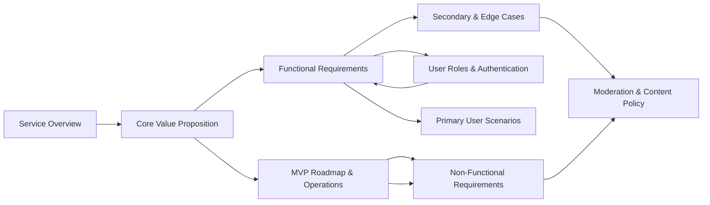

# econPoliticalForum — Documentation Table of Contents and Project Map

## Short project description
The econPoliticalForum project is a lightweight, safety-minded online discussion board focused on economic and political topics. Its purpose is to provide a structured, moderated environment where informed discussion, debate, and resource sharing can occur while minimizing abuse, misinformation, and legal/regulatory risk.

## Scope and purpose
- Provide a single, authoritative table of contents that maps every project document to its intended audience and purpose.
- Make it easy for engineers, product owners, moderators, legal, and operations to find the business requirements, policies, and runbooks required to implement and operate the service.
- Capture governance rules and ownership for each document in EARS format to ensure timely updates and traceability.

## Service metadata
- Service prefix: econPoliticalForum
- Primary roles referenced across the documentation: guest, registeredUser, moderator, administrator
- Primary owners: Product Manager (owner), Lead Backend Engineer (technical owner), Policy Lead (moderation & legal owner)
- Document version: 1.0
- Last updated: 2025-10-03

## Intended audience and recommended reading order
- Product managers and stakeholders: read Service Overview (01-service-overview.md), Core Value Proposition (03-core-value-proposition.md), and MVP Roadmap (10-mvp-roadmap.md).
- Backend developers and QA: read User Roles & Authentication (05-user-roles-authentication.md), Functional Requirements (04-functional-requirements.md), Primary User Scenarios (06-primary-user-scenarios.md), Secondary & Edge Cases (07-secondary-edge-cases.md), and Non-Functional Requirements (09-non-functional-requirements.md) in that order.
- Moderators, legal, and trust & safety reviewers: read Moderation & Content Policy (08-moderation-content-policy.md) and Secondary & Edge Cases (07-secondary-edge-cases.md).
- Operations and SRE: read Non-Functional Requirements (09-non-functional-requirements.md) and MVP Roadmap (10-mvp-roadmap.md).

## Document map (descriptive list of documents)
Each entry below contains: Document title — short summary — primary audience — relative link (update link targets if filenames change). All entries include the outline and expected detail level.

- Service Overview — High-level goals and business case — Audience: product managers, stakeholders, developers — Link: ./01-service-overview.md
  - Outline: Executive summary; Target market and users; Core value proposition; Business model; Success metrics and go/no-go criteria.
  - Detail level: Detailed business specification.

- Problem Definition — User pains and risk profile — Audience: product managers, legal advisors — Link: ./02-problem-definition.md
  - Outline: Problem statement; Target user pain points; Risks and sensitivities; Regulatory concerns; Opportunity statement.
  - Detail level: Moderate.

- Core Value Proposition — Minimal feature set that delivers value — Audience: product managers, marketing — Link: ./03-core-value-proposition.md
  - Outline: Primary benefits for users; Minimal feature set for MVP; Differentiation; Acquisition and retention levers.
  - Detail level: Moderate.

- Functional Requirements — Complete business-level functional requirements (EARS formatted) — Audience: backend developers, product owners — Link: ./04-functional-requirements.md
  - Outline: CRUD for posts/comments; Thread/category/tag behavior; Voting and reputation; Search and discovery; Notifications; Reporting; Acceptance criteria.
  - Detail level: Detailed specification.

- User Roles & Authentication — Roles, lifecycle, and token expectations — Audience: backend developers, security reviewers — Link: ./05-user-roles-authentication.md
  - Outline: Role definitions; Authentication lifecycle; Email verification; Session and token rules; Suspension and appeals.
  - Detail level: Detailed.

- Primary User Scenarios — Typical success journeys — Audience: developers, QA, product managers — Link: ./06-primary-user-scenarios.md
  - Outline: User personas; Browse, register, post, comment, vote journeys; Notification flows; Reporting initiation; Acceptance criteria.
  - Detail level: Moderate.

- Secondary & Edge Cases — Error paths, rate limits, and conflicts — Audience: backend developers, QA, operations — Link: ./07-secondary-edge-cases.md
  - Outline: Rate limits and throttling; Edit and deletion edge cases; Concurrency conflicts; Anonymous posting rules; Suspension/appeal scenarios.
  - Detail level: Detailed.

- Moderation & Content Policy — Rules, workflows, and escalation paths — Audience: moderators, administrators, legal — Link: ./08-moderation-content-policy.md
  - Outline: Prohibited content list; Reporting workflow and reporter protections; Moderator actions and escalation; Appeals; Transparency reporting.
  - Detail level: Detailed.

- Non-Functional Requirements — SLAs, privacy, security expectations — Audience: operations, backend developers, security — Link: ./09-non-functional-requirements.md
  - Outline: Performance SLAs; Scalability targets; Security and privacy principles; Accessibility; Monitoring and backups; Moderation latency.
  - Detail level: Detailed.

- MVP Roadmap & Operations — Launch checklist and integrations — Audience: product managers, operations — Link: ./10-mvp-roadmap.md
  - Outline: Operational checklist; Required integrations; Analytics and dashboards; Phased timeline; Acceptance criteria for launch.
  - Detail level: Moderate.

- 00-toc.md (this file) — Table of contents and governance map — Audience: all project stakeholders — Link: ./00-toc.md
  - Outline: Project description; Document map; Governance rules; References and next steps.
  - Detail level: High-level overview.

## Document relationships and dependencies
- THE Functional Requirements document SHALL depend on User Roles & Authentication for role definitions used in EARS rules.
- THE Moderation & Content Policy SHALL inform Secondary & Edge Cases and Non-Functional Requirements for moderation SLAs and logging expectations.
- THE MVP Roadmap SHALL reference Core Value Proposition and Service Overview for scope decisions.
- THE Non-Functional Requirements SHALL set business-level constraints that Functional Requirements must respect (for example, the 2-second content load expectation).

## How to use this documentation set
- IF you are a stakeholder deciding whether to fund or prioritize features, THEN start with the Service Overview, Core Value Proposition, and MVP Roadmap.
- IF you are a backend developer starting implementation, THEN read User Roles & Authentication, Functional Requirements, Primary User Scenarios, Secondary & Edge Cases, and Non-Functional Requirements in that order.
- IF you are part of moderation, legal, or trust & safety, THEN read Moderation & Content Policy, Secondary & Edge Cases, and Non-Functional Requirements for SLAs and retention policies.
- IF you are operations or SRE, THEN prioritize Non-Functional Requirements and MVP Roadmap for deployment and monitoring needs.

Recommended reading order for developers: ./05-user-roles-authentication.md -> ./04-functional-requirements.md -> ./06-primary-user-scenarios.md -> ./07-secondary-edge-cases.md -> ./09-non-functional-requirements.md

## Governance and maintenance (EARS-format requirements)
- WHEN any document is updated, THE document owner SHALL increment the document version and SHALL add a changelog entry including summary, author, and date within 7 calendar days.

- WHEN a major release (feature or policy) is approved for production, THE product manager SHALL ensure related documents are updated within 7 calendar days and SHALL record approver names and approval dates in a document metadata section.

- IF a document becomes obsolete or is superseded, THEN the owning team SHALL move the previous version to an /archive/ folder, SHALL mark the file header with a "superseded-by" pointer to the replacing document, and SHALL include the archival date.

- WHERE a document affects moderation or legal policy, THEN THE document SHALL require sign-off by the Policy Lead and a legal reviewer before being marked as final.

- WHILE the project is in active development, THE documentation owners SHALL ensure a changelog entry is created for every substantive update.

- WHEN a document requires legal or compliance sign-off, THEN THE project SHALL store approver name(s), role, and approval date in a metadata block at the top of the file.

## Access, authorship, and ownership (EARS formatted)
- THE project SHALL maintain a documented owner for each file: Product Manager (business), Lead Backend Engineer (technical), and Policy Lead (policy/legal) where applicable.
- WHEN a document is proposed for change, THEN THE proposed change SHALL include a reviewer from the owning discipline (technical or policy) and SHALL be approved by at least one designated reviewer before merge.
- IF a document is changed without required sign-offs in the repository, THEN THE change SHALL be reverted and the incident SHALL be logged for governance review.

## Where to find role and requirement details
- Role definitions and permission matrix are in: ./05-user-roles-authentication.md
- Complete functional behaviors and acceptance criteria are in: ./04-functional-requirements.md
- Moderation workflows and appeal processes are in: ./08-moderation-content-policy.md

## Glossary and abbreviations
- MAU: Monthly Active Users (business metric)
- SLA: Service Level Agreement (business SLA for moderation and availability)
- EARS: Easy Approach to Requirements Syntax (format used for requirements in functional documents)

## References and next steps
- FOR immediate implementation work, THE development team SHALL use the reading order recommended earlier and SHALL coordinate with product and policy owners to confirm policies before building moderation features.
- FOR initial launch (MVP), SEE: ./10-mvp-roadmap.md

## Quality checklist (EARS format)
- WHEN this file is reviewed, THE reviewer SHALL confirm that each document listed has a valid relative link and that the target file exists in the repository.
- WHEN this file is reviewed, THE reviewer SHALL confirm that the governance and owner entries are current and SHALL update the metadata block if owners have changed.
- WHEN this file is updated, THE updater SHALL ensure the content length remains >= 2,000 characters and SHALL ensure Mermaid diagrams validate with double-quoted labels.

> Developer Note: The content above contains business requirements and governance guidance only. Technical implementation decisions (architecture, APIs, database design, hosting) are at the discretion of the development team.