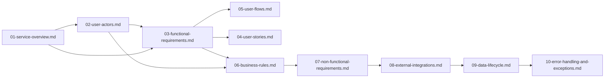

# 00 Table of Contents for discussionBoard Documentation

## Purpose and Scope
Provide a single navigation entry for the discussionBoard documentation set that guides stakeholders to the authoritative document for any topic related to business requirements, user workflows, or governance of the service. The TOC is intended for product managers, backend developers, QA engineers, operations, and legal/compliance reviewers. The file organizes and summarizes business-level artifacts; all technical implementation decisions (architecture, APIs, database design, vendor selection) remain the responsibility of the engineering team.

## Quick Index (Descriptive Links)
- [01-service-overview.md](./01-service-overview.md) — Service vision, business justification, high-level scope and success metrics.
- [02-user-actors.md](./02-user-actors.md) — Actor definitions, authentication expectations, and permission matrices.
- [03-functional-requirements.md](./03-functional-requirements.md) — Business-level feature requirements and acceptance criteria for posts, attachments, comments, moderation, and discovery.
- [04-user-stories.md](./04-user-stories.md) — Prioritized user stories and testable acceptance conditions for MVP journeys.
- [05-user-flows.md](./05-user-flows.md) — Step-by-step flows for posting, attaching files, moderation, registration, and password reset.
- [06-business-rules.md](./06-business-rules.md) — Measurable rules and constraints for posting, attachments, sanctions, and retention.
- [07-non-functional-requirements.md](./07-non-functional-requirements.md) — Business-level performance, availability, security and monitoring expectations.
- [08-external-integrations.md](./08-external-integrations.md) — Conceptual third-party integrations (file storage, email, spam detection) and fallback expectations.
- [09-data-lifecycle.md](./09-data-lifecycle.md) — Retention, archival, deletion, legal-hold and portability rules for posts, comments, attachments, and accounts.
- [10-error-handling-and-exceptions.md](./10-error-handling-and-exceptions.md) — User-facing error messages, retry/backoff expectations, and escalation procedures.

## Per-Document Summaries

### 01-service-overview.md
Purpose: Describe the product vision, why discussionBoard exists, the target market, and business success metrics.
Primary audience: Business stakeholders, product managers, backend developers.
Key questions answered:
- Why does the discussionBoard exist and what problem does it solve?
- Who are the target users and what are the primary use cases?
- What are measurable success metrics and MVP scope?
Primary sections expected: Service Vision and Purpose; Problem Definition; Core Value Proposition; Target Users; Business Model; KPIs; Scope and Out-of-Scope.
Related documents: 03-functional-requirements.md, 06-business-rules.md

### 02-user-actors.md
Purpose: Define guest/member/moderator actor responsibilities and business-level authentication expectations.
Primary audience: Backend developers, security reviewers, product managers.
Key questions answered:
- What are the available actor roles and their high-level permissions?
- What are the expected account lifecycle and session behaviors from a business standpoint?
Primary sections expected: Actor Definitions; Permission Matrix; Authentication & Verification Rules; Session & Token Lifecycle (business expectations); Audit and Accountability.
Related documents: 03-functional-requirements.md; 09-data-lifecycle.md

### 03-functional-requirements.md
Purpose: Capture business-level requirements for core features: posting, commenting, attachments, moderation, search and notifications.
Primary audience: Backend developers, QA, product managers.
Key questions answered:
- What must the system provide to meet member and moderator needs?
- How should attachments and content be validated from a business perspective?
Primary sections expected: Content Management; Attachment Support; Commenting; Moderation and Reporting; Search and Classification; Notifications; Visibility Rules.
Related documents: 01-service-overview.md; 06-business-rules.md

### 04-user-stories.md
Purpose: Provide prioritized, testable user stories describing member, moderator and guest journeys for MVP implementation.
Primary audience: Product managers, QA, backend developers.
Key questions answered:
- Which user journeys are critical for MVP?
- What acceptance criteria make each story testable?
Primary sections expected: Persona Summaries; Primary Member Stories; Moderator Stories; Guest Scenarios; Edge Cases and QA Scenarios.
Related documents: 03-functional-requirements.md; 05-user-flows.md

### 05-user-flows.md
Purpose: Describe step-by-step business flows for core tasks: post creation (with attachments), commenting, moderation workflow, account registration and password reset.
Primary audience: Backend developers, QA.
Key questions answered:
- What steps do users take to complete core tasks and what business validation occurs at each step?
- Where are decision points and how should the system respond to failures?
Primary sections expected: Post Creation Flow; Commenting Flow; Moderation Flow; Account Registration & Verification; Password Reset Flow.
Related documents: 03-functional-requirements.md; 10-error-handling-and-exceptions.md

### 06-business-rules.md
Purpose: Enumerate precise, measurable business rules that govern content length, edit windows, attachment limits, reporting thresholds, sanctions and retention.
Primary audience: Product managers, legal/compliance, backend developers.
Key questions answered:
- What constraints must be enforced on posts, comments and attachments?
- How are sanctions and moderation escalations applied and measured?
Primary sections expected: Posting and Editing Rules; Attachment Rules; Moderation Policies; Sanctions and Strike Lifecycle; Retention and Deletion Policies.
Related documents: 09-data-lifecycle.md; 03-functional-requirements.md

### 07-non-functional-requirements.md
Purpose: Establish business-level SLOs and expectations for performance, availability, security, scalability and monitoring.
Primary audience: Backend developers, operations, security.
Key questions answered:
- What are the measurable performance and availability targets for the MVP?
- What security and privacy constraints must be respected at a business level?
Primary sections expected: Performance SLOs; Availability Targets; Security & Privacy Expectations; Logging and Monitoring; Operational Recovery.
Related documents: 08-external-integrations.md; 09-data-lifecycle.md

### 08-external-integrations.md
Purpose: Describe the role of third-party services (file storage, email, spam detection, analytics), business rationale, and expected fallback behavior when integrations fail.
Primary audience: Backend developers, architects, procurement.
Key questions answered:
- Which categories of external services are required and why?
- How should the system behave when an integration is degraded or unavailable?
Primary sections expected: Integration Categories; Failure & Fallback Expectations; Privacy and Compliance Considerations; Cost & SLA Notes.
Related documents: 07-non-functional-requirements.md; 09-data-lifecycle.md

### 09-data-lifecycle.md
Purpose: Define retention windows, archival and purge cycles for posts, comments, attachments, and account data and describe legal-hold and export procedures.
Primary audience: Backend developers, legal/compliance, operations.
Key questions answered:
- How long is content retained and under what conditions is it purged?
- What are user rights around export and deletion and what SLAs apply?
Primary sections expected: Data Types and Ownership; Retention Rules (soft-delete and purge); Legal Holds; Export & Portability; Backup & Recovery SLAs.
Related documents: 06-business-rules.md; 08-external-integrations.md

### 10-error-handling-and-exceptions.md
Purpose: Specify user-facing error messages, retry/backoff expectations, and escalation for attachment failures, auth issues, and moderation action failures.
Primary audience: Backend developers, QA, operations.
Key questions answered:
- What should users see and be able to do when operations fail?
- What retry and queuing policies must the system follow for transient integration failures?
Primary sections expected: User-Facing Errors; Attachment Retry Policy; Authentication Failure Handling; Moderation Action Failures; Operational Rollback.
Related documents: 05-user-flows.md; 08-external-integrations.md

## Recommended Reading Order and Usage Guidance
- Product stakeholders and executives: read 01-service-overview.md first to understand vision and success metrics.
- For authentication, session and actor-related decisions: consult 02-user-actors.md before implementing features described in 03-functional-requirements.md.
- Backend implementation teams: implement features using 03-functional-requirements.md and 06-business-rules.md together to ensure behavior aligns with product policy and retention rules.
- QA: create test plans from 04-user-stories.md and validate flows in 05-user-flows.md; use 10-error-handling-and-exceptions.md for negative test cases.
- Operations and security: review 07-non-functional-requirements.md and 08-external-integrations.md for SLOs, fallback expectations and procurement considerations.

## Visual Map of Document Relationships

```mermaid
graph LR
  A["01-service-overview.md"] --> B["02-user-actors.md"]
  B --> C["03-functional-requirements.md"]
  C --> D["05-user-flows.md"]
  C --> E["04-user-stories.md"]
  C --> F["06-business-rules.md"]
  F --> G["07-non-functional-requirements.md"]
  G --> H["08-external-integrations.md"]
  H --> I["09-data-lifecycle.md"]
  I --> J["10-error-handling-and-exceptions.md"]
  A --> C
  B --> F
```

## Maintenance and Contribution
Location and update cadence:
- Files are stored at the repository root in the documentation folder. When adding or updating a document, create or update the corresponding numbered markdown file and update this TOC entry.
- The TOC SHALL be updated in the same change that introduces or renames any document. Updates to document filenames or scopes SHALL be reflected here within the same commit and pull request.

Authorship and review:
- Authors must include a short purpose, primary audience and at least two key questions answered in the front matter of each document.
- Document owners are responsible for maintaining accuracy; product owners, engineers, and legal/compliance SHALL coordinate on changes that impact policy, retention or security.

Contribution guidance:
- New documents MUST follow the structure used across this set: Purpose, Audience, Key Questions, Outline and Related Documents.
- Changes that affect business rules, retention periods, or legal obligations SHALL require sign-off from product and compliance representatives before merge.

## Governance and Who Uses Each Document
- Product and stakeholders: primary readers of 01-service-overview.md and 06-business-rules.md for strategy and policy decisions.
- Backend engineers: primary readers of 02-user-actors.md, 03-functional-requirements.md, 05-user-flows.md, 06-business-rules.md, 07-non-functional-requirements.md and 08-external-integrations.md for implementation.
- QA engineers: primary readers of 04-user-stories.md and 05-user-flows.md for acceptance testing and negative tests from 10-error-handling-and-exceptions.md.
- Operations/security/legal: primary readers of 07-non-functional-requirements.md, 08-external-integrations.md, 09-data-lifecycle.md and 10-error-handling-and-exceptions.md.

## Acceptance Checklist
- [ ] TOC file length >= 2,000 characters
- [ ] All listed documents have a concise purpose, audience, 2–3 key questions, and primary sections
- [ ] Mermaid diagram uses double-quoted labels and valid arrow syntax
- [ ] Developer Note present at the end and starts with "Developer Note:"
- [ ] No forbidden starting phrases used anywhere in the file

## Contact and Escalation
For clarification on business intent or policy changes, contact the following roles (use team aliases):
- Product Owner: @product-owner
- Documentation Owner: @doc-owner
- Engineering Lead: @eng-lead
- Legal/Compliance: @legal-compliance

Developer Note: Technical implementation decisions (architecture, API design, database schema, vendor selection) are left to the engineering team and require coordination with product and compliance when they affect policy or retention.