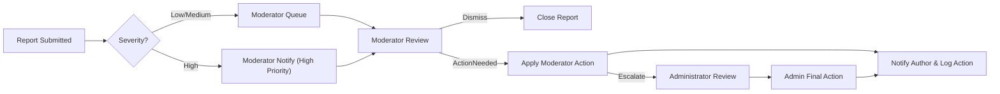
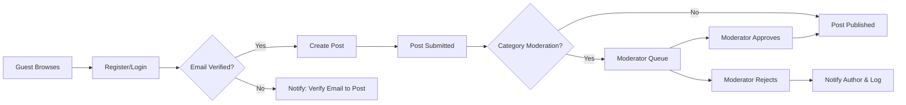

# econPoliticalForum — Service Overview and Requirements Analysis

## Executive summary

econPoliticalForum is a focused, lightweight online discussion board for economics and political topics. Its purpose is to enable constructive, evidence-based public discourse while minimizing harm, disinformation, and polarized abuse. The platform targets users who want topic-focused conversations (news analysis, policy discussion, research sharing) and organizations seeking a moderated community around economic and political themes.

Primary goals:
- Provide a safe, credible space for public discussion on economics and politics.
- Enable persistent, searchable threads organized by category, tag, and topic.
- Surface high-quality contributions through transparent voting and moderation.
- Offer a minimal, secure, and maintainable system suitable for iterative MVP launches.

This content describes the business-level requirements and acceptance criteria for econPoliticalForum. It specifies WHAT the service must do; technical architecture, APIs, database design, and deployment topology are intentionally left to the development team.

## Target market and users

Primary user segments:
- Policy professionals and academics: Seek rigorous discussion, citations, and moderation that enforces civility.
- Interested citizens and hobbyists: Want accessible conversations and the ability to follow topics and react.
- Journalists and commentators: Monitor trends, source viewpoints, and share analysis.
- Students and grassroots organizers: Engage in debates and discover resources.

Audience needs and expectations:
- Trustworthy moderation and transparent rules.
- Ability to find, follow, and archive topic threads.
- Lightweight onboarding with optional verification for higher privileges.
- Low-friction reading experience and reliable notification for followed topics.

Market risks and sensitivities:
- Political and economic topics are high-risk for misinformation, legal exposure, and harassment. The product must prioritize moderation, audit trails, and user protection at launch.

## Core value proposition

Value offered to users:
- Curated discussions: Clear categorization and moderation to keep conversations on-topic.
- Signal over noise: Voting and reputation primitives that elevate informed contributions.
- Discoverability: Tags, categories, and basic search for historical discussions.
- Safety-first design: Reporting flows and moderator tools to address abusive or illegal content.

Unique differentiators (initial):
- Focus on economic and political content with tailored moderation guidance.
- Lightweight feature set enabling rapid, safe MVP launch.
- Transparent moderation records available to administrators and (where appropriate) to community members.

## Competitive landscape and differentiation

Primary competitor types:
- Large public forums and social networks (Reddit, Twitter/X, Facebook): Broad audiences, less specialized moderation.
- Niche forums and mailing lists: Deeper domain expertise but often poor UX and discoverability.
- Professional communities (Slack/Discord/Research forums): Private, invitation-only and less public.

Differentiation strategy:
- Emphasize public, topic-centric discussion with clear content policies and lightweight moderation.
- Offer reliable, searchable threads with simple mechanisms for reporting and appeals.
- Target early adopters in academic and policy circles to build credibility.

## Business model (WHY / HOW / WHAT)

### Why this service exists
- Market need: There is demand for spaces dedicated to serious discussion on public policy and economic topics where noise and harassment are reduced.
- Problem solved: General-purpose social platforms deprioritize quality discussion, and specialized platforms are often closed or hard to discover.

### How the service will generate value (revenue strategy)
- Short to medium term (MVP): Build a community and reputation; keep the platform free for users to grow reach.
- Medium term (12–24 months): Offer optional paid features for organizations and power users (e.g., private moderated channels, enhanced analytics, priority moderation services). Consider ad-free subscription tiers for institutions.
- Long term: Partnerships with universities, think tanks, and media organizations for sponsored spaces or premium moderation services.

### Core operations to support the model
- Content moderation and trust-building are primary operational focuses.
- Community management (moderator recruitment, training materials, appeals process) must be funded initially through operational budgets or early sponsorship.

### Success metrics (KPIs)
- Monthly Active Users (MAU): target 10k in 12 months for an initial niche launch.
- Weekly retention rate (percentage of new users returning within 7 days): target >= 40%.
- Quality signal: Percentage of posts with at least one upvote within 7 days: target >= 30%.
- Moderation SLA: 95% of high-severity reports reviewed by moderators within 24 hours at launch.
- Time-to-first-response for verified support requests: within 48 hours.

## Prioritized feature list and MVP scope

MVP (Minimum Viable Product) — mandatory features for launch:
1. Registration and login (email/password with email verification).
2. Public categories and threaded posts (create/read/update/delete for own posts within business rules).
3. Comments/replies with nested threading to one level (comment on posts and reply to comments).
4. Simple upvote/downvote or like system with daily vote limits per content item.
5. Search and tag-based discovery (basic search across titles and tags).
6. Reporting UI and moderator queue (report creation, status tracking for moderators).
7. Moderator tools: hide/unpublish content, issue warnings, temporary suspensions.
8. User profiles with basic metadata and ability to follow threads/categories.
9. Notifications for replies, mentions, and moderation actions.
10. Bookmark/favorite for saved threads.

Secondary features (post-MVP):
- Advanced reputation and badges.
- Private messages and group creation.
- Rich media embedding with upload limits and moderation pipelines.
- Advanced search with filters (date range, author, score).
- Organization accounts and paid moderation tiers.

Rationale for prioritization: MVP focuses on enabling public, moderated discussion with safety controls and discovery. Advanced features increase complexity and risk and are deferred until the moderation model and community norms stabilize.

## User roles and permissions (business view)

Defined roles:
- guest: Unauthenticated visitors. Capabilities: browse public categories, read public posts and comments, view public user profiles. Restrictions: cannot create content, vote, report, or use member-only features.
- registeredUser: Authenticated users with verified email (posting in restricted categories may require verification). Capabilities: create and edit own posts/comments (within edit window), delete own content (subject to constraints), vote, bookmark, follow threads, report content, receive notifications, update own profile. Restrictions: cannot moderate or perform administrative functions.
- moderator: Trusted community members. Capabilities: review reports, hide/unpublish posts or comments, approve content in moderated categories, issue warnings, place temporary suspensions (duration-limited), view moderation logs, escalate to administrators. Restrictions: cannot change site-wide settings or permanently ban users unless authorized by administrators.
- administrator: Full system administrators. Capabilities: manage user roles and lifecycle (suspend, reinstate, change roles), configure categories and global policies, access system-wide analytics and logs for operational needs, conduct legal/compliance responses, and manage escalation outcomes. Restrictions: expected to follow governance and audit rules.

Permission highlights (business-level):
- WHEN a registeredUser attempts to create a post, THE system SHALL allow only registeredUser, moderator, or administrator roles to create posts; guests SHALL be redirected to registration flow when attempting to create content.
- THE system SHALL require email verification for creation of posts in categories marked as "verified-only".

## Authentication and account lifecycle (business view)

High-level expectations:
- Account creation: users register with email and password. Email verification is required before posting in restricted categories.
- Password recovery: users can request password reset via verified email, with a secure one-time token process (business requirement only).
- Session management: user sessions expire after a defined inactivity period; users can revoke all active sessions from their profile.
- Account suspension and appeals: moderators can apply temporary suspensions; administrators can apply permanent suspensions. Suspended accounts receive a business-facing notice and a clear appeals path.

EARS-formatted authentication/business requirements (examples):
- WHEN a new user registers, THE system SHALL send a verification email and SHALL mark the account as "unverified" until verification completes.
- WHEN a verified user requests password reset, THE system SHALL enable a secure reset process and SHALL expire the reset token within a limited time window.
- IF a user is temporarily suspended, THEN THE system SHALL prevent creation of new posts and SHALL send a notification to the suspended user with suspension reason and appeal instructions.

## Key business rules and validation (EARS format)

The following business rules are written in EARS format to be testable and unambiguous.

Posting and editing
- WHEN a registeredUser attempts to create a post, THE system SHALL allow post creation if the user is not suspended and has a verified email when posting in "verified-only" categories.
- WHEN a registeredUser submits a post, THE system SHALL accept title length up to 200 characters and body length up to 50,000 characters and SHALL reject submissions that exceed these limits with a user-facing error explaining the limit.
- WHEN a registeredUser edits their own post, THE system SHALL permit edits within 24 hours of the original post creation time. (Edit window can be extended by moderators under exceptional circumstances.)
- IF a post has been reported for serious policy violations and the case is under moderator review, THEN THE system SHALL place an administrative edit-lock preventing further edits by the author until resolution.

Comments and replies
- WHEN a registeredUser submits a comment, THE system SHALL limit comment length to 5,000 characters and SHALL permit one level of nested replies (comment -> reply).
- WHEN a registeredUser attempts to delete a comment, THE system SHALL allow deletion if the comment has not been archived by moderators; deleted comments SHALL be replaced by a standardized placeholder indicating the comment was removed by the user.

Voting and reputation
- WHEN a registeredUser casts a vote on a post or comment, THE system SHALL accept a single vote per user per content item and SHALL prevent duplicate votes for the same item.
- WHEN a registeredUser attempts to change their vote, THE system SHALL allow vote change within 24 hours of casting and SHALL record the change for transparency and potential abuse analysis.
- IF a user is found to be using coordinated accounts to manipulate votes, THEN THE system SHALL invalidate affected votes and THEN THE system SHALL flag the accounts for moderator review.

Rate limiting and abuse prevention
- WHEN a newly registeredUser (account age < 7 days) attempts to create posts, THE system SHALL limit the user to at most 3 posts per 24-hour period.
- WHEN a registeredUser attempts to create more than 10 comments within one minute, THE system SHALL temporarily throttle the account with a short cooldown message to the user and SHALL require the user to wait before posting more comments.

Publishing and visibility
- WHEN a post is created in an unmoderated category, THE system SHALL publish it immediately and SHALL display it to readers subject to search/indexing timelines.
- WHEN a post is created in a moderated category, THE system SHALL place the post into a moderator queue and SHALL ONLY publish it after moderator approval.

Deletion and data retention
- WHEN a registeredUser deletes their own post, THE system SHALL mark the content as deleted in public views but SHALL retain an immutable archived copy for moderation and legal compliance for a retention period defined by policy.
- IF an account is permanently banned for policy violations, THEN THE system SHALL orphan the user's past public posts (remove personal identifiers) while preserving post content for public continuity unless content is illegal and must be removed.

Reporting and moderation
- WHEN a user files a report, THE system SHALL capture the report category, target content ID, reporter ID (if authenticated), timestamp, and any additional reporter notes.
- WHEN a report is marked as high severity (e.g., illegal content, imminent threat), THE system SHALL escalate the report to administrators and SHALL notify moderation staff with 'high' priority.
- IF a moderator removes content, THEN THE system SHALL notify the content author with the reason and provide appeal instructions.

Transparency and audit
- WHEN moderation action is taken (hide, remove, suspend), THE system SHALL record an immutable moderation log entry including the moderator ID, action type, reason, and timestamp.
- WHEN a moderator or administrator reviews moderation history, THE system SHALL present filters by date, action type, and user for operational review.

Privacy and anonymization
- WHEN a user requests account deletion, THE system SHALL anonymize personal identifiers in public content while preserving content per retention policy; THE system SHALL provide a clear, human-readable confirmation to the user about what was removed and what remains.

Error handling and user messages
- IF user input validation fails (length, missing required fields), THEN THE system SHALL return a clear, localized user-facing message describing the exact validation error and the acceptable ranges.

## Moderation, content policy summary, and escalation workflow

Content policy principles (business-level):
- Prohibit content that is illegal, incitement to violence, direct harassment and doxxing, organized disinformation campaigns, and content that violates local laws. Nuanced political opinion and criticism are permitted provided they do not cross into prohibited categories.
- Protect reporter anonymity when requested.
- Encourage citations and source links for factual claims in economic or policy analysis; reward constructive contributions through moderator highlighting and community signals.

Moderation workflow (business steps):
1. User submits report with category; system triages potential high-severity reports automatically to moderator queue.
2. Moderator reviews report, applies action (dismiss, warn, hide, remove, temporary suspend, escalate to admin).
3. For escalated cases, administrators review and apply final action; action and reasoning recorded.
4. Author receives notification with action and appeals instructions when content is removed or account suspended.
5. Appeals undergo administrative review; reinstatement decisions recorded and communicated.

Mermaid diagram — Moderation escalation (left-to-right):

Notes: the diagram emphasizes decision points and handoffs. Moderators must have clear SLA expectations for each severity level.

## Non-functional requirements (business-level)

Performance and responsiveness
- WHEN a user requests a list of posts in a category, THE system SHALL return a usable paginated result so the user can begin reading within 2 seconds under normal load for pages of 20 items.
- WHEN a user clicks to view a single post with comments, THE system SHALL render the post and top-level comments within 2 seconds under normal load.

Scalability and growth
- WHERE growth increases 10x from initial launch, THE system SHALL preserve core functionality (posting, commenting, reporting) without changes to business workflows; capacity planning is a development task but business expectations for performance must remain.

Security and privacy
- THE system SHALL protect user personal data and SHALL provide a privacy notice describing data retention and deletion practices.
- WHEN legal or safety requests arrive (law enforcement, DMCA), THE system SHALL provide administrators with a documented, auditable process to handle requests.

Accessibility and inclusivity
- THE system SHALL conform to common accessibility expectations (keyboard navigation, readable content structure) and SHALL provide clear alternatives for content removed for policy reasons.

Operational SLAs and moderation latency
- WHEN a report is filed and classified as high severity, THE system SHALL surface it to moderators and administrators within 30 minutes and SHALL ensure a human review within 24 hours.
- WHEN a user-initiated private support request is made, THE system SHALL respond to the request within 48 hours.

Data retention and backup
- THE system SHALL retain moderation logs and content archives for a configurable retention period (recommendation: 2 years for moderator logs, subject to legal requirements) and SHALL provide secure backups for disaster recovery.

## Analytics and admin monitoring (business needs)

Required dashboards and metrics:
- Community activity: MAU, DAU, posts per day, comments per day, new registrations per day.
- Quality signals: percentage of posts with citations, reports per 1,000 posts, resolved reports vs open.
- Moderation performance: average time to first review, time to resolution, number of escalations, moderator actions per moderator.
- Abuse signals: vote irregularities, mass reporting incidents, accounts flagged for coordinated activity.

Business requirements for analytics:
- WHEN abnormal activity is detected (spike in reports or votes), THE system SHALL generate a high-priority alert to administrators and SHALL provide a filterable report to investigate.

## Operational considerations and legal/compliance expectations

Operational checklist for launch:
- Moderation team and onboarding materials prepared (guidelines, escalation rules).
- Backup strategy and retention policies defined and approved.
- Terms of Service, Privacy Policy, and content policy published and discoverable.
- Incident response playbook created for legal takedown and safety incidents.
- Clear record-keeping for moderation actions (immutable logs) to support appeals and audits.

Content backup and export
- WHEN an account is deleted or requested for export, THE system SHALL provide an export of the user's content per policy and SHALL anonymize public content upon deletion per the privacy rules.

## Acceptance criteria and go/no-go criteria for launch

Go/no-go criteria (business-oriented):
- Moderation staffing: at least one moderator per 5,000 anticipated monthly active users at launch and documented on-call coverage for high-severity reports.
- Safety: Moderation queue SLA for high severity must be demonstrably achievable in a staging environment.
- Legal: Published Terms of Service and Privacy Policy approved by legal counsel.
- Technical readiness (business validation): basic load tests show core workflows (post list and post view) meet the 2-second target under expected load.

## MVP roadmap and phased timeline (suggested)

Phase 0 (Preparation, 0–2 months): policy drafting, moderator recruitment, minimal UI prototypes, deployment baseline.
Phase 1 (MVP launch, 2–5 months): implement core features listed in MVP, internal moderation testing, invite-only beta for trusted communities.
Phase 2 (Public launch, 5–9 months): open registration, analytics rollout, first wave of post-MVP features (bookmarks, notifications, basic search improvements).
Phase 3 (Stability and growth, 9–18 months): reputation features, organization accounts, paid tiers and partnerships, advanced moderation tooling.

## Assumptions and open questions for stakeholders (business only)

Assumptions made in this content:
- The initial audience is English-speaking and the platform will launch in a limited set of jurisdictions to reduce legal complexity.
- Moderation will be primarily human-led with basic automation to surface high-severity items.
- The product will be free to users at launch.

Open questions requiring stakeholder confirmation (do not change behavior until answered):
- Desired initial jurisdictions and legal constraints for the launch.
- Target MAU and budget for moderation staffing for first 12 months.
- Whether anonymous or pseudonymous accounts are permitted beyond simple display name conventions.
- Specific retention policy durations required by legal counsel.

## Conclusion

This content defines the business purpose, user base, prioritized features, user roles and permissions, EARS-formatted business rules, moderation workflow, non-functional expectations, and MVP roadmap for econPoliticalForum. It is designed to enable backend and operations teams to understand the WHAT of the system: the features to implement, the business rules to enforce, and the operational SLAs to meet.

## Diagrams and quick references

- Moderation escalation diagram is included above.
- Suggested user journey diagram (publish flow) below:

## Statement on scope and developer autonomy

This content provides business requirements only. All technical implementation decisions (architecture, APIs, database design, technology stack, and deployment topology) belong to the development team and are outside the scope of these business requirements.

---

